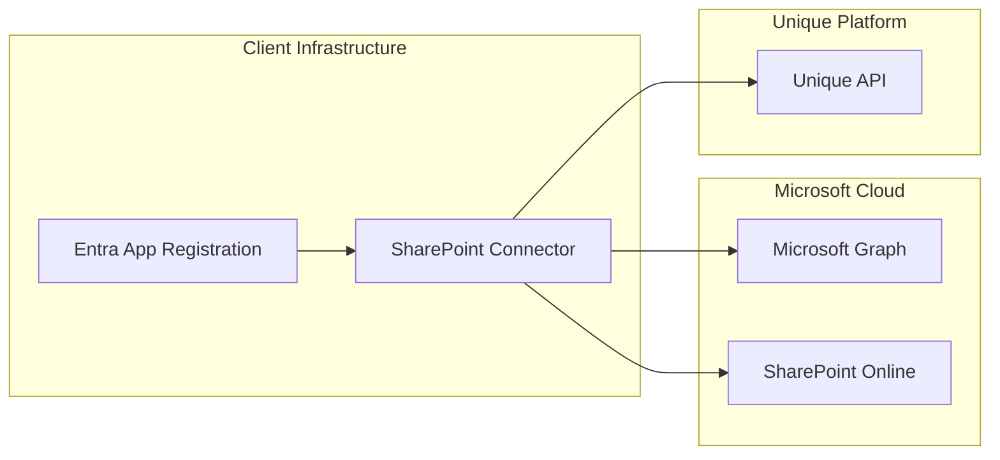
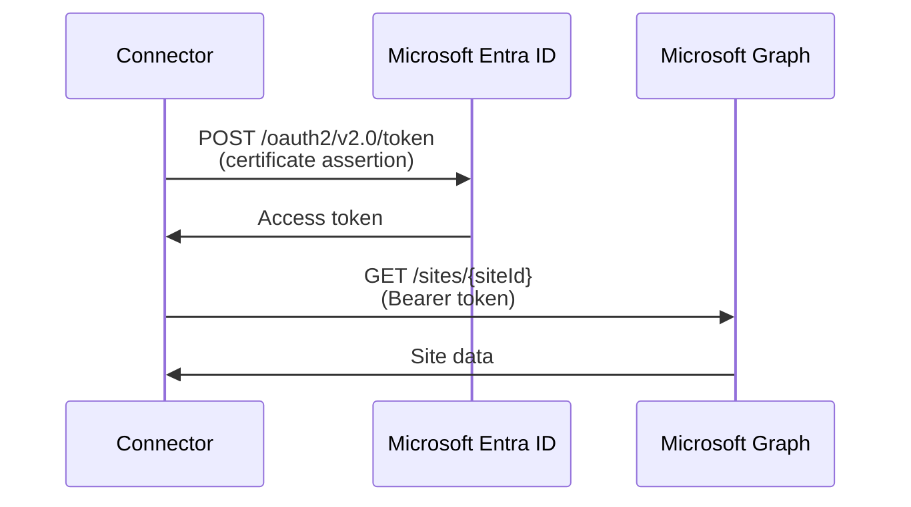

<!-- confluence-page-id: 1953366069 -->
<!-- confluence-space-key: PUBDOC -->


## Overview

The SharePoint Connector authenticates with Microsoft services using Azure AD (Microsoft Entra ID) application credentials. This guide covers the setup process for authentication.

## Authentication Methods

| Method | Use Case | Recommended |
|--------|----------|-------------|
| Certificate | Production environments | Yes |
| Client Secret | Development/testing only | No |

**Certificate authentication** is the recommended method for production. It uses an X.509 certificate to obtain OAuth2 access tokens from Entra ID.
**OIDC is currently not supported** for this connector. Client secret remains a fallback for non-production use and is discouraged for enterprise production deployments.

## Setup Steps

### 1. Create a Unique Service User

The connector requires a service user in Unique with the following permissions:

- `chat.admin.all`
- `chat.knowledge.read`
- `chat.knowledge.write`

**Steps:**

1. Navigate to ZITADEL
2. Create a new service user
3. Assign the required permissions
4. Note the user ID for configuration

For detailed instructions, see:
- [How To Configure A Service User](https://unique-ch.atlassian.net/wiki/spaces/PUBDOC/pages/1411023075)
- [Understand Roles and Permissions](https://unique-ch.atlassian.net/wiki/spaces/PUBDOC/pages/1411023168)

### 2. Create Azure AD Application Registration

#### Required Permissions

**Microsoft Graph** (for content sync):

| Permission | Type | Description |
|------------|------|-------------|
| `Sites.Selected` | Application | Fetch sites, folders, and content (if site-specific access) |
| `Lists.SelectedOperations.Selected` | Application | Fetch content from specific libraries (if library-specific access) |

**Microsoft Graph** (for permission sync - optional):

| Permission | Type | Description |
|------------|------|-------------|
| `GroupMember.Read.All` | Application | Read group members |
| `User.ReadBasic.All` | Application | Read user details |

**SharePoint REST API** (for permission sync - optional):

| Permission | Type | Description |
|------------|------|-------------|
| `Sites.Selected` | Application | Read site groups and members |

#### Registration Steps

1. Go to [Azure Portal](https://portal.azure.com) → **Azure Active Directory** → **App registrations**

2. Click **New registration**:
   - Name: `Unique SharePoint Connector`
   - Supported account types: **Accounts in this organizational directory only**
   - Redirect URI: Leave empty

3. Note the **Application (client) ID** and **Directory (tenant) ID**

4. Go to **API permissions** → **Add a permission**:
   - Select **Microsoft Graph** → **Application permissions**:
     - Add `Sites.Selected` (for site-specific access)
     - Add `Lists.SelectedOperations.Selected` (for library-specific access)
   - If permission sync is enabled, also add:
     - `GroupMember.Read.All`
     - `User.ReadBasic.All`
   - Select **SharePoint** → **Application permissions**:
     - Add `Sites.Selected` (required for permission sync to read site groups)

5. Click **Grant admin consent for [Your Organization]**

### 3. Create Azure AD Service Principal

The service principal enables the app registration to authenticate.

**Option 1: Admin consent URL**

Have an admin visit:

```
https://login.microsoftonline.com/{tenant-id}/v2.0/adminconsent
  ?client_id={your-app-id}
  &scope=https://graph.microsoft.com/.default
```

**Option 2: Azure CLI**

```bash
# Create the service principal
az ad sp create --id <app-id>

# Grant admin consent
# Go to Azure Portal → Enterprise applications → Your app → Permissions
# Click "Grant admin consent for <tenant>"
```

### 4. Grant Site-Specific Access

The `Sites.Selected` permission requires explicit access grants for each site. This is done via PowerShell.

#### Prerequisites

- PowerShell 7+
- [PnP PowerShell](https://pnp.github.io/powershell/) module
- SharePoint administrator rights

#### Grant Access Script

```powershell
# Install PnP PowerShell if needed
Install-Module -Name PnP.PowerShell -Scope CurrentUser

# Connect to SharePoint Admin
Connect-PnPOnline -Url "https://<tenant>-admin.sharepoint.com" -Interactive

# Grant site access to the app
Grant-PnPAzureADAppSitePermission `
  -AppId "<your-app-client-id>" `
  -DisplayName "Unique SharePoint Connector" `
  -Site "https://<tenant>.sharepoint.com/sites/<site-name>" `
  -Permissions Read

# Verify the grant
Get-PnPAzureADAppSitePermission -Site "https://<tenant>.sharepoint.com/sites/<site-name>"
```

**Repeat for each site** that should be synced.

#### Alternative: Graph Explorer

Use this option if you prefer granting site permissions through Microsoft Graph directly.

1. Open [Graph Explorer](https://developer.microsoft.com/en-us/graph/graph-explorer) and sign in as a SharePoint/Entra admin.
2. In **Modify permissions**, consent to `Sites.FullControl.All` (one-time admin action needed to grant `Sites.Selected` app permissions).
3. Grant site permission (replace placeholders):

```http
POST https://graph.microsoft.com/v1.0/sites/{site-id}/permissions
Content-Type: application/json

{
  "roles": ["read"],
  "grantedToIdentities": [
    {
      "application": {
        "id": "{app-client-id}",
        "displayName": "Unique SharePoint Connector"
      }
    }
  ]
}
```

4. Verify permission grant:

```http
GET https://graph.microsoft.com/v1.0/sites/{site-id}/permissions
```

Expected result: grant creation returns `201 Created`; verification returns `200 OK` and includes your app ID.

### 5. Grant Library-Specific Access

For more granular control, you can grant access to specific document libraries using `Lists.SelectedOperations.Selected`:

```powershell
# Grant library-specific access
Grant-PnPAzureADAppSitePermission `
  -AppId "<your-app-client-id>" `
  -DisplayName "Unique SharePoint Connector" `
  -Site "https://<tenant>.sharepoint.com/sites/<site-name>" `
  -Permissions Read `
  -List "Documents"
```

#### Alternative: Graph Explorer

1. Open [Graph Explorer](https://developer.microsoft.com/en-us/graph/graph-explorer) and sign in as admin.
2. In **Modify permissions**, consent to `Sites.Read.All` (one-time admin action for list discovery and grant checks).
3. Resolve target library ID:

```http
GET https://graph.microsoft.com/v1.0/sites/{site-id}/lists
```

Find the target library where `"list": { "template": "documentLibrary" }` and copy its `id`.

4. Grant app access on the library:

```http
POST https://graph.microsoft.com/v1.0/sites/{site-id}/lists/{list-id}/permissions
Content-Type: application/json

{
  "roles": ["read"],
  "grantedTo": {
    "application": {
      "id": "{app-client-id}"
    }
  }
}
```

5. Verify library permissions:

```http
GET https://graph.microsoft.com/v1.0/sites/{site-id}/lists/{list-id}/permissions
```

Expected result: grant creation returns `201 Created`; verification returns `200 OK` and contains your app ID.

### 6. Create Certificate

Create a self-signed certificate for authentication:

#### Using OpenSSL

```bash
# Generate private key
openssl genrsa -out connector.key 2048

# Generate certificate signing request
openssl req -new -key connector.key -out connector.csr \
  -subj "/CN=Unique SharePoint Connector/O=Your Organization"

# Generate self-signed certificate (valid for 2 years)
openssl x509 -req -days 730 -in connector.csr \
  -signkey connector.key -out connector.crt

# Create PFX for Azure upload (optional)
openssl pkcs12 -export -out connector.pfx \
  -inkey connector.key -in connector.crt
```

##### CSR Field Recommendations

If you run `openssl req` interactively, use these recommendations:

- **Common Name (CN):** Use a stable, descriptive name (for example `unique-sharepoint-connector-app`).
- **Organization (O):** Optional, but recommended for traceability.
- **Country/State/OU/Email:** Optional and typically not required by Entra for this flow.

The CN is used as certificate subject in Entra and helps operations teams identify the certificate during rotation.

#### Using PowerShell

```powershell
# Generate certificate
$cert = New-SelfSignedCertificate `
  -Subject "CN=Unique SharePoint Connector" `
  -CertStoreLocation "Cert:\CurrentUser\My" `
  -KeyExportPolicy Exportable `
  -KeySpec Signature `
  -KeyLength 2048 `
  -KeyAlgorithm RSA `
  -HashAlgorithm SHA256 `
  -NotAfter (Get-Date).AddYears(2)

# Export certificate (for Azure upload)
Export-Certificate -Cert $cert -FilePath "connector.cer"

# Export private key (for connector configuration)
$password = ConvertTo-SecureString -String "YourPassword" -Force -AsPlainText
Export-PfxCertificate -Cert $cert -FilePath "connector.pfx" -Password $password
```

#### Alternative Outputs and Conversion

Different tooling may output `.pfx`, `.p12`, `.cer`, `.crt`, or PEM files. The connector flow requires an asymmetric private key and matching certificate material.

If needed, convert formats with OpenSSL:

```bash
# Convert PFX/P12 to PEM bundle
openssl pkcs12 -in connector.pfx -out connector.pem -nodes

# Extract private key (PEM)
openssl pkey -in connector.pem -out connector.key

# Extract certificate (PEM)
openssl x509 -in connector.pem -out connector.crt
```

#### Upload Certificate to Azure AD

1. Go to Azure Portal → **App registrations** → Your app
2. Select **Certificates & secrets**
3. Click **Upload certificate**
4. Upload the `.cer` or `.crt` file
5. Note the **Thumbprint (SHA)** displayed and store it in your connector configuration where certificate thumbprint is required.

## Hosting Models

### Self-Hosted (SH)

Client hosts the connector and manages Entra App registration:



### Single-Tenant: Client-Hosted Connector

Client hosts connector within their infrastructure, connecting to Unique Single Tenant:

- Connector hosted by client
- Entra App Registration managed by client
- Suitable for isolated/on-premise SharePoints

### Single-Tenant: Unique-Hosted Connector

Unique hosts the connector on behalf of the client:

- Connector hosted by Unique
- Entra App Registration managed by Unique
- Client provides:
  - SharePoint URL
  - Tenant ID
  - Site configuration (one of):
    - Site IDs and settings via YAML configuration, or
    - SharePoint list location for dynamic configuration

## Interacting with Microsoft Graph

### Graph Principal

The connector uses the app registration to obtain OAuth2 tokens:
Only certificate-based app authentication is supported in this flow (OIDC is not available).



### Token Endpoint

```
https://login.microsoftonline.com/{tenantId}/oauth2/v2.0/token
```

## Interacting with SharePoint REST API

### SharePoint REST Principal

For permission sync, the connector also authenticates with SharePoint REST API:
Only certificate-based app authentication is supported in this flow (OIDC is not available).

**Token Endpoint:**

```
https://{tenant}.sharepoint.com
```

The same certificate is used for both Graph API and SharePoint REST API authentication.

### Site Group Access Requirements

When using permission sync, the app principal must be able to read site group members. If "Who can view the membership of the group?" is **not** set to **Everyone**, the connector cannot read group members.

**Mitigation options:**

1. Set group visibility to "Everyone"
2. Add the app principal as a group member/owner
3. Grant Full Control to the app principal

## Troubleshooting

### Invalid Client Error

**Symptom:** `AADSTS700016: Application with identifier 'xxx' was not found`

**Causes:**
- App registration not found in the tenant
- Service principal not created
- Wrong tenant ID

**Resolution:**
1. Verify app registration exists
2. Create service principal via admin consent
3. Check tenant ID configuration

### Certificate Errors

**Symptom:** `AADSTS700027: Client assertion contains an invalid signature`

**Causes:**
- Wrong certificate uploaded to Azure
- Certificate expired
- Private key doesn't match certificate

**Resolution:**
1. Re-upload certificate to Azure AD
2. Generate new certificate if expired
3. Verify certificate and key match

### RS256 Asymmetric Key Error

**Symptom:** `secretOrPrivateKey must be an asymmetric key when using RS256`

**Cause:**
- The connector received key material in an unsupported format (for example a plain secret string instead of file-based PEM/asymmetric key content).

**Resolution:**
1. Provide the private key to the connector as file content in supported PEM/asymmetric format.
2. Ensure the key matches the uploaded certificate.
3. If using KeyVault-backed configuration, make sure the secret value contains valid key file content rather than unrelated or transformed text.

### Permission Denied

**Symptom:** `403 Forbidden` when accessing sites or libraries

**Causes:**
- `Sites.Selected` or `Lists.SelectedOperations.Selected` permission not granted for the site/library
- Admin consent not completed

**Resolution:**
1. Grant site or library access via PowerShell
2. Complete admin consent in Azure Portal

### Site Not Found

**Symptom:** `Site not found` or `404` errors

**Causes:**
- Incorrect site ID
- Site deleted or renamed
- No access to site

**Resolution:**
1. Verify site ID using Graph Explorer
2. Re-grant site access if renamed
3. Check site exists in SharePoint
