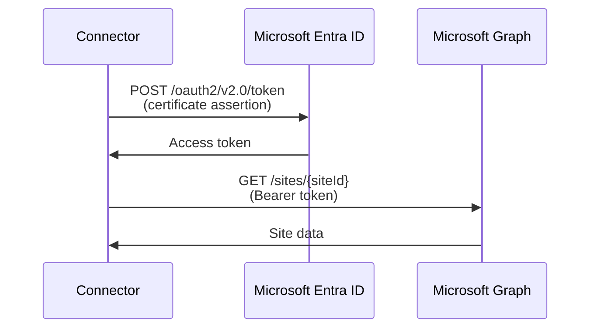

<!-- confluence-page-id: 1953366069 -->
<!-- confluence-space-key: PUBDOC -->

## Overview

The SharePoint Connector authenticates with Microsoft services using an Entra ID (Azure AD) app registration with **application permissions** — it authenticates as itself rather than on behalf of a user. This allows scoped, auditable, non-interactive access to exactly the SharePoint content Unique needs to sync.

How the app registration is provisioned depends on your deployment model:

- **Unique SaaS** — Unique provisions and manages the registration; you grant admin consent and provide SharePoint details
- **Self-Hosted** — your organization provisions the registration, configures the certificate, and operates the connector

## Required Permissions

The app registration requests the following application permissions.

**Microsoft Graph** (content sync):

| Permission                          | Type        | Description                                                     |
| ----------------------------------- | ----------- | --------------------------------------------------------------- |
| `Sites.Selected`                    | Application | Fetch sites, folders, and content (site-specific access)        |
| `Lists.SelectedOperations.Selected` | Application | Fetch content from specific libraries (library-specific access) |

**Microsoft Graph** (permission sync — optional):

| Permission             | Type        | Description        |
| ---------------------- | ----------- | ------------------ |
| `GroupMember.Read.All` | Application | Read group members |
| `User.ReadBasic.All`   | Application | Read user details  |

**SharePoint REST API** (permission sync — optional):

| Permission       | Type        | Description                  |
| ---------------- | ----------- | ---------------------------- |
| `Sites.Selected` | Application | Read site groups and members |

For full justifications, see [Microsoft Graph Permissions](../technical/permissions.md).

## Unique SaaS

When Unique hosts the SharePoint Connector, Unique provisions and manages the Entra ID app registration. Granting admin consent is the only Azure-side action required from your organization. Once consent is in place, provide your SharePoint tenant and site details to Unique — see [Configuration](./configuration.md) for the required values.

### Multi Tenant

Grant admin consent using the shared Unique app registration:

```
https://login.microsoftonline.com/organizations/adminconsent?client_id=29a02f83-6586-429e-9a49-7af46db05f00
```

If your organization uses multiple Azure tenants, confirm you are granting consent for the correct directory. See [Grant tenant-wide admin consent to an application](https://learn.microsoft.com/en-us/entra/identity/enterprise-apps/grant-admin-consent) for a tenant-specific admin consent URL; use application (client) ID `29a02f83-6586-429e-9a49-7af46db05f00`.

### Single Tenant

For Single Tenant deployments, Unique provisions a **dedicated app registration per client**. There is no shared consent URL — contact [Unique Support or Solution Engineering](mailto:enterprise-support@unique.ch) to receive your organization-specific admin consent URL.

Unique uses per-client registrations because this model:

- **Segregates access** — each registration is scoped exclusively to that client's SharePoint environment; no cross-tenant access is possible
- **Limits blast radius** — a compromised or misconfigured registration cannot affect any other client
- **Controls permissions tightly** — the registration carries exactly the permissions required for the agreed scope, and no more
- **Allows per-client customization** — optional capabilities such as permission sync can be added or removed per registration without touching shared infrastructure

## Self-Hosted

When your organization hosts the SharePoint Connector, your team manages the full setup: Entra app registration, certificate creation, site access grants, and connector configuration.

### Authentication Methods

| Method        | Use Case                 | Recommended |
| ------------- | ------------------------ | ----------- |
| Certificate   | Production environments  | Yes         |
| Client Secret | Development/testing only | No          |

**Certificate authentication** is the recommended method for production — it uses an X.509 certificate to obtain OAuth2 access tokens from Entra ID. **OIDC is currently not supported.** Client secret remains a fallback for non-production use only and is discouraged for enterprise deployments.

### Setup Steps

#### 1. Create a Unique Service User

The connector requires a service user in Unique with the following permissions:

- `chat.admin.all`
- `chat.knowledge.read`
- `chat.knowledge.write`

**Steps:**

1. Navigate to ZITADEL
2. Create a new service user
3. Assign the required permissions
4. Note the user ID for configuration

For detailed instructions, see:

- [How To Configure A Service User](https://unique-ch.atlassian.net/wiki/spaces/PUBDOC/pages/1411023075)
- [Understand Roles and Permissions](https://unique-ch.atlassian.net/wiki/spaces/PUBDOC/pages/1411023168)

#### 2. Create Azure AD Application Registration

1. Go to [Azure Portal](https://portal.azure.com) → **Azure Active Directory** → **App registrations**
2. Click **New registration**:
   - Name: `Unique SharePoint Connector`
   - Supported account types: **Accounts in this organizational directory only**
   - Redirect URI: Leave empty
3. Note the **Application (client) ID** and **Directory (tenant) ID**
4. Go to **API permissions** → **Add a permission**:
   - Select **Microsoft Graph** → **Application permissions**:
     - Add `Sites.Selected` (site-specific access)
     - Add `Lists.SelectedOperations.Selected` (library-specific access)
   - If permission sync is enabled, also add:
     - `GroupMember.Read.All`
     - `User.ReadBasic.All`
   - Select **SharePoint** → **Application permissions**:
     - Add `Sites.Selected` (required for permission sync to read site groups)
5. Click **Grant admin consent for [Your Organization]**

#### 3. Create Azure AD Service Principal

The service principal enables the app registration to authenticate.

**Option 1: Admin consent URL**

Have an admin visit:

```
https://login.microsoftonline.com/{tenant-id}/v2.0/adminconsent
  ?client_id={your-app-id}
  &scope=https://graph.microsoft.com/.default
```

**Note:** Because this connector is a server-side application, the app registration typically has **no redirect/reply URL** configured. After granting consent, Microsoft may show an `AADSTS500113: No reply address is registered for the application` message. In this flow you can ignore it — verify success in Azure Portal → **Enterprise applications** → your app → **Permissions** where admin consent is marked as granted.

**Option 2: Azure CLI**

```bash
az ad sp create --id <app-id>
# Then: Azure Portal → Enterprise applications → Your app → Permissions → Grant admin consent for <tenant>
```

#### 4. Grant Site-Specific Access

The `Sites.Selected` permission requires explicit access grants per site.

**Via PowerShell (recommended):**

```powershell
# Install PnP PowerShell if needed
Install-Module -Name PnP.PowerShell -Scope CurrentUser

# Connect to SharePoint Admin
Connect-PnPOnline -Url "https://<tenant>-admin.sharepoint.com" -Interactive

# Grant site access to the app
Grant-PnPAzureADAppSitePermission `
  -AppId "<your-app-client-id>" `
  -DisplayName "Unique SharePoint Connector" `
  -Site "https://<tenant>.sharepoint.com/sites/<site-name>" `
  -Permissions Read

# Verify the grant
Get-PnPAzureADAppSitePermission -Site "https://<tenant>.sharepoint.com/sites/<site-name>"
```

**Repeat for each site** that should be synced.

**Via Graph Explorer:**

1. Open [Graph Explorer](https://developer.microsoft.com/en-us/graph/graph-explorer) and sign in as a SharePoint/Entra admin.
2. In **Modify permissions**, consent to `Sites.FullControl.All` (one-time admin action needed to grant `Sites.Selected` app permissions).
3. Grant site permission:

```http
POST https://graph.microsoft.com/v1.0/sites/{site-id}/permissions
Content-Type: application/json

{
  "roles": ["read"],
  "grantedToIdentities": [
    {
      "application": {
        "id": "{app-client-id}",
        "displayName": "Unique SharePoint Connector"
      }
    }
  ]
}
```

4. Verify: `GET https://graph.microsoft.com/v1.0/sites/{site-id}/permissions` — expect `200 OK` with your app ID.

#### 5. Grant Library-Specific Access

For more granular control, grant access to specific document libraries using `Lists.SelectedOperations.Selected`:

**Via PowerShell:**

```powershell
Grant-PnPAzureADAppSitePermission `
  -AppId "<your-app-client-id>" `
  -DisplayName "Unique SharePoint Connector" `
  -Site "https://<tenant>.sharepoint.com/sites/<site-name>" `
  -Permissions Read `
  -List "Documents"
```

**Via Graph Explorer:**

1. Open [Graph Explorer](https://developer.microsoft.com/en-us/graph/graph-explorer) and sign in as admin.
2. In **Modify permissions**, consent to `Sites.Read.All` (one-time admin action for list discovery and grant checks).
3. Resolve target library ID:

```http
GET https://graph.microsoft.com/v1.0/sites/{site-id}/lists
```

Find the target library where `"list": { "template": "documentLibrary" }` and copy its `id`.

4. Grant app access on the library:

```http
POST https://graph.microsoft.com/v1.0/sites/{site-id}/lists/{list-id}/permissions
Content-Type: application/json

{
  "roles": ["read"],
  "grantedTo": {
    "application": {
      "id": "{app-client-id}"
    }
  }
}
```

5. Verify: `GET https://graph.microsoft.com/v1.0/sites/{site-id}/lists/{list-id}/permissions` — expect `200 OK` with your app ID.

#### 6. Create Certificate

**Via OpenSSL:**

```bash
# Generate private key
openssl genrsa -out connector.key 2048

# Generate certificate signing request
openssl req -new -key connector.key -out connector.csr \
  -subj "/CN=Unique SharePoint Connector/O=Your Organization"

# Generate self-signed certificate (valid for 2 years)
openssl x509 -req -days 730 -in connector.csr \
  -signkey connector.key -out connector.crt

# Create PFX for Azure upload (optional)
openssl pkcs12 -export -out connector.pfx \
  -inkey connector.key -in connector.crt
```

CSR field recommendations when running `openssl req` interactively:

- **Common Name (CN):** Use a stable, descriptive name (e.g. `unique-sharepoint-connector-app`).
- **Organization (O):** Optional, but recommended for traceability.
- **Country/State/OU/Email:** Optional and not required by Entra for this flow.

**Via PowerShell:**

```powershell
$cert = New-SelfSignedCertificate `
  -Subject "CN=Unique SharePoint Connector" `
  -CertStoreLocation "Cert:\CurrentUser\My" `
  -KeyExportPolicy Exportable `
  -KeySpec Signature `
  -KeyLength 2048 `
  -KeyAlgorithm RSA `
  -HashAlgorithm SHA256 `
  -NotAfter (Get-Date).AddYears(2)

Export-Certificate -Cert $cert -FilePath "connector.cer"

$password = ConvertTo-SecureString -String "YourPassword" -Force -AsPlainText
Export-PfxCertificate -Cert $cert -FilePath "connector.pfx" -Password $password
```

**Format conversion (if needed):**

Different tooling may output `.pfx`, `.p12`, `.cer`, `.crt`, or PEM files. The connector requires an asymmetric private key and matching certificate material.

```bash
# Convert PFX/P12 to PEM bundle
openssl pkcs12 -in connector.pfx -out connector.pem -nodes

# Extract private key
openssl pkey -in connector.pem -out connector.key

# Extract certificate
openssl x509 -in connector.pem -out connector.crt
```

**Upload to Azure AD:**

1. Go to Azure Portal → **App registrations** → Your app
2. Select **Certificates & secrets**
3. Click **Upload certificate**
4. Upload the `.cer` or `.crt` file
5. Note the **Thumbprint (SHA)** — store it in your connector configuration where the certificate thumbprint is required.

### Authentication Reference

#### Microsoft Graph

The connector uses the app registration to obtain OAuth2 tokens via certificate assertion. Only certificate-based authentication is supported (OIDC is not available).


```mermaid
sequenceDiagram
    participant Connector
    participant EntraID as Microsoft Entra ID
    participant Graph as Microsoft Graph

    Connector->>EntraID: POST /oauth2/v2.0/token<br/>(certificate assertion)
    EntraID->>Connector: Access token

    Connector->>Graph: GET /sites/{siteId}<br/>(Bearer token)
    Graph->>Connector: Site data
```

Token endpoint:

```
https://login.microsoftonline.com/{tenantId}/oauth2/v2.0/token
```

#### SharePoint REST API

For permission sync, the connector also authenticates with the SharePoint REST API using the same certificate. Only certificate-based authentication is supported (OIDC is not available).

Token endpoint:

```
https://{tenant}.sharepoint.com
```

**Site group access requirements:** When using permission sync, the app principal must be able to read site group members. If "Who can view the membership of the group?" is **not** set to **Everyone**, the connector cannot read group members.

Mitigation options:

1. Set group visibility to "Everyone"
2. Add the app principal as a group member/owner
3. Grant Full Control to the app principal

## Troubleshooting

### Invalid Client Error

**Symptom:** `AADSTS700016: Application with identifier 'xxx' was not found`

**Causes:**
- App registration not found in the tenant
- Service principal not created
- Wrong tenant ID

**Resolution:**
1. Verify app registration exists
2. Create service principal via admin consent
3. Check tenant ID configuration

### Certificate Errors

**Symptom:** `AADSTS700027: Client assertion contains an invalid signature`

**Causes:**
- Wrong certificate uploaded to Azure
- Certificate expired
- Private key doesn't match certificate

**Resolution:**
1. Re-upload certificate to Azure AD
2. Generate new certificate if expired
3. Verify certificate and key match

### RS256 Asymmetric Key Error

**Symptom:** `secretOrPrivateKey must be an asymmetric key when using RS256`

**Cause:** The connector received key material in an unsupported format (for example a plain secret string instead of file-based PEM/asymmetric key content).

**Resolution:**
1. Provide the private key as file content in supported PEM/asymmetric format.
2. Ensure the key matches the uploaded certificate.
3. If using KeyVault-backed configuration, make sure the secret value contains valid key file content.

### Permission Denied

**Symptom:** `403 Forbidden` when accessing sites or libraries

**Causes:**
- `Sites.Selected` or `Lists.SelectedOperations.Selected` not granted for the target site/library
- Admin consent not completed
- **Permission scope mismatch:** The app registration has `Sites.Selected` but the admin granted **library-level** access (via `-List` parameter). Library-level grants require `Lists.SelectedOperations.Selected` — `Sites.Selected` alone does not cover them and will return 403.

**Resolution:**
1. Verify the app registration includes the correct permission for the type of grant issued:
   - Site-level grants → `Sites.Selected`
   - Library-level grants → `Lists.SelectedOperations.Selected`
   - Mixed → both permissions (recommended default)
2. Grant site or library access via PowerShell
3. Complete admin consent in Azure Portal

### TLS Certificate Validation Errors

**Symptom:** `UNABLE_TO_VERIFY_LEAF_SIGNATURE`, `SELF_SIGNED_CERT_IN_CHAIN`, or similar TLS errors when connecting to Microsoft APIs.

**Cause:** The pod's default trust store does not include the CA that signed the endpoint certificates. This typically happens in environments with a corporate proxy that re-signs TLS traffic or a custom PKI.

**Resolution:** Provide a CA bundle via the `NODE_EXTRA_CA_CERTS` environment variable:

```yaml
env:
  NODE_EXTRA_CA_CERTS: /app/certs/ca-bundle.pem
```

Mount the PEM file containing the additional CA certificates into the pod and point the variable to its path.

### Site Not Found

**Symptom:** `Site not found` or `404` errors

**Causes:**
- Incorrect site ID
- Site deleted or renamed
- No access to site

**Resolution:**
1. Verify site ID using Graph Explorer
2. Re-grant site access if renamed
3. Check site exists in SharePoint
