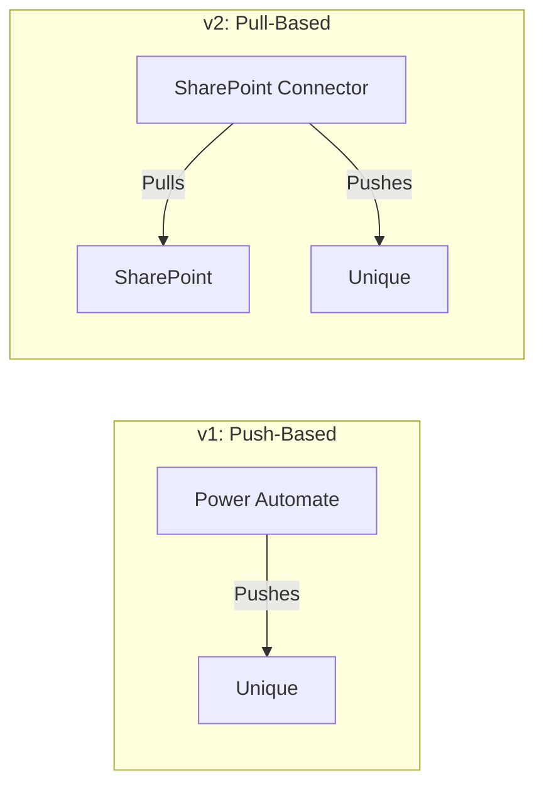
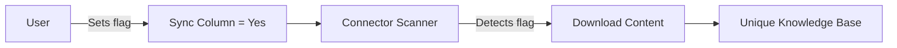

<!-- confluence-space-key: PUBDOC -->

The SharePoint Connector is a Node.js-based service that integrates Microsoft SharePoint Online with the Unique platform. It periodically scans configured SharePoint sites, downloads flagged documents, and ingests them into the Unique knowledge base.

**Core Capabilities:**

- Fetches content from Microsoft Graph API and SharePoint REST API
- Processes and forwards content to Unique AI's APIs
- Handles authentication through Azure AD (Microsoft Entra ID)
- Manages permission synchronization between SharePoint and Unique
- Operates on a configurable schedule (default: every 15 minutes)

## Documentation

| Document | Description |
|----------|-------------|
| [Architecture](./architecture.md) | System components, hosting models, connectivity |
| [Flows](./flows.md) | Content sync, permission sync, file diff mechanism |
| [Permissions](./permissions.md) | Microsoft Graph and SharePoint REST API permissions |
| [Security](./security.md) | Security updates, reports, and SBOM |

## Key Concepts

### Pull-Based Architecture

Unlike the previous Power Automate-based connector (v1) which used push-based principles, the SharePoint Connector v2 **pulls** information from SharePoint:

**Benefits:**

- No dependencies on Power Automate licensing
- Full control over sync timing and behavior
- Better visibility into sync operations
- Containerized deployment model

### Selective Sync via Column Flag

Documents are not automatically synced. Users must explicitly flag documents by setting a custom column value:

### File Diff Mechanism

The connector maintains state to detect changes:

- **New files**: Flagged files not previously synced
- **Modified files**: Files with changed content hash or metadata
- **Deleted files**: Previously synced files no longer flagged or deleted from SharePoint

See [File Diff Flow](./flows.md#file-diff-mechanism) for details.

## Related Documentation

- [Operator Guide](../operator/README.md) - Deployment and operations
- [FAQ](../faq.md) - Frequently asked questions
- [SharePoint Connector Overview](../README.md) - End-user documentation

## Standard References

- [Microsoft Graph API](https://learn.microsoft.com/en-us/graph/overview) - Graph API overview
- [SharePoint REST API](https://learn.microsoft.com/en-us/sharepoint/dev/sp-add-ins/get-to-know-the-sharepoint-rest-service) - SharePoint REST service
- [Microsoft Entra ID](https://learn.microsoft.com/en-us/entra/identity/) - Authentication and authorization
