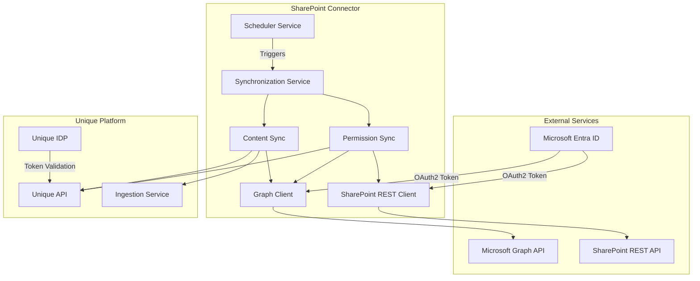
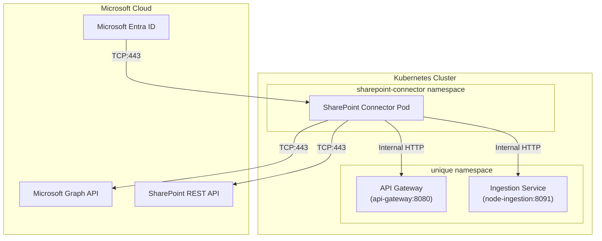
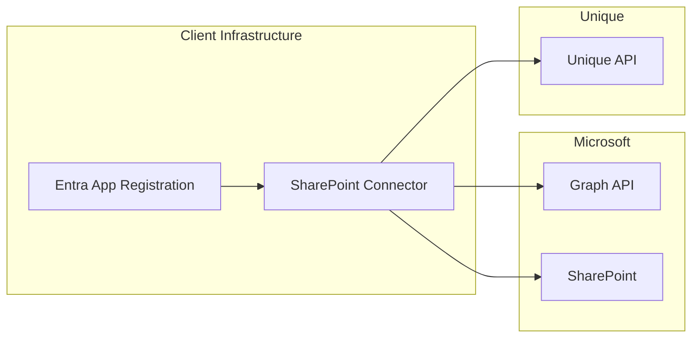

<!-- confluence-space-key: PUBDOC -->

## High-Level Architecture



## Key Components

### In Short

- The system reads content and permissions from Microsoft Graph and SharePoint REST API, processes it, and pushes it into Unique AI
- All communication is secure, well-defined, and limited to known ports and protocols
- The design aligns with typical financial-sector network security expectations
- SharePoint REST API is only needed if permission sync is enabled
- Site configurations can be loaded from a static YAML file or dynamically from a SharePoint list

### Dynamic Site Configuration

The connector supports two configuration sources:

- **Static (YAML):** Site configurations are defined in the tenant configuration file using `sitesSource: config_file`
- **Dynamic (SharePoint List):** Site configurations are read from a designated SharePoint list using `sitesSource: sharepoint_list`

When using SharePoint list configuration:
- Each row in the list represents a site to sync
- Changes to the list take effect on the next sync cycle
- No connector restart required for configuration changes

### Microsoft Graph (External SaaS)

- Provides authentication, authorization, SharePoint content, and permission information
- Accessed securely over the internet
- **Traffic:**
  - UDP/TCP:53 (DNS) - for name resolution
  - TCP:443 (HTTPS) - for API communication
- **Direction:** Outbound (Egress) from the connector

### SharePoint REST (External SaaS)

- Provides site-specific permissions and group member information
- Only used when permission sync is enabled
- Accessed securely over the internet
- **Traffic:**
  - UDP/TCP:53 (DNS) - for name resolution
  - TCP:443 (HTTPS) - for API communication
- **Direction:** Outbound (Egress) from the connector

### SharePoint Connector (Internal Service, Node.js)

- Fetches content from Microsoft Graph and SharePoint REST API
- Processes and forwards content to Unique AI's APIs
- Handles authentication through the Unique IDP
- **Traffic:**
  - Outbound HTTPS to Microsoft Graph (TCP:443)
  - Outbound HTTPS to SharePoint REST (TCP:443)
  - Internal HTTPS to Unique AI (TCP:443)
  - DNS lookups (UDP/TCP:53)

### Unique AI (Internal Service)

- Core content ingestion and API service
- Receives processed data from the SharePoint Connector
- Serves APIs used by other internal or external systems
- **Traffic:**
  - Receives HTTPS (TCP:443) requests from the connector
  - Uses internal DNS (UDP/TCP:53)

### Unique IDP (Identity Provider)

- Manages authentication for Unique AI APIs
- **Traffic:**
  - TCP:443 (HTTPS) for token retrieval
  - UDP/TCP:53 (DNS) for resolution

## Cluster-Internal Deployment

When deployed inside the same Kubernetes cluster as Unique services:



In cluster-internal mode:

- Zitadel token validation is not needed
- Services communicate securely within the cluster
- Company and user scope is maintained via request headers:
  - `x-company-id`
  - `x-user-id`

## Multi-Origin Support

**Note:** Multi-origin support is not available until after version `2.0.0` GA.

### Scenarios

| Alias | Scenario | As of Version |
|-------|----------|---------------|
| Same Microsoft tenant / **multiple SharePoints** | Client has multiple SharePoint instances to sync | Not yet supported |
| **Multiple Microsoft tenants** / multiple SharePoints | Connect different tenants to Unique | Not yet supported |

### Multi-Origin Until Supported

Until native multi-origin support is available, clients can achieve the same functionality by deploying the connector multiple times, each configured for a different origin/SharePoint.

## Container Platform

The connector runs on any container orchestrator. Unique provides a versioned Helm chart for Kubernetes deployment.

Clients desiring to run the connector outside Kubernetes can use the Helm chart as documentation and inspiration.

## Connectivity

All external communication is encrypted via HTTPS (TCP:443).

### Authentication Endpoint

```
https://login.microsoftonline.com/{tenantId}/oauth2/v2.0/token
```

Used to obtain OAuth2 tokens for Microsoft Graph and SharePoint REST APIs.

### Microsoft Graph Endpoints

| Endpoint | Use Case |
|----------|----------|
| `graph.microsoft.com/v1.0/sites/{siteId}` | Fetch site information |
| `graph.microsoft.com/v1.0/sites/{siteId}/drives` | Fetch document libraries |
| `graph.microsoft.com/v1.0/drives/{driveId}/items/{itemId}/children` | Fetch folder contents |
| `graph.microsoft.com/v1.0/drives/{driveId}/items/{itemId}/content` | Download file content |
| `graph.microsoft.com/v1.0/sites/{siteId}/lists` | Fetch site lists (for ASPX pages) |
| `graph.microsoft.com/v1.0/drives/{driveId}/items/{itemId}/permissions` | Fetch item permissions |
| `graph.microsoft.com/v1.0/groups/{groupId}/members` | Fetch group members |

### SharePoint REST Endpoints (Permission Sync Only)

| Endpoint | Use Case |
|----------|----------|
| `{tenant}.sharepoint.com/sites/{siteName}/_api/web/sitegroups/getById({groupId})` | Fetch site group details |
| `{tenant}.sharepoint.com/sites/{siteName}/_api/web/sitegroups/getById({groupId})/users` | Fetch site group members |

## Hosting Models

### Self-Hosted (SH)



| Aspect | Responsibility |
|--------|---------------|
| Connector hosting | Client |
| Entra App Registration | Client |
| Unique deliverable | Container image, Helm chart, documentation |

### Single-Tenant: Client-Hosted

Client uses Unique Single Tenant but hosts the connector:

- Suitable for isolated/on-premise SharePoints
- Client manages both connector and Entra App Registration
- Connector connects to Unique via external API

### Single-Tenant: Unique-Hosted

Unique hosts the connector on behalf of the client:

- Unique provides App ID (client ID) of the Entra App Registration
- Client provides:
  - SharePoint URL
  - Tenant ID
  - Site configuration (one of):
    - Site IDs and settings via YAML configuration, or
    - SharePoint list location for dynamic configuration

## System Scalability and Resource Sizing

The Node.js service operates with the following resource allocation:

- Memory allocation: approximately 2 GB
- CPU allocation: 1 core

These settings ensure the service has sufficient capacity for expected workloads.

**Note:** The connector is an IO-driven, low CPU workload. Unique AI ingestion services are typically the bottleneck, depending on embedding models used.

## Related Documentation

- [Flows](./flows.md) - Content sync, permission sync, file diff mechanism
- [Permissions](./permissions.md) - Microsoft Graph and SharePoint REST permissions
- [Security](./security.md) - Security updates and SBOM
- [Operator Guide](../operator/README.md) - Deployment and operations

## Standard References

- [Microsoft Graph API](https://learn.microsoft.com/en-us/graph/overview) - Graph API documentation
- [SharePoint REST API](https://learn.microsoft.com/en-us/sharepoint/dev/sp-add-ins/get-to-know-the-sharepoint-rest-service) - SharePoint REST documentation
- [Microsoft Entra ID](https://learn.microsoft.com/en-us/entra/identity/) - Authentication documentation
