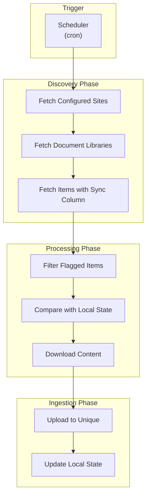
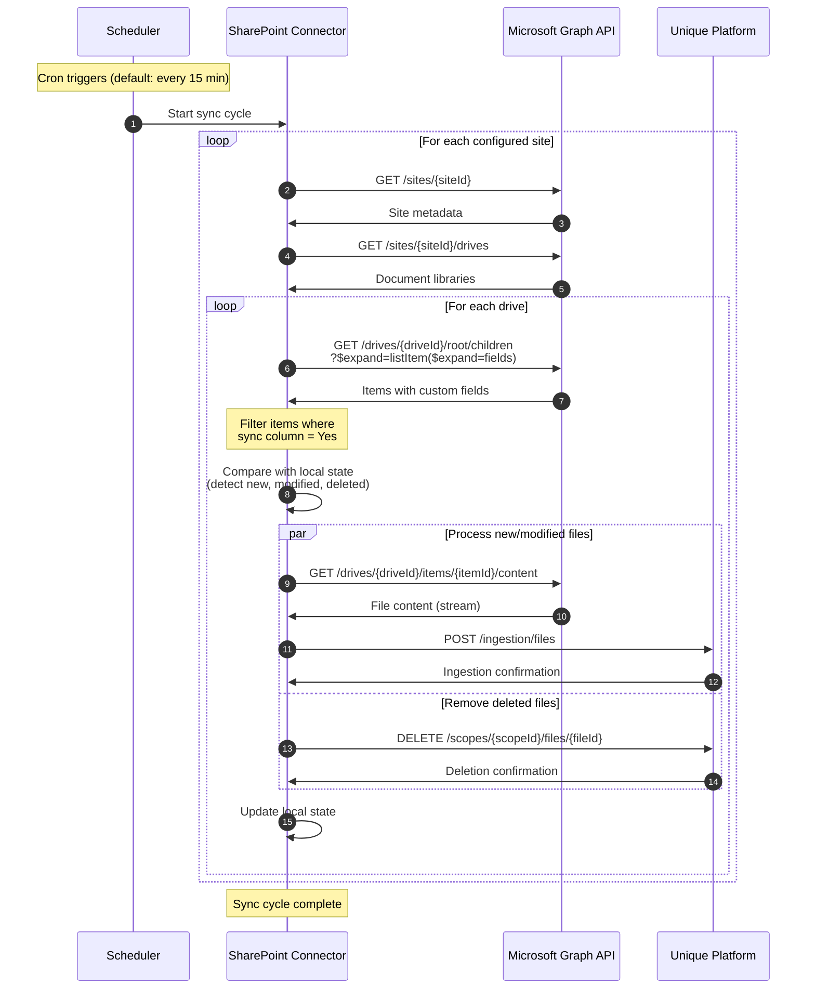
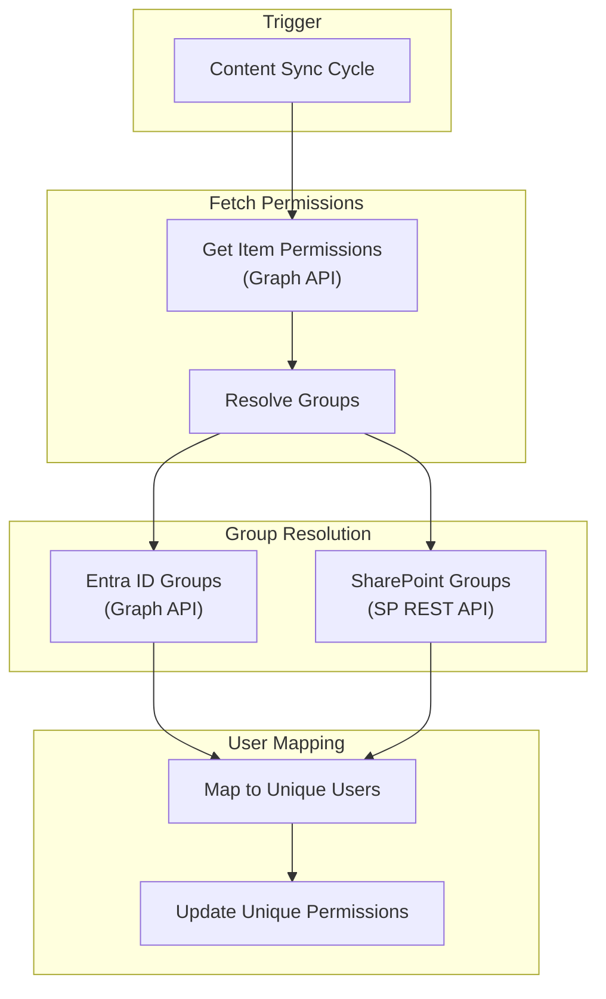
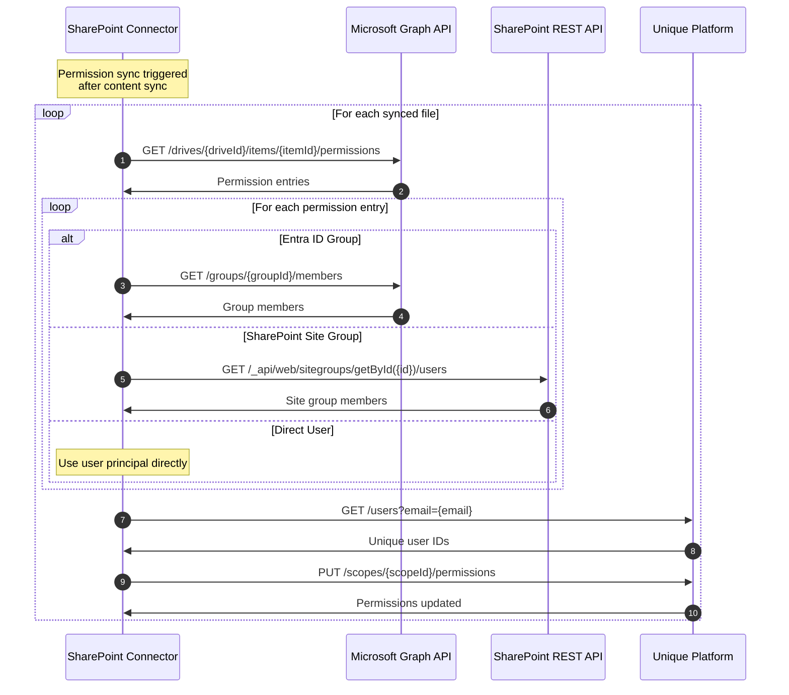
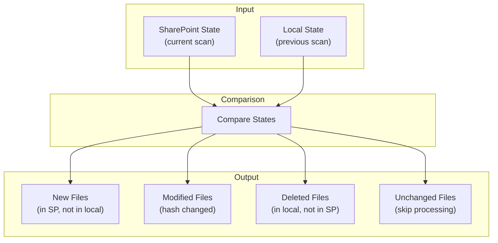
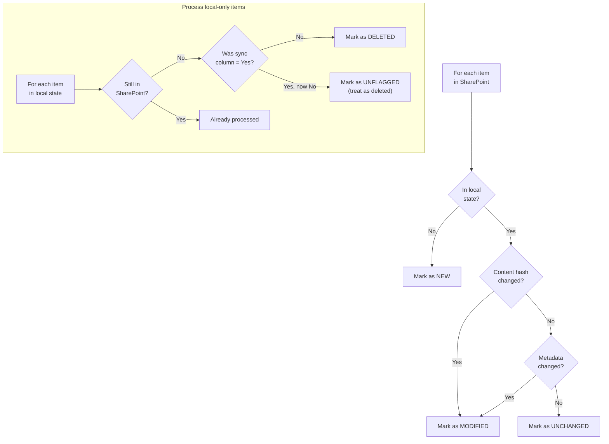
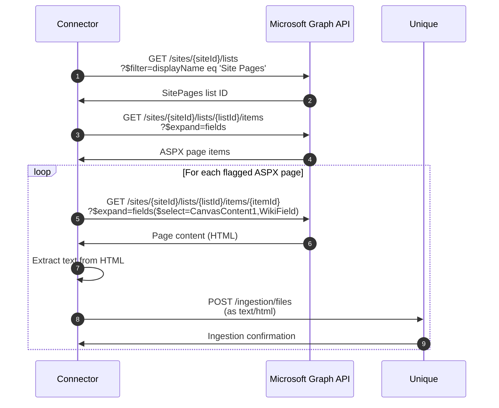
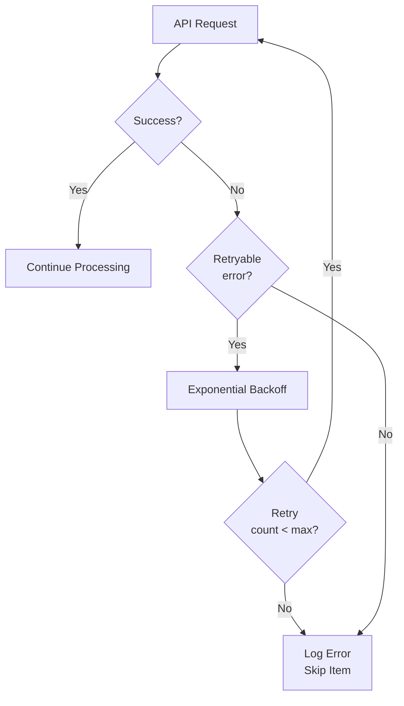

<!-- confluence-page-id: 1952546867 -->
<!-- confluence-space-key: PUBDOC -->

## Content Sync Flow

The content sync flow runs periodically (default: every 15 minutes) to synchronize flagged documents from SharePoint to Unique.

### Overview

### Sequence Diagram

## Permission Sync Flow

When enabled, the permission sync flow synchronizes SharePoint permissions to Unique.

### Overview

### Sequence Diagram

### Permission Types

The connector handles different permission sources:

| Source | API | Resolution |
|--------|-----|------------|
| Direct user grant | Graph API | Map email to Unique user |
| Entra ID (Azure AD) group | Graph API | Expand group members |
| SharePoint site group | SharePoint REST | Expand group members |
| Sharing link | Graph API | Extract grantees |

### Group Visibility Requirement

IMPORTANT: For SharePoint site groups, the connector must be able to read group members. If "Who can view the membership of the group?" is **not** set to "Everyone", the connector cannot read members.

**Mitigation:**

- Set group visibility to "Everyone"
- Add app principal as group member/owner
- Grant Full Control to app principal

### Public Site and Tenant-Wide Groups

For public SharePoint sites, permissions can include tenant-wide principals such as `Everyone` or `Everyone except external users`. The connector does not expand these principals for sync. As a result, content may be accessible in SharePoint while corresponding tenant-wide visibility is not mirrored in Unique permissions.

## File Diff Mechanism

The connector maintains local state to detect changes between sync cycles.

### State Comparison

### Change Detection Logic

### State Attributes

| Attribute | Description | Used For |
|-----------|-------------|----------|
| `itemId` | SharePoint item ID | Unique identifier |
| `driveId` | Document library ID | Scope identification |
| `contentHash` | SHA-256 of content | Change detection |
| `lastModified` | Last modification timestamp | Change detection |
| `syncColumnValue` | Current flag state | Unflag detection |
| `uniqueFileId` | Unique platform file ID | Deletion |

## ASPX Page Processing

SharePoint site pages (`.aspx`) require special handling:

### ASPX Sync Flow

### Content Extraction

ASPX pages contain structured content in special fields:

| Field | Content Type | Description |
|-------|--------------|-------------|
| `CanvasContent1` | JSON/HTML | Modern page web parts |
| `WikiField` | HTML | Classic wiki content |

The connector extracts text content from these fields for ingestion.

## Error Handling

### Error Handling Strategy

The connector applies scenario-specific behavior to keep sync cycles stable while avoiding incorrect permission or content updates:

| Scenario | Typical Cause | Connector Behavior |
|----------|---------------|--------------------|
| Authentication/configuration error | Invalid certificate, wrong tenant/app configuration | Fail the current cycle early, log actionable error, require operator fix |
| Transient API/network error | 429/5xx, temporary network failures | Retry with backoff up to retry limit, then skip affected item and continue |
| Permission denied (`403`) | Missing site/library grant or group visibility restriction | Skip affected item/permission sync path and continue remaining work |
| Not found (`404`) | Item deleted/renamed or stale state | Treat as deleted where applicable and reconcile local state |
| Malformed/unsupported content | Corrupt file or parser failure | Log item-level error, skip item, continue cycle |

### Retry Logic

### Retryable Errors

| Error Code | Description | Retry |
|------------|-------------|-------|
| 429 | Rate limited | Yes (with backoff) |
| 500 | Server error | Yes |
| 502 | Bad gateway | Yes |
| 503 | Service unavailable | Yes |
| 504 | Gateway timeout | Yes |
| 401 | Unauthorized | Yes (refresh token) |

### Non-Retryable Errors

| Error Code | Description | Action |
|------------|-------------|--------|
| 400 | Bad request | Skip item, log error |
| 403 | Forbidden | Skip item, log error |
| 404 | Not found | Mark as deleted |

## Related Documentation

- [Architecture](./architecture.md) - System components and infrastructure
- [Permissions](./permissions.md) - Required API permissions
- [Configuration](../operator/configuration.md) - Scheduler and processing settings

## Standard References

- [Microsoft Graph API - DriveItem](https://learn.microsoft.com/en-us/graph/api/resources/driveitem) - DriveItem resource
- [Microsoft Graph API - Permissions](https://learn.microsoft.com/en-us/graph/api/driveitem-list-permissions) - List permissions
- [SharePoint REST API](https://learn.microsoft.com/en-us/sharepoint/dev/sp-add-ins/get-to-know-the-sharepoint-rest-service) - REST service overview
