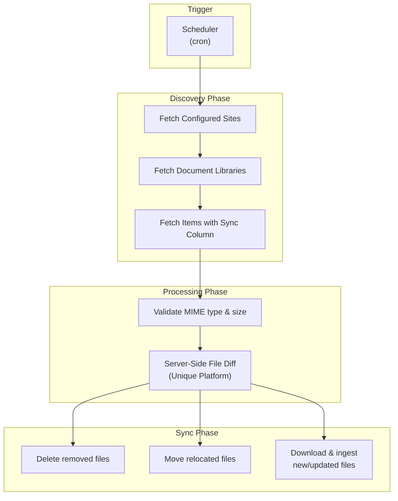
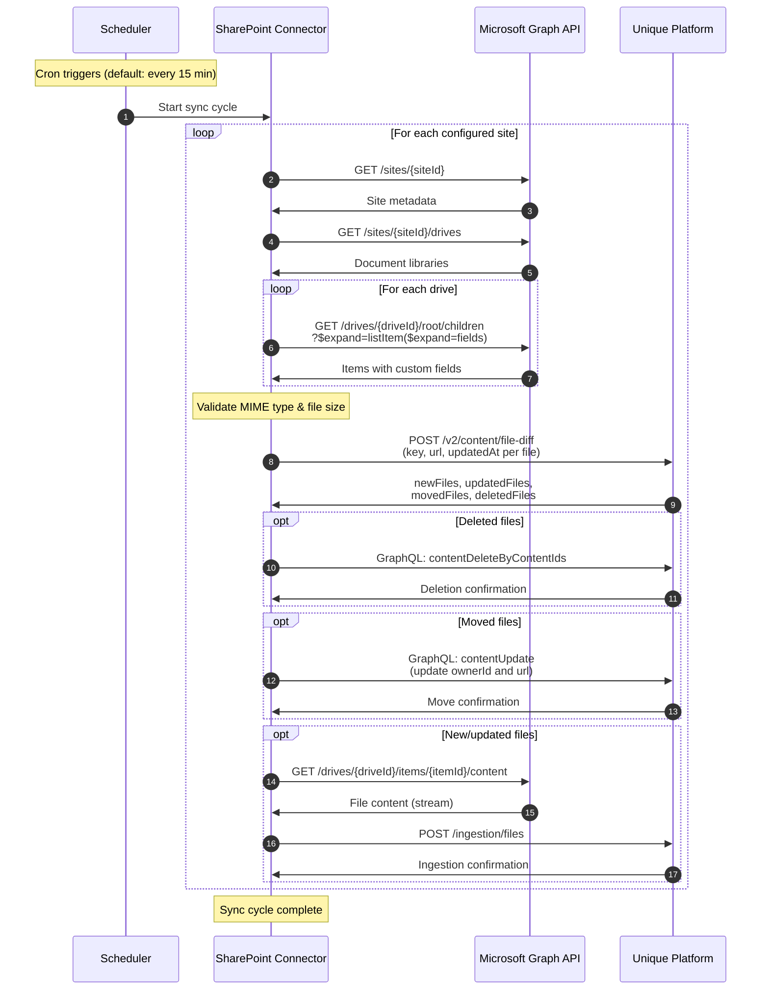
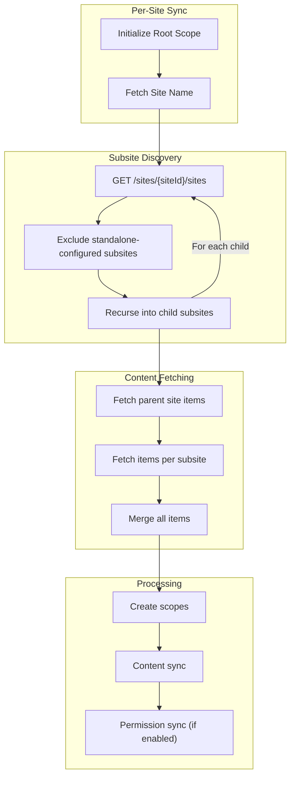
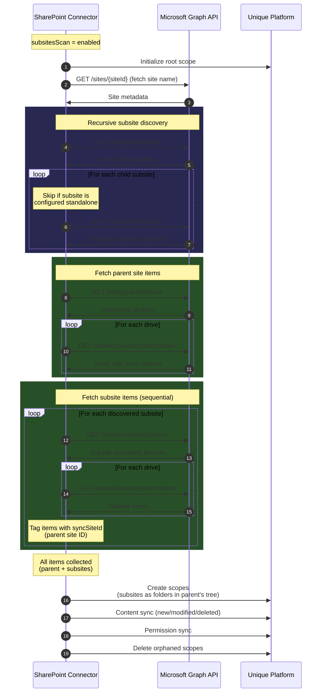
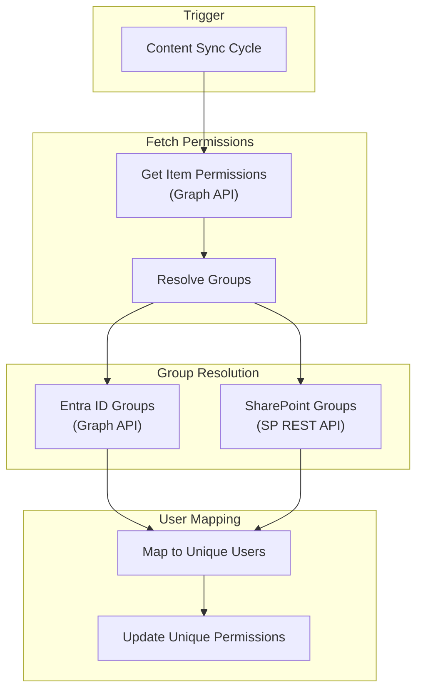
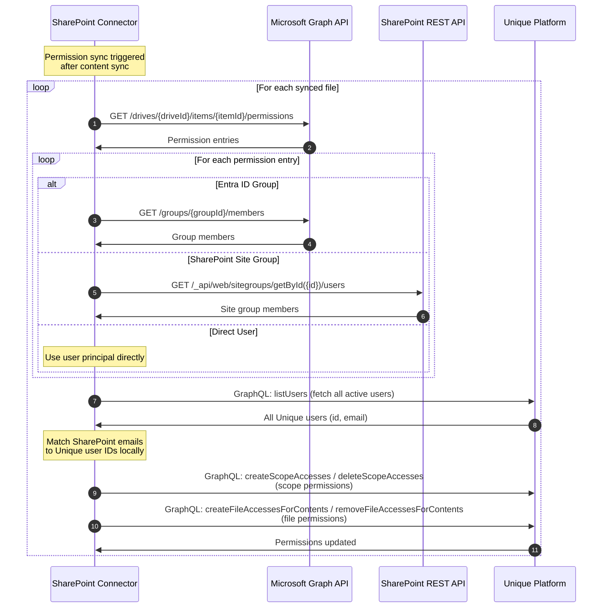
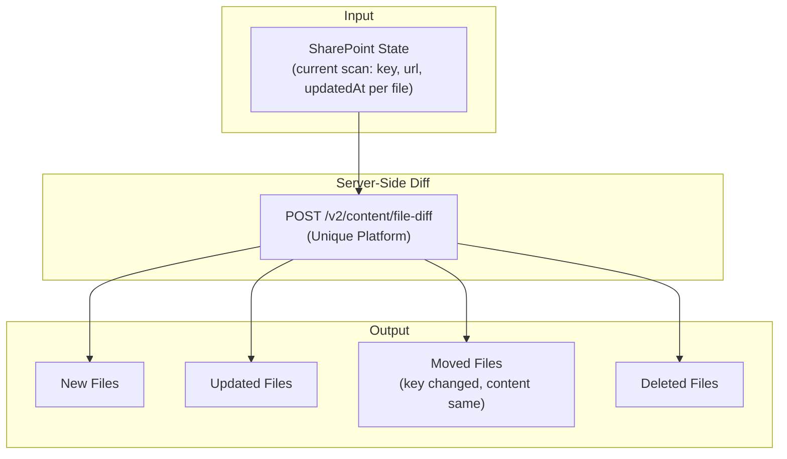
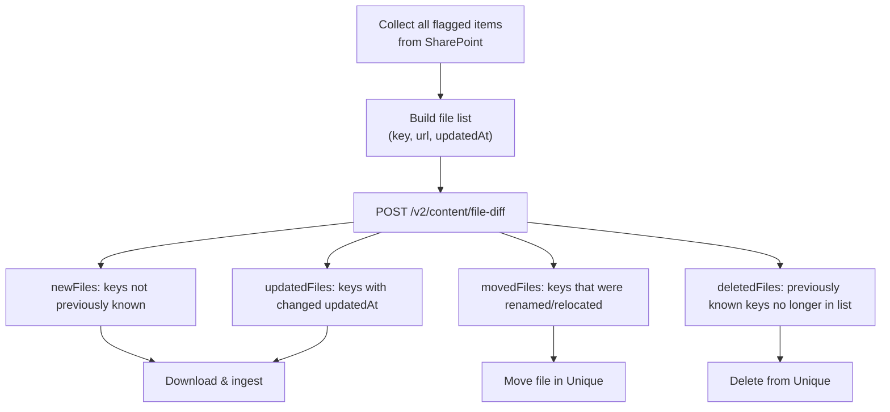
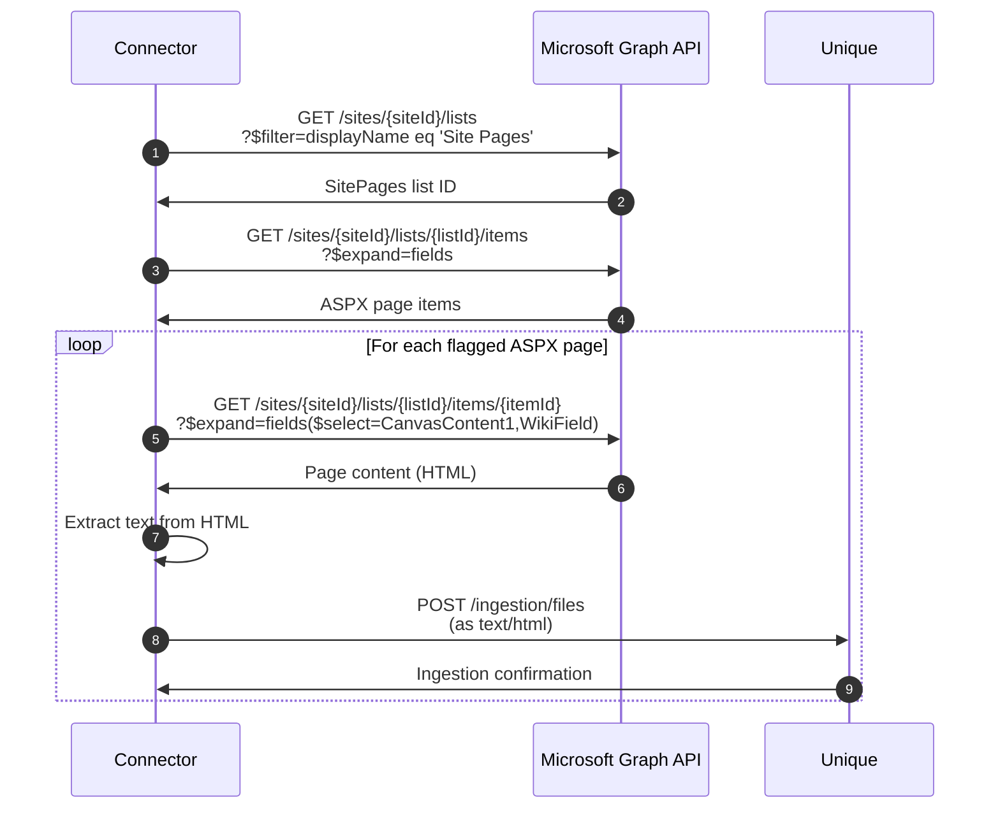
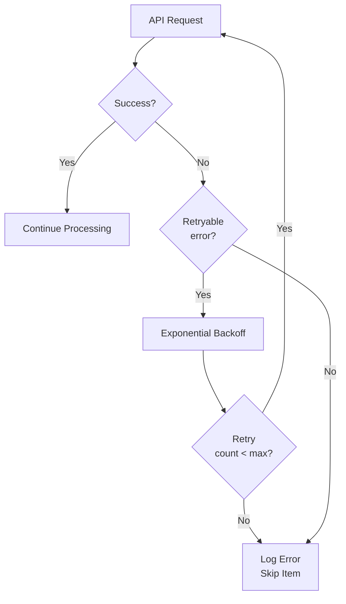

<!-- confluence-page-id: 1952546867 -->
<!-- confluence-space-key: PUBDOC -->

## Content Sync Flow

The content sync flow runs periodically (default: every 15 minutes) to synchronize flagged documents from SharePoint to Unique.

### Overview

```mermaid
flowchart TB
    subgraph Trigger["Trigger"]
        Scheduler["Scheduler<br/>(cron)"]
    end

    subgraph Discovery["Discovery Phase"]
        FetchSites["Fetch Configured Sites"]
        FetchDrives["Fetch Document Libraries"]
        FetchItems["Fetch Items with Sync Column"]
    end

    subgraph Processing["Processing Phase"]
        Validate["Validate MIME type & size"]
        Diff["Server-Side File Diff<br/>(Unique Platform)"]
    end

    subgraph Sync["Sync Phase"]
        Delete["Delete removed files"]
        Move["Move relocated files"]
        Ingest["Download & ingest<br/>new/updated files"]
    end

    Scheduler --> FetchSites
    FetchSites --> FetchDrives
    FetchDrives --> FetchItems
    FetchItems --> Validate
    Validate --> Diff
    Diff --> Delete
    Diff --> Move
    Diff --> Ingest
```

### Sequence Diagram

The connector is **stateless** — it does not maintain local state between sync cycles. Change detection is performed by the Unique platform's file diff API.

```mermaid
sequenceDiagram
    autonumber
    participant Scheduler
    participant Connector as SharePoint Connector
    participant Graph as Microsoft Graph API
    participant Unique as Unique Platform

    Note over Scheduler: Cron triggers (default: every 15 min)
    Scheduler->>Connector: Start sync cycle

    loop For each configured site
        Connector->>Graph: GET /sites/{siteId}
        Graph->>Connector: Site metadata

        Connector->>Graph: GET /sites/{siteId}/drives
        Graph->>Connector: Document libraries

        loop For each drive
            Connector->>Graph: GET /drives/{driveId}/root/children<br/>?$expand=listItem($expand=fields)
            Graph->>Connector: Items with custom fields
        end

        Note over Connector: Validate MIME type & file size

        Connector->>Unique: POST /v2/content/file-diff<br/>(key, url, updatedAt per file)
        Unique->>Connector: newFiles, updatedFiles,<br/>movedFiles, deletedFiles

        opt Deleted files
            Connector->>Unique: GraphQL: contentDeleteByContentIds
            Unique->>Connector: Deletion confirmation
        end

        opt Moved files
            Connector->>Unique: GraphQL: contentUpdate<br/>(update ownerId and url)
            Unique->>Connector: Move confirmation
        end

        opt New/updated files
            Connector->>Graph: GET /drives/{driveId}/items/{itemId}/content
            Graph->>Connector: File content (stream)
            Connector->>Unique: POST /ingestion/files
            Unique->>Connector: Ingestion confirmation
        end
    end

    Note over Connector: Sync cycle complete
```

## Subsite Discovery and Sync Flow

When `subsitesScan` is enabled for a site, the connector extends the per-site content sync with recursive subsite discovery and content fetching. All steps run sequentially.

### Overview

```mermaid
flowchart TB
    subgraph SiteSync["Per-Site Sync"]
        InitScope["Initialize Root Scope"]
        FetchSiteName["Fetch Site Name"]
    end

    subgraph SubsiteDiscovery["Subsite Discovery"]
        ListSubsites["GET /sites/{siteId}/sites"]
        FilterConfigured["Exclude standalone-configured subsites"]
        Recurse["Recurse into child subsites"]
    end

    subgraph ContentFetch["Content Fetching"]
        FetchParentItems["Fetch parent site items"]
        FetchSubsiteItems["Fetch items per subsite"]
        MergeItems["Merge all items"]
    end

    subgraph Processing["Processing"]
        Scopes["Create scopes"]
        ContentSync["Content sync"]
        PermSync["Permission sync (if enabled)"]
    end

    InitScope --> FetchSiteName
    FetchSiteName --> ListSubsites
    ListSubsites --> FilterConfigured
    FilterConfigured --> Recurse
    Recurse -->|"For each child"| ListSubsites
    Recurse --> FetchParentItems

    FetchParentItems --> FetchSubsiteItems
    FetchSubsiteItems --> MergeItems

    MergeItems --> Scopes
    Scopes --> ContentSync
    ContentSync --> PermSync
```

### Sequence Diagram

```mermaid
sequenceDiagram
    autonumber
    participant Connector as SharePoint Connector
    participant Graph as Microsoft Graph API
    participant Unique as Unique Platform

    Note over Connector: subsitesScan = enabled

    Connector->>Unique: Initialize root scope
    Connector->>Graph: GET /sites/{siteId} (fetch site name)
    Graph->>Connector: Site metadata

    rect rgb(40, 40, 80)
        Note over Connector,Graph: Recursive subsite discovery
        Connector->>Graph: GET /sites/{siteId}/sites
        Graph->>Connector: Direct child subsites

        loop For each child subsite
            Note over Connector: Skip if subsite is<br/>configured standalone
            Connector->>Graph: GET /sites/{childId}/sites
            Graph->>Connector: Nested subsites (recurse)
        end
    end

    rect rgb(40, 80, 40)
        Note over Connector,Graph: Fetch parent site items
        Connector->>Graph: GET /sites/{siteId}/drives
        Graph->>Connector: Document libraries
        loop For each drive
            Connector->>Graph: GET /drives/{driveId}/root/children
            Graph->>Connector: Items with sync column
        end
    end

    rect rgb(40, 80, 40)
        Note over Connector,Graph: Fetch subsite items (sequential)
        loop For each discovered subsite
            Connector->>Graph: GET /sites/{subsiteId}/drives
            Graph->>Connector: Subsite document libraries
            loop For each drive
                Connector->>Graph: GET /drives/{driveId}/root/children
                Graph->>Connector: Subsite items
            end
            Note over Connector: Tag items with syncSiteId<br/>(parent site ID)
        end
    end

    Note over Connector: All items collected<br/>(parent + subsites)

    Connector->>Unique: Create scopes<br/>(subsites as folders in parent's tree)
    Connector->>Unique: Content sync (new/modified/deleted)
    Connector->>Unique: Permission sync
    Connector->>Unique: Delete orphaned scopes
```

### Key Behaviors

- **Recursive discovery**: The connector walks the full subsite tree, not just direct children.
- **Deduplication**: Subsites already configured as standalone sites (via compound ID) are skipped along with their descendants.
- **Unified scope tree**: Subsite content is placed under the parent site's root scope. A subsite at path `ParentSite/SubA` creates scopes like `/RootScope/SubA/Documents/...`.
- **File diff keying**: Subsite items carry a `syncSiteId` pointing to the parent site. The file-diff mechanism uses this to scope all items (parent + subsites) under one diff key, ensuring correct deletion detection when subsites are removed.

## Permission Sync Flow

When enabled, the permission sync flow synchronizes SharePoint permissions to Unique.

### Overview

```mermaid
flowchart TB
    subgraph Trigger["Trigger"]
        SyncCycle["Content Sync Cycle"]
    end

    subgraph FetchPerms["Fetch Permissions"]
        ItemPerms["Get Item Permissions<br/>(Graph API)"]
        ResolveGroups["Resolve Groups"]
    end

    subgraph GroupResolution["Group Resolution"]
        EntraGroups["Entra ID Groups<br/>(Graph API)"]
        SPGroups["SharePoint Groups<br/>(SP REST API)"]
    end

    subgraph UserMapping["User Mapping"]
        MapUsers["Map to Unique Users"]
        UpdatePerms["Update Unique Permissions"]
    end

    SyncCycle --> ItemPerms
    ItemPerms --> ResolveGroups
    ResolveGroups --> EntraGroups
    ResolveGroups --> SPGroups
    EntraGroups --> MapUsers
    SPGroups --> MapUsers
    MapUsers --> UpdatePerms
```

### Sequence Diagram

```mermaid
sequenceDiagram
    autonumber
    participant Connector as SharePoint Connector
    participant Graph as Microsoft Graph API
    participant SPREST as SharePoint REST API
    participant Unique as Unique Platform

    Note over Connector: Permission sync triggered<br/>after content sync

    loop For each synced file
        Connector->>Graph: GET /drives/{driveId}/items/{itemId}/permissions
        Graph->>Connector: Permission entries

        loop For each permission entry
            alt Entra ID Group
                Connector->>Graph: GET /groups/{groupId}/members
                Graph->>Connector: Group members
            else SharePoint Site Group
                Connector->>SPREST: GET /_api/web/sitegroups/getById({id})/users
                SPREST->>Connector: Site group members
            else Direct User
                Note over Connector: Use user principal directly
            end
        end

        Connector->>Unique: GraphQL: listUsers (fetch all active users)
        Unique->>Connector: All Unique users (id, email)
        Note over Connector: Match SharePoint emails<br/>to Unique user IDs locally

        Connector->>Unique: GraphQL: createScopeAccesses / deleteScopeAccesses <br/> (scope permissions)
        Connector->>Unique: GraphQL: createFileAccessesForContents / removeFileAccessesForContents <br/> (file permissions)
        Unique->>Connector: Permissions updated
    end
```

### Permission Types

The connector handles different permission sources:

| Source                    | API             | Resolution               |
| ------------------------- | --------------- | ------------------------ |
| Direct user grant         | Graph API       | Map email to Unique user |
| Entra ID (Azure AD) group | Graph API       | Expand group members     |
| SharePoint site group     | SharePoint REST | Expand group members     |
| Sharing link              | Graph API       | Extract grantees         |

### Group Visibility Requirement

IMPORTANT: For SharePoint site groups, the connector must be able to read group members. If "Who can view the membership of the group?" is **not** set to "Everyone", the connector cannot read members.

**Mitigation:**

- Set group visibility to "Everyone"
- Add app principal as group member/owner
- Grant Full Control to app principal

### Public Site and Tenant-Wide Groups

For public SharePoint sites, permissions can include tenant-wide principals such as `Everyone` or `Everyone except external users`. The connector does not expand these principals for sync. As a result, content may be accessible in SharePoint while corresponding tenant-wide visibility is not mirrored in Unique permissions.

## File Diff Mechanism

The connector uses the Unique platform's server-side file diff API (`/v2/content/file-diff`) to detect changes between sync cycles. The connector does **not** compute local content hashes — instead, it sends each file's `key`, `url`, and `updatedAt` timestamp to the diff endpoint, which returns categorized results.

### State Comparison

```mermaid
flowchart TB
    subgraph Input["Input"]
        SharePointState["SharePoint State<br/>(current scan: key, url, updatedAt per file)"]
    end

    subgraph Comparison["Server-Side Diff"]
        Compare["POST /v2/content/file-diff<br/>(Unique Platform)"]
    end

    subgraph Output["Output"]
        New["New Files"]
        Modified["Updated Files"]
        Moved["Moved Files<br/>(key changed, content same)"]
        Deleted["Deleted Files"]
    end

    SharePointState --> Compare
    Compare --> New
    Compare --> Modified
    Compare --> Moved
    Compare --> Deleted
```

### Change Detection Logic

```mermaid
flowchart TB
    Start["Collect all flagged items<br/>from SharePoint"] --> BuildList["Build file list<br/>(key, url, updatedAt)"]
    BuildList --> CallDiff["POST /v2/content/file-diff"]

    CallDiff --> NewFiles["newFiles: keys not previously known"]
    CallDiff --> UpdatedFiles["updatedFiles: keys with changed updatedAt"]
    CallDiff --> MovedFiles["movedFiles: keys that were renamed/relocated"]
    CallDiff --> DeletedFiles["deletedFiles: previously known keys no longer in list"]

    NewFiles --> Ingest["Download & ingest"]
    UpdatedFiles --> Ingest
    MovedFiles --> Move["Move file in Unique"]
    DeletedFiles --> Delete["Delete from Unique"]
```

### File Diff Item Attributes

Each item sent to the diff API contains:

| Attribute   | Description                                                               | Used For                     |
| ----------- | ------------------------------------------------------------------------- | ---------------------------- |
| `key`       | Unique key identifying the file (derived from SharePoint drive/item path) | Identity and change tracking |
| `url`       | SharePoint URL of the file                                                | Location tracking            |
| `updatedAt` | Last modification timestamp from SharePoint                               | Change detection             |

## ASPX Page Processing

SharePoint site pages (`.aspx`) require special handling:

### ASPX Sync Flow

```mermaid
sequenceDiagram
    autonumber
    participant Connector
    participant Graph as Microsoft Graph API
    participant Unique

    Connector->>Graph: GET /sites/{siteId}/lists<br/>?$filter=displayName eq 'Site Pages'
    Graph->>Connector: SitePages list ID

    Connector->>Graph: GET /sites/{siteId}/lists/{listId}/items<br/>?$expand=fields
    Graph->>Connector: ASPX page items

    loop For each flagged ASPX page
        Connector->>Graph: GET /sites/{siteId}/lists/{listId}/items/{itemId}<br/>?$expand=fields($select=CanvasContent1,WikiField)
        Graph->>Connector: Page content (HTML)

        Connector->>Connector: Extract text from HTML
        Connector->>Unique: POST /ingestion/files<br/>(as text/html)
        Unique->>Connector: Ingestion confirmation
    end
```

### Content Extraction

ASPX pages contain structured content in special fields:

| Field            | Content Type | Description           |
| ---------------- | ------------ | --------------------- |
| `CanvasContent1` | JSON/HTML    | Modern page web parts |
| `WikiField`      | HTML         | Classic wiki content  |

The connector extracts text content from these fields for ingestion.

## Error Handling

### Error Handling Strategy

The connector applies scenario-specific behavior to keep sync cycles stable while avoiding incorrect permission or content updates:

| Scenario                           | Typical Cause                                              | Connector Behavior                                                         |
| ---------------------------------- | ---------------------------------------------------------- | -------------------------------------------------------------------------- |
| Authentication/configuration error | Invalid certificate, wrong tenant/app configuration        | Fail the current cycle early, log actionable error, require operator fix   |
| Transient API/network error        | 429/5xx, temporary network failures                        | Retry with backoff up to retry limit, then skip affected item and continue |
| Permission denied (`403`)          | Missing site/library grant or group visibility restriction | Skip affected item/permission sync path and continue remaining work        |
| Not found (`404`)                  | Item deleted/renamed or stale state                        | Treat as deleted where applicable and reconcile local state                |
| Malformed/unsupported content      | Corrupt file or parser failure                             | Log item-level error, skip item, continue cycle                            |

### Retry Logic

```mermaid
flowchart TB
    Request["API Request"] --> Response{"Success?"}
    Response -->|Yes| Continue["Continue Processing"]
    Response -->|No| CheckRetry{"Retryable<br/>error?"}

    CheckRetry -->|Yes| Backoff["Exponential Backoff"]
    Backoff --> RetryCount{"Retry<br/>count < max?"}
    RetryCount -->|Yes| Request
    RetryCount -->|No| Fail["Log Error<br/>Skip Item"]

    CheckRetry -->|No| Fail
```

### Retryable Errors

| Error Code | Description         | Retry               |
| ---------- | ------------------- | ------------------- |
| 429        | Rate limited        | Yes (with backoff)  |
| 500        | Server error        | Yes                 |
| 502        | Bad gateway         | Yes                 |
| 503        | Service unavailable | Yes                 |
| 504        | Gateway timeout     | Yes                 |
| 401        | Unauthorized        | Yes (refresh token) |

### Non-Retryable Errors

| Error Code | Description | Action               |
| ---------- | ----------- | -------------------- |
| 400        | Bad request | Skip item, log error |
| 403        | Forbidden   | Skip item, log error |
| 404        | Not found   | Mark as deleted      |

## Related Documentation

- [Architecture](./architecture.md) - System components and infrastructure
- [Permissions](./permissions.md) - Required API permissions
- [Configuration](../operator/configuration.md) - Scheduler and processing settings

## Standard References

- [Microsoft Graph API - DriveItem](https://learn.microsoft.com/en-us/graph/api/resources/driveitem) - DriveItem resource
- [Microsoft Graph API - Permissions](https://learn.microsoft.com/en-us/graph/api/driveitem-list-permissions) - List permissions
- [SharePoint REST API](https://learn.microsoft.com/en-us/sharepoint/dev/sp-add-ins/get-to-know-the-sharepoint-rest-service) - REST service overview
