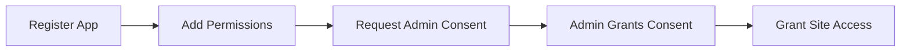

<!-- confluence-page-id: 1953399156 -->
<!-- confluence-space-key: PUBDOC -->


## Overview

The SharePoint Connector requires specific permissions to access Microsoft Graph API and SharePoint REST API. This document lists all required permissions with their use cases.

## Permission Summary

### Content Sync (Required)

| API | Permission | Type | Description |
|-----|------------|------|-------------|
| Microsoft Graph | `Sites.Selected` | Application | Access to specifically granted sites |
| Microsoft Graph | `Lists.SelectedOperations.Selected` | Application | Access to specifically granted document libraries |

**Note:** Use `Sites.Selected` for site-level access or `Lists.SelectedOperations.Selected` for more granular library-level access.

### Permission Sync (Optional)

| API | Permission | Type | Description |
|-----|------------|------|-------------|
| Microsoft Graph | `GroupMember.Read.All` | Application | Read group memberships |
| Microsoft Graph | `User.ReadBasic.All` | Application | Read basic user profiles |
| SharePoint REST | `Sites.Selected` | Application | Access site groups |

## Microsoft Graph Permissions

### Content Mode

These APIs are used for fetching SharePoint content:

| API Endpoint | Method | Use Case | Permission |
|--------------|--------|----------|------------|
| `/sites/{siteId}` | GET | Fetch site metadata | `Sites.Selected` |
| `/sites/{siteId}/drives` | GET | Fetch document libraries | `Sites.Selected` |
| `/drives/{driveId}/items/{itemId}/children` | GET | Fetch folder children | `Sites.Selected` |
| `/drives/{driveId}/items/{itemId}/content` | GET | Download file content | `Sites.Selected` |
| `/sites/{siteId}/lists` | GET | Find SitePages list | `Sites.Selected` |
| `/sites/{siteId}/lists/{listId}/items` | GET | List ASPX pages | `Sites.Selected` |
| `/sites/{siteId}/lists/{listId}/items/{itemId}` | GET | Get ASPX page content | `Sites.Selected` |

### Permission Mode

These APIs are used when permission sync is enabled:

| API Endpoint | Method | Use Case | Permission |
|--------------|--------|----------|------------|
| `/drives/{driveId}/items/{itemId}/permissions` | GET | Fetch file/folder permissions | `Sites.Selected` |
| `/sites/{siteId}/lists/{listId}/items/{itemId}/permissions` | GET | Fetch ASPX page permissions (beta) | `Sites.Selected` |
| `/groups/{groupId}/members` | GET | Read Entra ID group members | `GroupMember.Read.All`, `User.ReadBasic.All` |
| `/groups/{groupId}/owners` | GET | Read Entra ID group owners | `GroupMember.Read.All`, `User.ReadBasic.All` |

## SharePoint REST Permissions

These APIs are only used when permission sync is enabled:

| API Endpoint | Method | Use Case | Permission |
|--------------|--------|----------|------------|
| `/_api/web/sitegroups/getById({groupId})` | GET | Read site group details | `Sites.Selected` |
| `/_api/web/sitegroups/getById({groupId})/users` | GET | Read site group members | `Sites.Selected`* |

**Note:** *If "Who can view the membership of the group?" is **not** set to "Everyone", the connector cannot read group members. The app principal must be a member/owner of the group or hold Full Control.

### Public Sites and Tenant-Wide Visibility Groups

Public SharePoint sites may include tenant-wide principals such as `Everyone` and `Everyone except external users`. These principals are intentionally not expanded by the connector for permission sync. This can lead to expected differences where content is visible in SharePoint through tenant-wide visibility but not mirrored as broad visibility in Unique.

## Why Sites.Selected?

### Least Privilege Principle

`Sites.Selected` follows the principle of least privilege:

| Permission | Scope | Admin Control |
|------------|-------|---------------|
| `Sites.Read.All` | All sites in tenant | None (all sites exposed) |
| `Sites.ReadWrite.All` | All sites in tenant | None (all sites exposed) |
| `Sites.Selected` | Only granted sites | Per-site grants required |

### Benefits

- **Explicit access**: Each site must be explicitly granted
- **Auditability**: Clear record of which sites are accessible
- **Revocability**: Access can be revoked per-site
- **Compliance**: Meets enterprise security requirements

### Granting Sites.Selected Access

Access is granted via PowerShell:

```powershell
# Connect to SharePoint Admin
Connect-PnPOnline -Url "https://{tenant}-admin.sharepoint.com" -Interactive

# Grant access to a specific site
Grant-PnPAzureADAppSitePermission `
  -AppId "{client-id}" `
  -DisplayName "Unique SharePoint Connector" `
  -Site "https://{tenant}.sharepoint.com/sites/{site-name}" `
  -Permissions Write
```

See [Authentication Guide](../operator/authentication.md#grant-site-specific-access-sitesselected-permission) for detailed instructions.

## Permission Justification

### Sites.Selected

**Justification:** Required to read site structure, document libraries, and file content from specifically granted SharePoint sites.

**Why not Sites.Read.All?**

- `Sites.Read.All` grants access to all sites in the tenant
- Most organizations require explicit site-by-site access control
- `Sites.Selected` allows administrators to control exactly which sites are accessible

### Lists.SelectedOperations.Selected

**Justification:** For more granular access control at the document library level instead of the entire site.

**When to use?**

- When only specific document libraries need to be synced
- When site-level access is too broad for compliance requirements
- Combined with `Sites.Selected` for mixed access scenarios

### GroupMember.Read.All

**Justification:** Required to expand Entra ID (Azure AD) group memberships when syncing permissions.

**Why needed?**

- SharePoint permissions often reference Entra ID groups
- To sync permissions, the connector must resolve group members
- Without this permission, group-based permissions cannot be synced

### User.ReadBasic.All

**Justification:** Required to read basic profile information (email, display name) for permission mapping.

**Why needed?**

- Permission entries reference users by ID
- Connector needs email/username to map to Unique users
- Only basic profile fields are accessed (not full profile)

## Admin Consent

All permissions require admin consent because they are application permissions:



### Consent URL

```
https://login.microsoftonline.com/{tenant-id}/v2.0/adminconsent
  ?client_id={app-id}
  &scope=https://graph.microsoft.com/.default
```

## Application vs Delegated Permissions

The SharePoint Connector uses **application permissions** (not delegated):

| Aspect | Application | Delegated |
|--------|-------------|-----------|
| User context | None (service account) | Signed-in user |
| Consent | Admin only | User or admin |
| Access scope | As configured | Limited by user access |
| Use case | Background services | User-interactive apps |

**Why application permissions?**

- Connector runs as a background service
- No user is signed in during sync
- Consistent access regardless of individual user permissions

## Rate Limits

Microsoft Graph enforces rate limits:

| Limit Type | Value | Scope |
|------------|-------|-------|
| Requests per app | ~10,000 / 10 min | Per app registration |
| Concurrent requests | 4 per app per resource | Per resource type |

The connector respects these limits via:

- Configurable rate limiting (`GRAPH_API_RATE_LIMIT`)
- Exponential backoff on 429 responses
- Concurrent request limiting

## Related Documentation

- [Authentication](../operator/authentication.md) - Azure AD setup and permissions
- [Architecture](./architecture.md) - System components
- [Flows](./flows.md) - Permission sync flow details

## Standard References

- [Microsoft Graph Permissions Reference](https://learn.microsoft.com/en-us/graph/permissions-reference) - Complete permissions list
- [Sites.Selected Permission](https://learn.microsoft.com/en-us/graph/api/site-get?view=graph-rest-1.0&tabs=http#permissions) - Sites.Selected documentation
- [Application vs Delegated Permissions](https://learn.microsoft.com/en-us/azure/active-directory/develop/v2-permissions-and-consent) - Permission types explained
