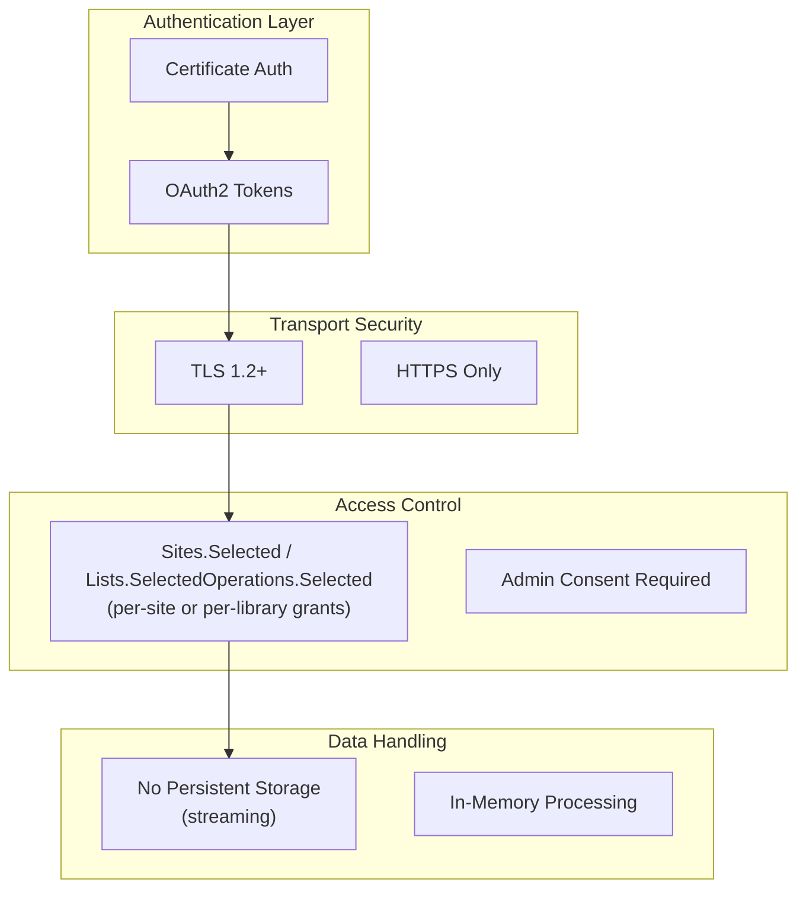

<!-- confluence-space-key: PUBDOC -->

## Overview

This document describes security practices, update policies, and the Software Bill of Materials (SBOM) for the SharePoint Connector.

## Security Architecture

## Security Principles

### Least Privilege Access

- **Sites.Selected / Lists.SelectedOperations.Selected**: Only access explicitly granted sites or libraries
- **No tenant-wide access**: Cannot access sites not specifically granted
- **Per-site/library revocation**: Access can be removed from individual sites or libraries

### Certificate-Based Authentication

- **X.509 certificates**: Industry-standard authentication
- **No shared secrets**: Certificate private keys never leave the connector
- **Rotation support**: Certificates can be rotated without service disruption

### Transport Security

- **TLS 1.2+**: All external communication encrypted
- **Certificate validation**: Server certificates validated
- **No plaintext**: No unencrypted data transmission

### Data Handling

- **Streaming transfers**: Files streamed, not stored locally
- **In-memory processing**: Data processed in memory
- **No persistent storage**: No local file storage of SharePoint content

## Compliance Considerations

### Data Residency

- Connector does not store SharePoint content persistently
- Data flows: SharePoint → Connector (memory) → Unique
- No intermediate storage

### Audit Logging

All operations are logged with:

- Timestamp
- Operation type
- Resource identifiers
- Success/failure status
- Error details (if applicable)

### Access Controls

| Control | Implementation |
|---------|----------------|
| Authentication | Certificate-based (X.509) |
| Authorization | Sites.Selected / Lists.SelectedOperations.Selected grants |
| Audit | Structured logging |
| Encryption | TLS 1.2+ in transit |

## Best Practices

### For Operators

1. **Rotate certificates** before expiration
2. **Review site grants** periodically
3. **Monitor logs** for anomalies
4. **Update promptly** when security patches released
5. **Use certificate authentication** for production environments

### For Security Teams

1. **Review SBOM** for each deployment
2. **Assess CVEs** against deployed version
3. **Audit site grants** for least privilege
4. **Monitor API usage** for anomalies
5. **Test in staging** before production updates

## Related Documentation

- [Authentication](../operator/authentication.md) - Certificate and auth setup
- [Configuration](../operator/configuration.md) - Security-related settings
- [Permissions](./permissions.md) - Required API permissions

## Standard References

- [Microsoft Security Best Practices](https://learn.microsoft.com/en-us/security/compass/compass) - Microsoft security guidance
- [OWASP Top 10](https://owasp.org/www-project-top-ten/) - Web application security risks
- [CycloneDX](https://cyclonedx.org/) - SBOM specification
- [SPDX](https://spdx.dev/) - Software Package Data Exchange
