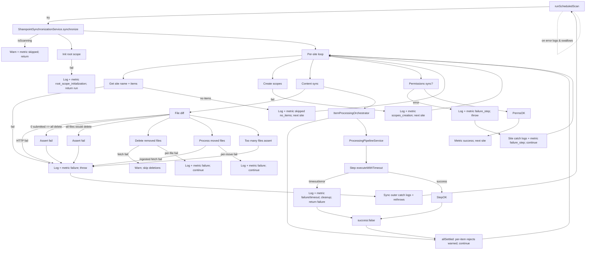

# SharePoint Connector — Complete Error Handling

## End-to-end Diagram

## Comprehensive Error Handling Table
Handling indicators: ❌ throw/rethrow · 🟦 swallow · 🟡 log/continue/return · 🟢 safe continue · ⚪ gap/not handled.
| # | Area | Step / Action | Error condition | Handling | Notes / Metrics | Code |
| --- | --- | --- | --- | --- | --- | --- |
| 1 | Entry | `main.ts` bootstrap | Startup failure | ❌ Bubbles (no local catch) | Process-level failure | `src/main.ts:11-30` |
| 2 | Entry | Scheduler onModuleInit | Trigger initial scan | 🟡 No guard (fires) | N/A | `src/scheduler/scheduler.service.ts:19-23` |
| 3 | Entry | `runScheduledScan` | Shutdown in progress | 🟢 Log & return (skip) | Skip scan | `src/scheduler/scheduler.service.ts:43-47` |
| 4 | Entry | `runScheduledScan` body | Any error | 🟦 Log sanitized, swallow | Cron continues | `src/scheduler/scheduler.service.ts:49-60` |
| 5 | Entry | `destroyCronJobs` | Stop jobs error | 🟦 Log sanitized, continue shutdown | Non-fatal | `src/scheduler/scheduler.service.ts:63-75` |
| 6 | Sync controller | `isScanning` true | Concurrent scan | 🟢 Log warn, metric skipped, return | No throw | `src/sharepoint-synchronization/sharepoint-synchronization.service.ts:35-45` |
| 7 | Sync controller | Unknown error in `synchronize` | Runtime error | ❌ Log sanitized, metric failure, rethrow | Scheduler swallows | `src/sharepoint-synchronization/sharepoint-synchronization.service.ts:178-189` |
| 8 | Root scope | Init fails | Missing user/scope/create accesses | 🟡 Log + metric, return | Aborts run, no throw | `src/sharepoint-synchronization/sharepoint-synchronization.service.ts:56-71` |
| 9 | Per-site | Fetch site name/items | Graph error | ❌ Throw -> outer catch | Site abort -> rethrow to scheduler | `src/sharepoint-synchronization/sharepoint-synchronization.service.ts:82-99` |
| 10 | Per-site | No items | Empty list | 🟢 Log + metric, continue | Skip site | `src/sharepoint-synchronization/sharepoint-synchronization.service.ts:91-100` |
| 11 | Scopes | Recursive scope creation | Unique scopes error | 🟡 Log + metric, continue site | Continue next site | `src/sharepoint-synchronization/sharepoint-synchronization.service.ts:102-123` |
| 12 | Scopes | ExternalId update | Update error | 🟡 Warn, continue | Non-fatal | `src/sharepoint-synchronization/scope-management.service.ts:187-244` |
| 13 | Scopes | determineScopeForItem | Missing path | 🟡 Warn, return undefined | Fallback to root | `src/sharepoint-synchronization/scope-management.service.ts:318-339` |
| 14 | Scopes/Moves | Moved file missing SharePoint item | Not found | 🟡 Warn, continue | FileMoveProcessor | `src/sharepoint-synchronization/file-move-processor.service.ts:112-135` |
| 15 | Scopes/Moves | Missing scope for moved file | Not found | 🟡 Warn, continue | FileMoveProcessor | `src/sharepoint-synchronization/file-move-processor.service.ts:125-138` |
| 16 | Moves | Fetch ingested files | Unique files fetch error | ❌ Log + throw | Site failure | `src/sharepoint-synchronization/file-move-processor.service.ts:51-59` |
| 17 | Moves | Individual move | Move API error | 🟡 Log + metric, continue moves | Partial continue | `src/sharepoint-synchronization/file-move-processor.service.ts:68-89` |
| 18 | Content diff | File diff HTTP | Non-2xx | ❌ Throw | Site failure | `src/unique-api/unique-file-ingestion/unique-file-ingestion.service.ts:102-133` |
| 19 | Content diff | 0 submitted -> all delete | Guard assert | ❌ Assert -> throw | Prevent mass delete | `src/sharepoint-synchronization/content-sync.service.ts:166-199` |
| 20 | Content diff | All files would be deleted | Guard assert | ❌ Assert -> throw | Prevent mass delete | `src/sharepoint-synchronization/content-sync.service.ts:202-223` |
| 21 | Content diff | Too many files | Assert on maxIngestedFiles | ❌ Assert -> throw | Site failure | `src/sharepoint-synchronization/content-sync.service.ts:99-107` |
| 22 | Content diff | ASPX scan failure branch | Promise.allSettled reject | 🟡 Log, continue with files | Partial continue | `src/microsoft-apis/graph/graph-api.service.ts:61-82` |
| 23 | Content diff | Drive scan failure branch | Promise.allSettled reject | 🟡 Log, continue with ASPX | Partial continue | `src/microsoft-apis/graph/graph-api.service.ts:83-98` |
| 24 | Delete | Fetch to delete | Unique files fetch error | 🟡 Warn, return | Skip deletion | `src/sharepoint-synchronization/content-sync.service.ts:233-243` |
| 25 | Delete | Per-file delete | Unique delete error | 🟡 Log + metric, continue | Partial continue | `src/sharepoint-synchronization/content-sync.service.ts:245-269` |
| 26 | Move scopes | Missing scope path | 🟡 Warn | Continue (may use root) | `src/sharepoint-synchronization/scope-management.service.ts:271-307` |
| 27 | Items orchestrator | Per-item failures | Any step reject | 🟢 allSettled; warn count | No throw | `src/processing-pipeline/item-processing-orchestrator.service.ts:42-61` |
| 28 | Pipeline common | Step timeout/error | Timeout or rejection | 🟡 Log + metric, cleanup, return failure | Caller ignores result | `src/processing-pipeline/processing-pipeline.service.ts:76-113` |
| 29 | Pipeline | Missing MIME / disallowed MIME | Assert | ❌ Assert -> throw |  | `src/processing-pipeline/steps/content-fetching.step.ts:98-105` |
| 30 | Pipeline | Content fetch fails | Download/aspx fetch error | ❌ Log + throw |  | `src/processing-pipeline/steps/content-fetching.step.ts:38-95` |
| 31 | Pipeline | ASPX processing | Build HTML error | ❌ Log + throw |  | `src/processing-pipeline/steps/aspx-processing.step.ts:22-45` |
| 32 | Pipeline | Content registration | Missing fields/assert or API error | ❌ Log + throw |  | `src/processing-pipeline/steps/content-registration.step.ts:40-122` |
| 33 | Pipeline | Storage upload | HTTP non-2xx or request error | ❌ Log + throw; cleanup attempts delete | Per-file failure | `src/processing-pipeline/steps/storage-upload.step.ts:28-125` |
| 34 | Pipeline | Storage cleanup | Delete registered content fails | 🟡 Log, swallow | Continue | `src/processing-pipeline/steps/storage-upload.step.ts:57-83` |
| 35 | Pipeline | Ingestion finalization | Missing registrationResponse assert or API error | ❌ Log + throw |  | `src/processing-pipeline/steps/ingestion-finalization.step.ts:30-72` |
| 36 | Permissions | PermissionsSyncService | Any error | ❌ Log + metric, rethrow | Site-level catch handles | `src/permissions-sync/permissions-sync.service.ts:60-147` |
| 37 | Permissions | FetchGraphPermissionsMapQuery | Map fetch error | ❌ Propagate throw | Site failure | `src/permissions-sync/fetch-graph-permissions-map.query.ts:26-46` |
| 38 | Permissions | Unparseable identity | Unknown shape | 🟡 Warn, skip entry | Continue | `src/permissions-sync/fetch-graph-permissions-map.query.ts:49-130` |
| 39 | Permissions | FetchGroupsWithMemberships site groups | SharePoint REST non-2xx | ❌ Assert -> throw |  | `src/permissions-sync/fetch-groups-with-memberships.query.ts:96-131` |
| 40 | Permissions | FetchGroupsWithMemberships MS groups | 404 deleted Entra group | 🟡 Warn, treat as empty | Continue | `src/permissions-sync/fetch-groups-with-memberships.query.ts:203-244` |
| 41 | Permissions | FetchGroupsWithMemberships MS groups | Other errors | ❌ Log + throw |  | `src/permissions-sync/fetch-groups-with-memberships.query.ts:200-248` |
| 42 | Permissions | Unsupported site group nesting | assert.fail | ❌ Throw |  | `src/permissions-sync/fetch-groups-with-memberships.query.ts:275-319` |
| 43 | Permissions | SyncSharepointGroupsToUnique | Unique API errors | ❌ Throw |  | `src/permissions-sync/sync-sharepoint-groups-to-unique.command.ts:54-158` |
| 44 | Permissions | Zero-member group | Skipped/deleted without error | 🟢 Continue |  | `src/permissions-sync/sync-sharepoint-groups-to-unique.command.ts:162-195` |
| 45 | Permissions | SyncSharepointFilesPermissionsToUnique | Missing SharePoint perms for file | 🟡 Warn, skip file | Continue | `src/permissions-sync/sync-sharepoint-files-permissions-to-unique.command.ts:55-117` |
| 46 | Permissions | File permissions diff | Unique add/remove errors | ❌ Throw |  | `src/permissions-sync/sync-sharepoint-files-permissions-to-unique.command.ts:118-155` |
| 47 | Permissions | Service user removal | Filtered out | 🟢 Access kept |  | `src/permissions-sync/sync-sharepoint-files-permissions-to-unique.command.ts:104-114` |
| 48 | Permissions | SyncSharepointFolderPermissionsToUnique | Missing root group | 🟡 Warn, skip |  | `src/permissions-sync/sync-sharepoint-folder-permissions-to-unique.command.ts:59-70` |
| 49 | Permissions | Folder missing in SharePoint | 🟡 Warn, skip folder | Continue | `src/permissions-sync/sync-sharepoint-folder-permissions-to-unique.command.ts:141-163` |
| 50 | Permissions | Folder perms diff | Unique scopes add/remove errors | ❌ Throw |  | `src/permissions-sync/sync-sharepoint-folder-permissions-to-unique.command.ts:164-317` |
| 51 | Clients | UniqueGraphqlClient | Non-2xx GraphQL | ❌ Log + metrics, throw | Limiter wraps | `src/unique-api/clients/unique-graphql.client.ts:65-149` |
| 52 | Clients | IngestionHttpClient | Non-2xx REST | ❌ Log + metrics, throw | Retry interceptor | `src/unique-api/clients/ingestion-http.client.ts:99-176` |
| 53 | Clients | UniqueFileIngestionService register/finalize | Missing fields/assert or API error | ❌ Throw |  | `src/unique-api/unique-file-ingestion/unique-file-ingestion.service.ts:32-100` |
| 54 | Clients | UniqueFiles/Scopes/Groups/Users | GraphQL errors | ❌ Throw |  | `src/unique-api/unique-files/unique-files.service.ts:44-205` |
| 55 | Clients | UniqueAuthService | Token fetch error | ❌ Log + throw |  | `src/unique-api/unique-auth.service.ts:20-75` |
| 56 | Clients | Graph MetricsMiddleware | Graph request error | ❌ Log + metrics, rethrow | Records throttles/slow metrics | `src/microsoft-apis/graph/middlewares/metrics.middleware.ts:55-151` |
| 57 | Clients | Graph TokenRefreshMiddleware | Refresh or retry error | 🟦 Log, swallow | No rethrow | `src/microsoft-apis/graph/middlewares/token-refresh.middleware.ts:12-41` |
| 58 | SharePoint REST | requestSingle | Non-2xx | ❌ Assert -> throw |  | `src/microsoft-apis/sharepoint-rest/sharepoint-rest-http.service.ts:71-91` |
| 59 | SharePoint REST | requestBatch | Batch non-2xx | ❌ Log + assert -> throw |  | `src/microsoft-apis/sharepoint-rest/sharepoint-rest-http.service.ts:95-200` |
| 60 | SharePoint REST | Batch item non-200 | Log error, assert fail -> throw | ❌ Throw | `src/microsoft-apis/sharepoint-rest/sharepoint-rest-http.service.ts:171-190` |
| 61 | SharePoint REST | TokenRefreshInterceptor | Refresh/retry error | 🟦 Log, swallow; continue end | No rethrow | `src/microsoft-apis/sharepoint-rest/token-refresh.interceptor.ts:8-150` |
| 62 | SharePoint REST | Pagination missing | TODO; not handled | ⚪ Gap | `src/microsoft-apis/sharepoint-rest/sharepoint-rest-client.service.ts:10-27` |
| 63 | Graph fetch | getAspxPagesForSite | Fetch error | 🟡 Warn, return [] |  | `src/microsoft-apis/graph/graph-api.service.ts:195-229` |
| 64 | Graph fetch | recursivelyFetchDriveItems | Fetch error | 🟡 Log + warn, return partial | Continue other drives | `src/microsoft-apis/graph/graph-api.service.ts:447-523` |
| 65 | Graph fetch | downloadFileContent/site lists/list items/site info/drives | Fetch error | ❌ Log + throw |  | `src/microsoft-apis/graph/graph-api.service.ts:156-193` |
| 66 | Graph fetch | getAllSiteItems promise branches | ASPX or drive branch failure | 🟡 Log, continue other branch | Partial continue | `src/microsoft-apis/graph/graph-api.service.ts:61-98` |
| 67 | Graph fetch | MetricsMiddleware extractEndpoint | URL parse fail | 🟢 Return \"unknown\" | Avoid throw | `src/microsoft-apis/graph/middlewares/metrics.middleware.ts:252-268` |
| 68 | Shared utils | BatchProcessorService | Invalid args or batch error | ❌ Assert/throw | Per-batch logs sanitized | `src/shared/services/batch-processor.service.ts:20-61` |
| 69 | Shared utils | normalizeError/sanitizeError | Serialization issues | 🟡 Fallback to String(error) | For logging | `src/utils/normalize-error.ts:3-24` |
| 70 | Shared utils | parseJsonEnvironmentVariable | Invalid JSON | ❌ Throw with field name | Config parse guard | `src/utils/config.util.ts:3-12` |
| 71 | Behavior | Scheduler catch | Any rethrow from synchronize | 🟦 Logs, swallows | Cron keeps running | `src/scheduler/scheduler.service.ts:55-60` |

## Notes
- All logging uses `sanitizeError` to avoid leaking sensitive data.
- Metrics are recorded for skips/failures/timeouts where counters/histograms exist.
- Assertions are used as guard rails for invariants (diff safety, MIME presence, registration response, limits).
