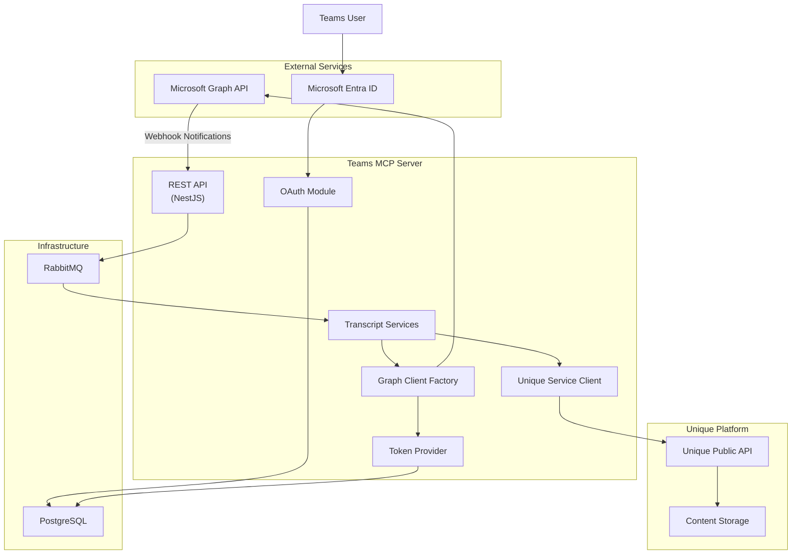
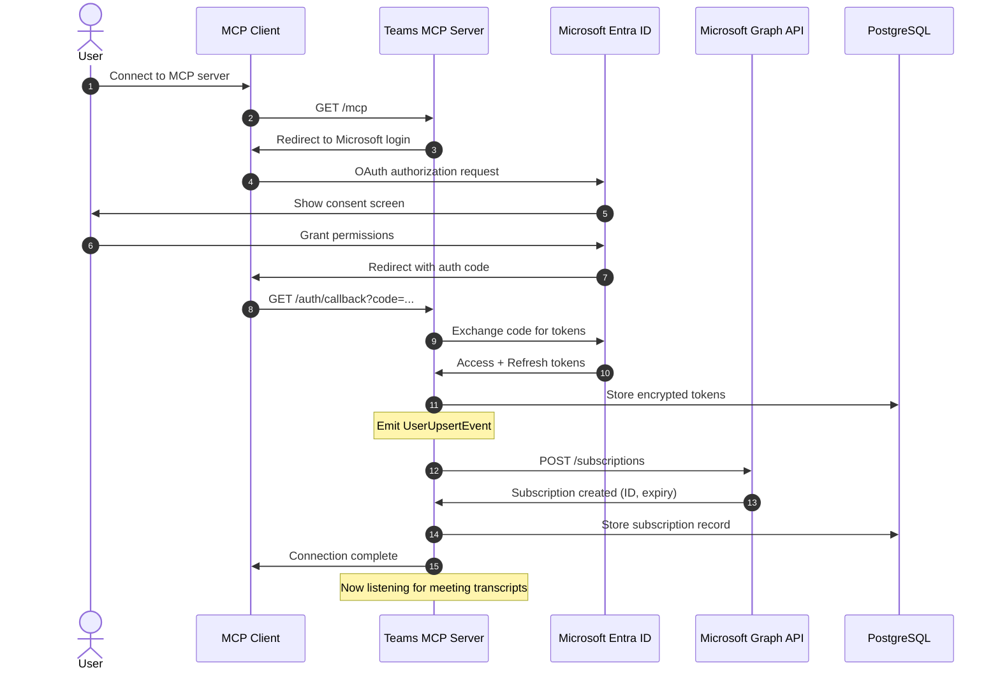
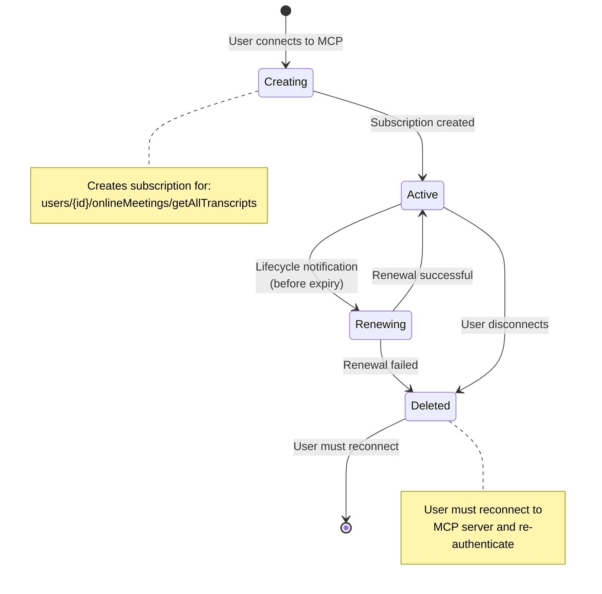
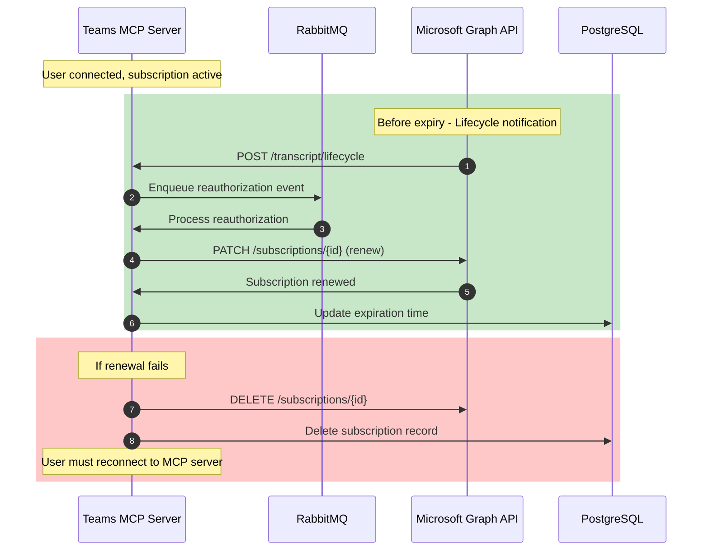
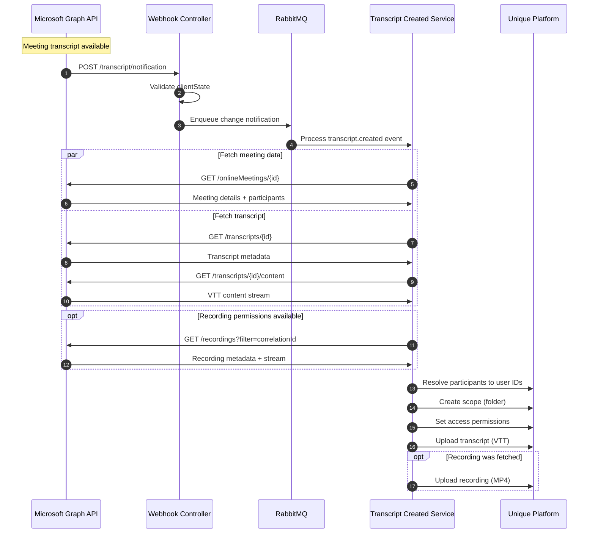
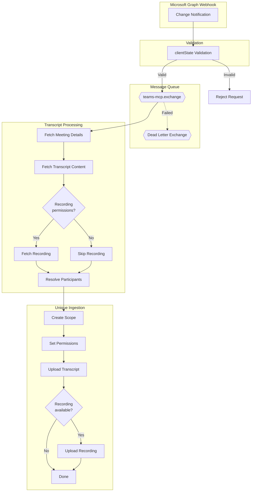

# Teams MCP Server

A NestJS-based microservice that integrates Microsoft Teams meetings with the Unique platform through the Model Context Protocol (MCP). It captures meeting transcripts and recordings from Microsoft Teams and ingests them into Unique with proper access controls.

## Table of Contents

- [Overview](#overview)
- [Architecture](#architecture)
- [Components](#components)
- [Flows](#flows)
  - [User Connection Flow](#user-connection-flow)
  - [Subscription Lifecycle](#subscription-lifecycle)
  - [Transcript Processing Flow](#transcript-processing-flow)
- [Configuration](#configuration)
- [Development](#development)
- [Deployment](#deployment)

## Overview

The Teams MCP Server:

- Captures Microsoft Teams meeting transcripts and recordings in real-time
- Manages webhook subscriptions to Microsoft Graph API for notifications
- Handles OAuth2 authentication with Microsoft Entra ID
- Ingests content into the Unique platform with participant-based access controls
- Manages subscription lifecycle (create, renew, remove) with scheduled synchronization

## Architecture



## Components

```mermaid
flowchart LR
    subgraph Auth["Authentication"]
        MicrosoftProvider["Microsoft OAuth Provider"]
        McpOAuthStore["MCP OAuth Store"]
        TokenMgmt["Token Management"]
    end

    subgraph Transcript["Transcript Module"]
        WebhookController["Webhook Controller"]
        SubscriptionCreate["Subscription Create"]
        SubscriptionRemove["Subscription Remove"]
        SubscriptionReauth["Subscription Reauthorize"]
        TranscriptCreated["Transcript Created"]
    end

    subgraph MSGraph["Microsoft Graph"]
        GraphFactory["Graph Client Factory"]
        TokenProvider["Token Provider"]
        MetricsMiddleware["Metrics Middleware"]
        RefreshMiddleware["Token Refresh Middleware"]
    end

    subgraph UniqueIntegration["Unique Integration"]
        UniqueService["Unique Service"]
    end

    subgraph Data["Data Layer"]
        DrizzleORM["Drizzle ORM"]
        Subscriptions[("subscriptions")]
        UserProfiles[("user_profiles")]
        OAuthState[("oauth_*")]
    end

    subgraph Queue["Message Queue"]
        AMQPModule["AMQP Module"]
        MainExchange{{"Main Exchange"}}
        DLX{{"Dead Letter Exchange"}}
    end

    Auth --> Data
    Transcript --> Queue
    Transcript --> MSGraph
    Transcript --> UniqueIntegration
    MSGraph --> Data
    Queue --> Transcript
```



### Component Descriptions

| Component | Purpose |
|-----------|---------|
| **Microsoft OAuth Provider** | Handles OAuth2 flow with Microsoft Entra ID |
| **MCP OAuth Store** | Stores encrypted JWT tokens in PostgreSQL |
| **Token Provider** | Manages access/refresh tokens with automatic refresh |
| **Graph Client Factory** | Creates authenticated Microsoft Graph API clients |
| **Webhook Controller** | Receives notifications from Microsoft Graph |
| **Subscription Services** | Manages Graph API subscription lifecycle |
| **Transcript Created Service** | Processes new transcripts and recordings |
| **Unique Service** | Interfaces with Unique Public API for content ingestion |
| **AMQP Module** | RabbitMQ integration for async message processing |

## Flows

### User Connection Flow

Everything starts when a user connects to the MCP server. This triggers OAuth authentication and sets up the subscription for receiving meeting notifications.

```mermaid
flowchart LR
    subgraph Connection["User Connects to MCP Server"]
        Connect["User opens MCP client"]
        MCPEndpoint["GET /mcp"]
    end

    subgraph Auth["OAuth Authentication"]
        Redirect["Redirect to Microsoft"]
        Consent["User grants permissions"]
        Callback["Callback with auth code"]
        Exchange["Exchange for tokens"]
        Store["Store encrypted tokens"]
    end

    subgraph Setup["Subscription Setup"]
        UserUpsert["Emit UserUpsertEvent"]
        CreateSub["Create Graph subscription"]
        StoreSub["Store subscription record"]
    end

    subgraph Ready["Ready for Notifications"]
        Active["Subscription Active"]
        Listen["Listening for transcripts"]
    end

    Connect --> MCPEndpoint
    MCPEndpoint --> Redirect
    Redirect --> Consent
    Consent --> Callback
    Callback --> Exchange
    Exchange --> Store
    Store --> UserUpsert
    UserUpsert --> CreateSub
    CreateSub --> StoreSub
    StoreSub --> Active
    Active --> Listen
```





**OAuth Scopes Required:**
- `User.Read` - Read user profile
- `OnlineMeetings.Read` - Read meeting details
- `OnlineMeetingRecording.Read.All` - Read meeting recordings (optional)
- `OnlineMeetingTranscript.Read.All` - Read meeting transcripts
- `offline_access` - Obtain refresh tokens

### Subscription Lifecycle

Subscriptions are **renewed** (not recreated) before they expire. If renewal fails for any reason, the subscription is deleted and the user must reconnect to the MCP server to re-authenticate.





**Subscription Scheduling:**
- Subscriptions are set to expire at a configured UTC hour (default: 3 AM)
- This batches all renewals to a single time window
- Daily renewal ensures token validity is checked consistently
- Minimum 2-hour subscription lifetime required for lifecycle notifications
- **If renewal fails**: Subscription is deleted and user must reconnect to MCP server

### Transcript Processing Flow

When a meeting transcript becomes available, Microsoft Graph sends a webhook notification. The recording is fetched **only if the user has recording permissions**.





**Webhook Validation:**
- Microsoft Graph sends a `clientState` value with each notification
- The server validates this matches the secret configured during subscription creation
- Invalid `clientState` results in request rejection

**Recording Permissions:**
- Recording fetch requires `OnlineMeetingRecording.Read.All` scope
- If the user hasn't granted this permission, only the transcript is captured
- Recording availability is checked before attempting upload

**Access Control:**
- Meeting organizer receives **write + read** access
- Meeting participants receive **read** access
- Users are resolved by email or username in Unique platform

## Configuration

Copy `.env.example` to `.env` and configure the following:

### Required Variables

| Variable | Description |
|----------|-------------|
| `SELF_URL` | Base URL for OAuth callbacks (e.g., `http://localhost:9542`) |
| `DATABASE_URL` | PostgreSQL connection string |
| `AMQP_URL` | RabbitMQ connection string |
| `MICROSOFT_CLIENT_ID` | Azure AD application client ID |
| `MICROSOFT_CLIENT_SECRET` | Azure AD application client secret |
| `MICROSOFT_WEBHOOK_SECRET` | 128-char hex secret used as `clientState` for webhook validation |
| `MICROSOFT_PUBLIC_WEBHOOK_URL` | Publicly reachable URL for Microsoft webhooks |
| `AUTH_HMAC_SECRET` | 64-char hex secret for JWT signing |
| `ENCRYPTION_KEY` | 64-char hex secret for AES-GCM token encryption |

### Unique API Configuration

**External Mode** (for external deployments):
```env
UNIQUE_SERVICE_AUTH_MODE=external
UNIQUE_API_BASE_URL=http://localhost:8092/public/
UNIQUE_SERVICE_EXTRA_HEADERS={"authorization":"Bearer <app-key>","x-app-id":"<app-id>","x-user-id":"<user-id>","x-company-id":"<company-id>"}
```

**Cluster Local Mode** (for in-cluster deployments):
```env
UNIQUE_SERVICE_AUTH_MODE=cluster_local
UNIQUE_API_BASE_URL=http://chat.namespace.svc:PORT/public/chat/
UNIQUE_INGESTION_SERVICE_BASE_URL=http://ingestions.namespace.svc:PORT
UNIQUE_SERVICE_EXTRA_HEADERS={"x-company-id":"<company-id>","x-user-id":"<user-id>"}
```

### Optional Variables

| Variable | Default | Description |
|----------|---------|-------------|
| `LOG_LEVEL` | `info` | Logging level (debug, info, warn, error) |
| `MICROSOFT_SUBSCRIPTION_EXPIRATION_TIME_HOURS_UTC` | `3` | Hour (UTC) for scheduled subscription expiry |
| `AUTH_ACCESS_TOKEN_EXPIRES_IN_SECONDS` | `60` | Access token TTL |
| `AUTH_REFRESH_TOKEN_EXPIRES_IN_SECONDS` | `2592000` | Refresh token TTL (30 days) |
| `UNIQUE_ROOT_SCOPE_PATH` | `Teams-MCP` | Root folder path in Unique |
| `UNIQUE_USER_FETCH_CONCURRENCY` | `5` | Concurrent user resolution limit |

### Generating Secrets

```bash
# Generate 128-char hex secret (for MICROSOFT_WEBHOOK_SECRET)
openssl rand -hex 64

# Generate 64-char hex secret (for AUTH_HMAC_SECRET, ENCRYPTION_KEY)
openssl rand -hex 32
```

## Development

### Prerequisites

- Node.js 20+
- pnpm
- PostgreSQL 17
- RabbitMQ 4
- Microsoft Azure AD application with required permissions

### Setup

```bash
# Install dependencies
pnpm install

# Run database migrations
pnpm db:migrate

# Start development server
pnpm dev
```

### Available Scripts

| Script | Description |
|--------|-------------|
| `pnpm dev` | Start development server |
| `pnpm build` | Build for production |
| `pnpm test` | Run unit tests |
| `pnpm test:e2e` | Run end-to-end tests |
| `pnpm test:coverage` | Run tests with coverage |
| `pnpm db:generate` | Generate database migrations |
| `pnpm db:migrate` | Apply database migrations |
| `pnpm style` | Check code style |
| `pnpm style:fix` | Fix code style issues |

### Local Development with Dev Tunnels

For local webhook testing, use Azure Dev Tunnels:

```bash
# Create a tunnel
devtunnel create --allow-anonymous

# Set MICROSOFT_PUBLIC_WEBHOOK_URL to your tunnel URL
```

## Deployment

### Docker Compose (Production)

```bash
docker compose -f docker-compose.prod.yaml up -d
```

Services:
- `teams-mcp`: Main application (port 3000)
- `teams-mcp-migration`: Database migration runner
- `postgres`: PostgreSQL 17
- `rabbitmq`: RabbitMQ 4 with management UI

### Kubernetes (Helm)

```bash
helm install teams-mcp ./deploy/helm-charts/teams-mcp \
  --namespace teams-mcp \
  --create-namespace \
  -f values.yaml
```

### Terraform (Azure)

Infrastructure modules available in `deploy/terraform/`:
- `teams-mcp-secrets`: Azure Key Vault integration
- `teams-mcp-entra-application`: Microsoft Entra app registration

## Observability

The service includes comprehensive observability:

- **Logging**: Structured JSON logs via Pino with correlation IDs
- **Metrics**: OpenTelemetry instrumentation for Graph API calls
- **Tracing**: Distributed tracing via OpenTelemetry
- **Dashboards**: Grafana dashboard available in Helm chart

Configure with environment variables:
```env
OTEL_SERVICE_NAME=teams-mcp
OTEL_EXPORTER_OTLP_ENDPOINT=http://collector:4318
OTEL_EXPORTER_PROMETHEUS_PORT=8081
```
