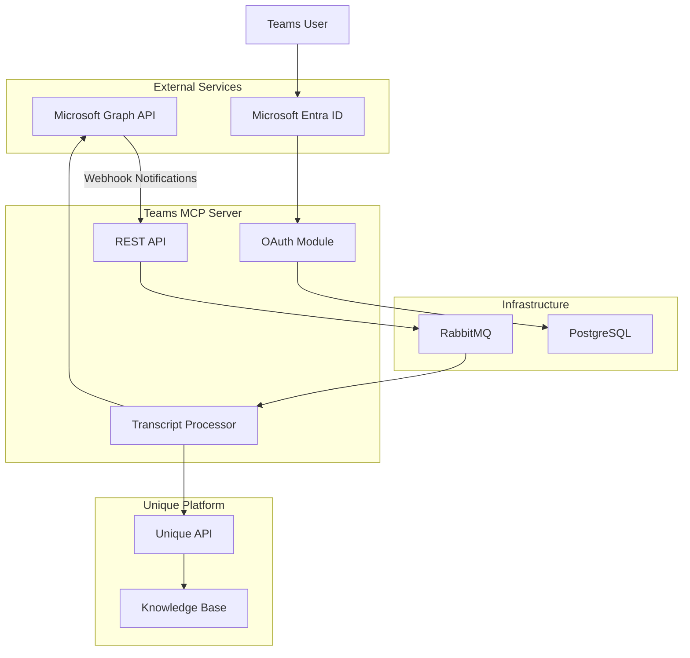
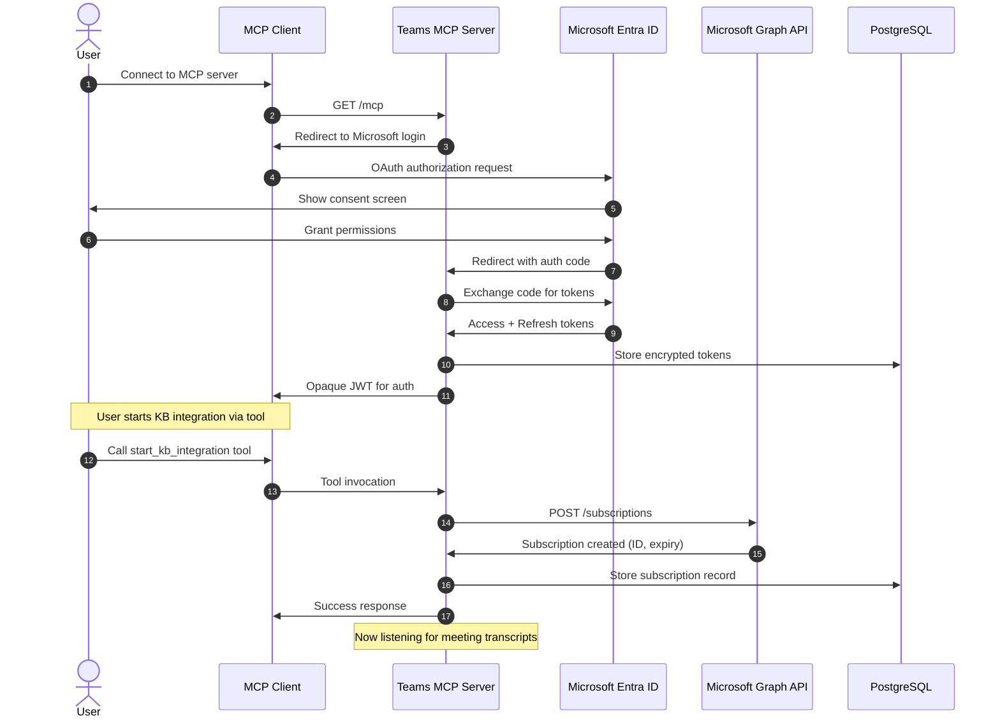
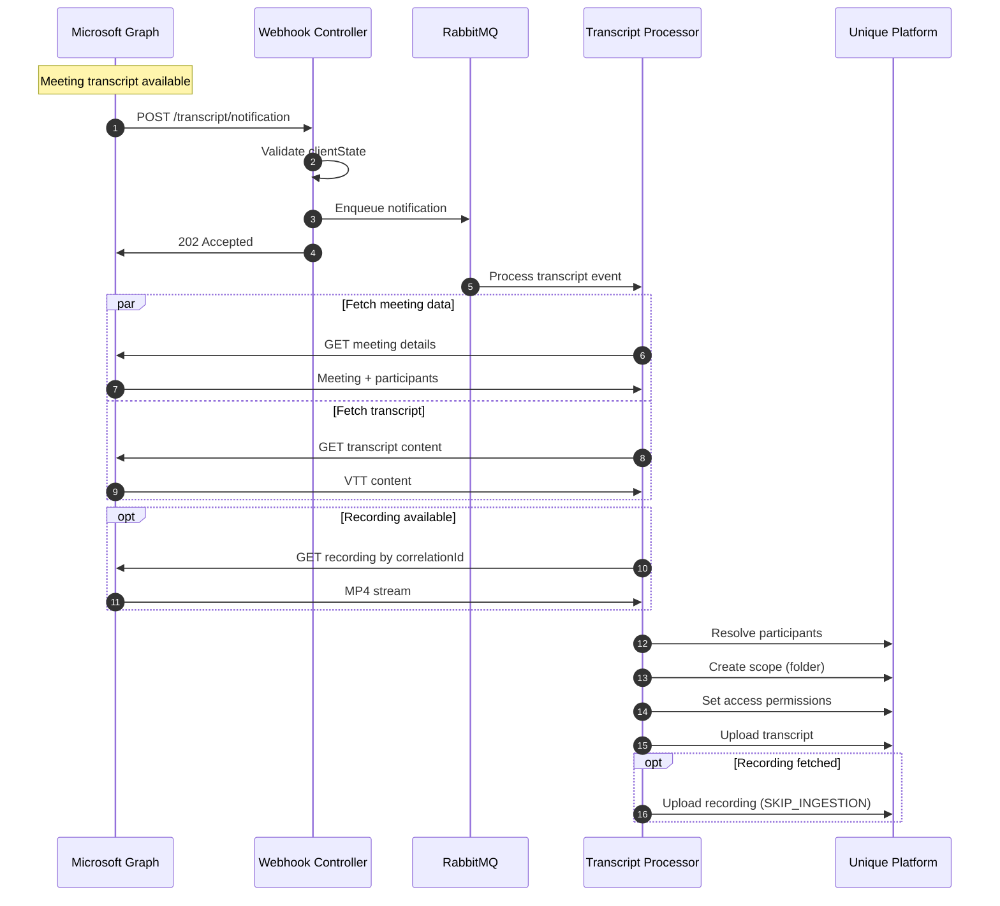
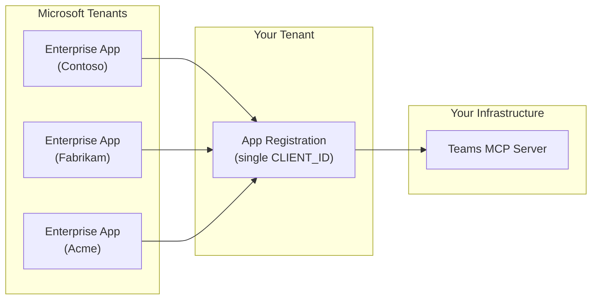

<!-- confluence-page-id: 1802633229 -->
<!-- confluence-space-key: PUBDOC -->

!!! danger "Experimental Software Disclaimer"
    **`teams-mcp` is experimental software.**

    - **No SLA/SSLA**: No service level agreements or support level agreements apply
    - **No Support**: No guaranteed support, response times, or issue resolution
    - **Breaking Changes**: APIs, configurations, and behavior may change without notice between versions
    - **No Stability Guarantees**: Features may be incomplete, modified, or removed at any time
    - **Data Loss Risk**: Bugs or changes may result in data loss or corruption
    - **Use at Your Own Risk**: This software is provided "as-is" without warranties of any kind

    Experimental software is intended for evaluation and testing purposes only. Do not rely on this software for production workloads without understanding these limitations.

## Overview

The Teams MCP Server is a cloud-native application that automatically captures meeting transcripts and recordings from Microsoft Teams and ingests them into the Unique knowledge base. This guide provides administrators with essential information about requirements, features, and limitations.

**Note:** This is a connector-style MCP server that does two things. First, it automatically ingests meeting **transcripts and recordings** into the Unique knowledge base in the background, where they are then queried **from within Unique**. Second, it exposes an interactive tool surface of 13 MCP tools — 8 chat/messaging tools and 5 transcript/KB management tools. Through these tools, **chat and channel messages are accessible in Unique on demand, but are never ingested into it** — they are fetched live from the Microsoft Graph API and exist only in Microsoft, whereas transcripts and recordings are copied into the Unique knowledge base. This ingested-vs-live distinction is the key thing to understand; see [Where the data lives](#where-the-data-lives-ingested-vs-live). Chat and channel tools take ids obtained from the `list_*` tools. See [Technical Reference — Tools](./technical/tools.md) for the full tool reference.

For deployment, configuration, and operational details, see the [IT Operator Guide](./operator/README.md).

## Quick Summary

**What it does:** Two things. (1) Automatically captures meeting transcripts and recordings from Microsoft Teams and **ingests them into Unique's AI knowledge base** with participant-based access controls, where they are queried from within Unique. (2) Exposes interactive tools that make Teams chat and channel messages **accessible in Unique on demand — fetched live from the Microsoft Graph API and never ingested** (they exist only in Microsoft, not in the Unique knowledge base).

**Deployment:** Kubernetes-based NestJS microservice

**Authentication:** Uses delegated OAuth2 with Microsoft Entra ID (user signs in and consents)

**Processing:** Real-time webhook-driven (notifications received immediately when transcripts are available)

## Requirements

### Microsoft 365 / Teams

| Requirement | Details |
|-------------|---------|
| **Microsoft Teams** | Active tenant with transcription enabled for meetings |
| **Microsoft Entra ID** | Tenant with Application Administrator rights for app registration |
| **License** | Microsoft 365 license with Teams meeting transcription capabilities |

**Prerequisites:**

- Access to Microsoft Entra ID for app registration
- Microsoft Teams meetings with transcription enabled by policy
- Users must be able to consent to delegated permissions (or admin consent granted)

### Permissions

All permissions are **Delegated** (not Application), meaning they act on behalf of the signed-in user and can only access data that user has access to.

| Permission | Type | Admin Consent | Required |
|------------|------|---------------|----------|
| `User.Read` | Delegated | No | Yes |
| `Calendars.Read` | Delegated | No | Yes |
| `OnlineMeetings.Read` | Delegated | No | Yes |
| `OnlineMeetingRecording.Read.All` | Delegated | Yes | Yes |
| `OnlineMeetingTranscript.Read.All` | Delegated | Yes | Yes |
| `offline_access` | Delegated | No | Yes |
| `ChannelMessage.Send` | Delegated | No | Yes |
| `ChatMessage.Send` | Delegated | No | Yes |
| `Chat.ReadBasic` | Delegated | No | Yes |
| `Chat.Read` | Delegated | No | Yes |
| `Team.ReadBasic.All` | Delegated | No | Yes |
| `Channel.ReadBasic.All` | Delegated | No | Yes |
| `ChannelMessage.Read.All` | Delegated | Yes | Yes |

For detailed permission justifications, see [Microsoft Graph Permissions](./technical/permissions.md#least-privilege-justification).

## Features

The server offers **two independent capability tracks**:

- **[Meeting Transcripts & Recordings](#meeting-transcripts--recordings)** — background ingestion of meeting transcripts (and their recordings) into the Unique knowledge base, plus tools to search and manage that ingestion. Webhook-driven and asynchronous.
- **[Chats & Channels Messaging](#chats--channels-messaging)** — an interactive tool surface for reading, searching, and sending Teams chat and channel messages live via Microsoft Graph. Synchronous and on-demand.

The two tracks are described separately below, followed by the [cross-cutting capabilities](#cross-cutting-capabilities) that apply to both.

### Where the Data Lives: Ingested vs. Live

This is the single most important distinction between the two tracks. **Both are accessible through Unique — the difference is where the data is stored.**

!!! important "Both are accessible in Unique; only transcripts are ingested"
    **Meeting transcripts and recordings are ingested — copied into the Unique knowledge base — and queried from that stored copy. Teams chat and channel messages are also accessible in Unique, through this server's MCP tools, but they are never ingested: they are fetched live from the Microsoft Graph API on demand and exist only in Microsoft, never as a copy in Unique.**

    Messages being "not ingested" means only that Unique keeps no copy of them — **not** that they are inaccessible. The Unique AI can read, search, and send them at any time via the tools; it just reaches back to Microsoft each time instead of reading a stored copy.

| | Meeting transcripts & recordings | Chats & channels messages |
|---|---|---|
| **Accessible through Unique?** | **Yes** — via Unique AI and the transcript tools | **Yes** — via the MCP messaging tools |
| **Ingested (copied) into Unique?** | **Yes** — stored in the knowledge base | **No** — never copied; the data lives only in Microsoft |
| **How it is served** | Queried from the **stored copy in Unique** — indexed and searchable (`find_transcripts`) | Fetched **live from the Microsoft Graph API** on every call (`get_*_messages`, `search_messages`) |
| **Freshness** | Point-in-time snapshot captured at ingestion | Always current — reflects Teams in real time |
| **If this server is disconnected** | The copy remains in Unique and stays queryable | No longer reachable — nothing was stored, so there is no copy to fall back on |
| **Data flow** | Teams → Unique knowledge base (once) → query the copy | Teams → live fetch on each call → returned to the caller (no copy kept) |

### Meeting Transcripts & Recordings

This is the connector track: once a user connects, meeting transcripts (and recordings) are captured automatically and ingested into Unique. Chat and channel messages are **not** part of this track — they are never ingested.

**Real-time Transcript and Recording Capture**

- Webhook-based notifications from [Microsoft Graph API](https://learn.microsoft.com/en-us/graph/overview)
- Automatic capture when meeting transcripts become available
- VTT format transcript content ingested into Unique
- MP4 recording files stored alongside transcripts (with `SKIP_INGESTION` mode)
- Both artifacts linked via `content_correlation_id` in metadata

**Participant-Based Access Control**

- Meeting organizer receives **write + read** access in Unique
- Meeting participants receive **read** access in Unique
- Users resolved by email or username in Unique platform

**Automatic Subscription Management**

- Microsoft Graph webhook subscriptions created automatically on user connection
- Subscriptions renewed automatically before expiration
- Failed renewals handled gracefully with user reconnection required

**Reliability**

- RabbitMQ message queue for asynchronous webhook processing
- Dead Letter Exchange (DLX) for failed message inspection and retry
- Meets Microsoft's strict webhook response requirements (< 10 seconds)
- See [FAQ - Why use RabbitMQ for webhook processing?](./faq.md#why-use-rabbitmq-for-webhook-processing) for details

**Search & management tools** (see [Technical Reference — Tools](./technical/tools.md#transcript--knowledge-base-management)):

- `find_transcripts`: Semantic + keyword search within ingested transcripts
- `ingest_meeting`: Ingest a specific meeting's transcript on demand
- `start_kb_integration` / `stop_kb_integration` / `verify_kb_integration_status`: Manage and inspect the ingestion subscription

### Chats & Channels Messaging

This is the interactive track: tools that read, search, and send Teams messages live through Microsoft Graph. These messages are fetched on every call and are **never** ingested into the Unique knowledge base.

Chat and messaging tools target chats and channels by id: call a `list_*` tool to obtain an id (and distinguishing metadata), then pass that id to a read, write, or search tool. See [Technical Reference — Tools](./technical/tools.md#teams--channels).

- `list_teams`: List all Microsoft Teams the user is a member of; returns team id and `isArchived` flag
- `list_channels`: List all channels in a team (by team id); returns channel id, `createdDateTime`, and `membershipType`
- `list_chats`: List the user's recent chats (1:1, group, and meeting chats) by chat id; returns `createdDateTime`, `lastMessageAt`, and members for topic-less or 1:1 chats
- `get_chat_messages`: Retrieve recent messages from a chat (by chat id)
- `get_channel_messages`: Retrieve recent messages from a channel (by team id + channel id)
- `search_messages`: Search messages by keyword across chats and channels via the Microsoft Search API; returns chat/channel ids alongside results, enabling subsequent reads or sends
- `send_channel_message`: Send a plain text message to a Teams channel (by team id + channel id)
- `send_chat_message`: Send a plain text message to a Teams chat (by chat id)

### Cross-Cutting Capabilities

These apply to both tracks.

**Self-Service User Connection**

- Users connect their own Microsoft account via [OAuth 2.1](https://oauth.net/2.1/) with [PKCE](https://datatracker.ietf.org/doc/html/rfc7636)
- No IT administrator involvement required for individual connections

**Security**

- OAuth 2.1 with PKCE for authentication ([RFC 7636](https://datatracker.ietf.org/doc/html/rfc7636))
- Microsoft tokens encrypted at rest using AES-256-GCM
- Refresh token rotation with family-based revocation
- Short-lived access tokens (60 seconds default)
- See [Security Documentation](./technical/security.md#token-security) for details

**Observability**

- Detailed logging with trace IDs

**Configuration**

- Configurable token TTLs
- Automatic subscription renewal via Microsoft lifecycle webhooks
- Rate limiting support

## How It Works

### High-Level Architecture



See [Architecture Documentation](./technical/architecture.md#components) for detailed component diagrams.

### User Connection Flow



See [User Connection Flow](./technical/flows.md#user-connection-flow) for additional details.

### Transcript Processing Flow



See [Transcript Processing Flow](./technical/flows.md#transcript-processing-flow) for additional details.

### Messaging Flow

The two flows above cover the transcript track, which is webhook-driven and asynchronous. The messaging track works differently: chat and channel tools are handled **synchronously and inline** — each tool call queries Microsoft Graph and returns immediately, with no queue, background worker, or ingestion. The caller discovers an id with a `list_*` tool, then passes it to a read, search, or send tool.

See [Chat Flows](./technical/flows.md#chat-flows) for the read, search, and send sequence diagrams.

### User Workflows

Both tracks begin with the same one-time connection, then diverge — because their data models differ (see [Where the data lives](#where-the-data-lives-ingested-vs-live)).

**One-time setup (both tracks)**

1. Open MCP client and connect to Teams MCP Server
2. Sign in with Microsoft account
3. Grant required permissions

#### Transcripts & Recordings Workflow — ingest once, then query in Unique

1. **Enable ingestion** (One-time) — call `start_kb_integration` (or rely on `MICROSOFT_AUTO_START_INGESTION` if the operator enabled it)
2. **Automatic capture** (Ongoing)
   - Attend Microsoft Teams meetings with transcription enabled
   - Meeting ends and transcript becomes available
   - Teams MCP automatically receives a webhook notification
   - Transcript and recording (if available) are captured and **ingested into the Unique knowledge base**
3. **Query in Unique** (Ongoing)
   - Meeting content lives in the Unique knowledge base — organizer gets write + read, participants get read
   - Search and query it **from within Unique** via Unique AI, or with `find_transcripts`
   - Content remains available in Unique even after the user disconnects

#### Chats & Channels Workflow — always query live from the API

1. **Discover the target** (Each use) — call a `list_*` tool (`list_chats`, `list_teams` → `list_channels`) or `search_messages` to obtain the chat/channel id
2. **Read, search, or send** (Each use)
   - Pass the id to `get_chat_messages` / `get_channel_messages`, `search_messages`, or `send_*_message`
   - Messages are fully accessible to the Unique AI through these tools — every call fetches **live from the Microsoft Graph API**, so you always see the current state of Teams
3. **Accessible, but never stored in Unique**
   - The tools give the AI on-demand access, but Unique keeps **no copy** — messages are never ingested into the knowledge base; they exist only in Microsoft
   - Because nothing is stored, there is no knowledge-base copy to query later: once the user disconnects, the tools simply stop returning results

## Limitations and Constraints

### Authentication Constraints

| Constraint | Reason |
|------------|--------|
| **Delegated permissions only** | Requires user sign-in; application-only access would need admin-configured policies per user |
| **No certificate auth** | Certificate auth only works with Client Credentials flow, incompatible with delegated permissions |
| **Single app registration** | Each MCP server deployment uses one Entra ID app registration (multi-tenant capable) |
| **Admin consent required** | `OnlineMeetingRecording.Read.All` and `OnlineMeetingTranscript.Read.All` need admin approval |

See [Authentication Architecture - Single App Registration Architecture](./technical/architecture.md#single-app-registration-architecture) for details.

### Operational Constraints

| Constraint | Impact | Mitigation |
|------------|--------|------------|
| **90-day token expiry** | User must reconnect after ~90 days of inactivity | Monitor for disconnected users |
| **Webhook timeout** | Microsoft requires response in <10 seconds | RabbitMQ decouples reception from processing |
| **Subscription expiry** | Graph subscriptions expire after 3 days max | Automatic renewal via lifecycle notifications |
| **Encryption key change** | All stored tokens become unreadable | Users must reconnect; plan for maintenance window |

### Scaling Considerations

| Factor | Limit | Notes |
|--------|-------|-------|
| **Microsoft Graph rate limits** | ~10,000 requests/10 min per app | Shared across all users of the app registration |
| **Concurrent user lookups** | Configurable (default: 5) | Set via `UNIQUE_USER_FETCH_CONCURRENCY` |
| **Database connections** | PostgreSQL pool size | Monitor connection usage under load |

### Not Supported

**Meeting transcripts & recordings:**

- **Real-time transcription**: Only processes completed transcripts, not live captions
- **Meeting creation**: Read-only access; cannot create or modify meetings
- **Selective meeting capture**: All meetings with transcription enabled are captured (no organizer-only or meeting-type filter)
- **Historical/full sync**: No mechanism to backfill transcripts from meetings that took place before the user connected; see [Why can't historical transcripts be synced?](./faq.md#why-cant-historical-transcripts-be-synced)
- **Delta/incremental sync**: No ability to poll for missed or updated transcripts since a given point in time; see [Why is there no delta sync?](./faq.md#why-is-there-no-delta-sync)
- **Missed-notification recovery**: If a subscription lapses, any transcripts produced during the gap are permanently lost — there is no catch-up or replay mechanism
- **Transcript format variants**: Only VTT-format transcripts are processed; meetings with transcripts in other formats are silently skipped
- **Recording size assurance**: No application-level size check on recordings; very large files (e.g., multi-hour all-hands) may time out during download and be skipped, while the transcript is still ingested

**Chats & channels messaging:**

- **Rich message sends**: `send_chat_message` and `send_channel_message` send plain text only — no `@mentions`, no rich content (bold, tables, adaptive cards), and no attachment upload
- **Message threading/replies**: There is no tool for replying to a specific message in a thread; only new top-level messages can be sent
- **Chat/channel message ingestion**: Messages read or searched via the messaging tools are fetched live from Microsoft Graph on every call and are **not** ingested into the Unique knowledge base; only meeting transcripts are ingested

**General:**

- **Token introspection**: Tokens validated locally with short TTLs for performance
- **Multi-tenant in one session**: A user belonging to multiple Microsoft tenants must authenticate separately for each tenant; one OAuth session covers exactly one tenant

### Microsoft Graph API Constraints

The following limitations originate directly from the Microsoft Graph API and cannot be worked around while using **delegated permissions**.

#### No Delta Sync with Delegated Permissions

Microsoft Graph does expose a delta API for transcripts and recordings:

```
GET /users/{userId}/onlineMeetings/getAllTranscripts(...)/delta
GET /users/{userId}/onlineMeetings/getAllRecordings(...)/delta
```

These APIs support both full initial synchronization and incremental sync (returning only transcripts added since the last `$deltaToken`). However, the official permission table is:

| Permission type | Support |
|---|---|
| Delegated (work or school account) | **Not supported** |
| Delegated (personal Microsoft account) | **Not supported** |
| Application | `OnlineMeetingTranscript.Read.All` / `OnlineMeetingRecording.Read.All` |

Source: [callTranscript: delta — Microsoft Graph API reference](https://learn.microsoft.com/en-us/graph/api/calltranscript-delta) · [callRecording: delta — Microsoft Graph API reference](https://learn.microsoft.com/en-us/graph/api/callrecording-delta)

Teams MCP uses delegated permissions so that users can connect their own Microsoft account without IT administrator involvement. Switching to application permissions would enable delta sync, but would require tenant administrators to configure [Application Access Policies](https://learn.microsoft.com/en-us/graph/cloud-communication-online-meeting-application-access-policy) via PowerShell for every user — defeating the self-service connection model.

#### No Historical/Full Sync with Delegated Permissions

The only Microsoft Graph API capable of listing transcripts across all of a user's meetings (without knowing individual meeting IDs in advance) is `getAllTranscripts`:

```
GET /users/{userId}/onlineMeetings/getAllTranscripts(meetingOrganizerUserId='{userId}',startDateTime=...)
```

This API also requires **application permissions only** — delegated permissions are explicitly not supported.

Source: [onlineMeeting: getAllTranscripts — Microsoft Graph API reference](https://learn.microsoft.com/en-us/graph/api/onlinemeeting-getalltranscripts)

With delegated permissions, the only available path to read transcripts is `GET /users/{userId}/onlineMeetings/{meetingId}/transcripts`, which requires knowing the meeting ID in advance. There is no delegated-permission API that enumerates past meetings and their transcripts in bulk. As a result, Teams MCP can only capture transcripts going forward from the moment the user connects — not from any earlier meetings.

**Additional constraints on historical data (even with application permissions):**

- Transcripts are only accessible for meetings that have not expired. One-time meetings expire 60 days after their scheduled time; recurring meetings with no end date expire 1 year after the last activity.
- Recording and transcript files are subject to the tenant's admin-configured expiration policy (Microsoft default: 120 days after creation).

Source: [Limits and specifications for Microsoft Teams — Meeting expiration](https://learn.microsoft.com/en-us/microsoftteams/limits-specifications-teams)

### Single App Registration Architecture

Each Teams MCP Server deployment uses **one Microsoft Entra ID app registration**:



- **Multi-tenant support**: Configure app as "Accounts in any organizational directory"
- **Enterprise Application**: Created in each tenant when admin grants consent
- **Shared infrastructure**: One deployment serves all tenants
- **Data isolation**: Each user's data scoped by their Microsoft user ID

See [Authentication Architecture - Single App Registration Architecture](./technical/architecture.md#single-app-registration-architecture) for details.

## Future Versions

Planned enhancements will be documented here.

## Related Documentation

- [FAQ](./faq.md) - Frequently asked questions

### For IT Operators

- [Operator Guide](./operator/README.md) - Deployment, configuration, and operations
  - [Deployment](./operator/deployment.md) - Kubernetes and Helm setup
  - [Configuration](./operator/configuration.md) - Environment variables and settings
  - [Authentication](./operator/authentication.md) - Microsoft Entra ID setup
  - [FAQ](./faq.md) - Frequently asked questions

### Technical Reference

- [Technical Reference](./technical/README.md) - Architecture, flows, and design decisions
  - [Architecture](./technical/architecture.md) - System components and infrastructure
  - [Flows](./technical/flows.md) - User connection, subscription lifecycle, transcript processing
  - [Permissions](./technical/permissions.md) - Microsoft Graph permissions with justification
  - [Security](./technical/security.md) - Encryption, authentication, and threat model

## Standard References

- [Microsoft Graph API](https://learn.microsoft.com/en-us/graph/overview) - Microsoft Graph documentation
- [Microsoft Graph Permissions Reference](https://learn.microsoft.com/en-us/graph/permissions-reference) - Permission details
- [Microsoft Entra ID Documentation](https://learn.microsoft.com/en-us/entra/identity/) - Authentication and authorization
- [OAuth 2.1](https://oauth.net/2.1/) - OAuth 2.1 specification
- [RFC 7636 - PKCE](https://datatracker.ietf.org/doc/html/rfc7636) - Proof Key for Code Exchange
- [RFC 6749 - OAuth 2.0](https://datatracker.ietf.org/doc/html/rfc6749) - OAuth 2.0 Authorization Framework
- [Model Context Protocol](https://modelcontextprotocol.io/) - MCP specification
- [MCP Authorization](https://modelcontextprotocol.io/specification/2025-03-26/basic/authorization) - MCP authorization spec
