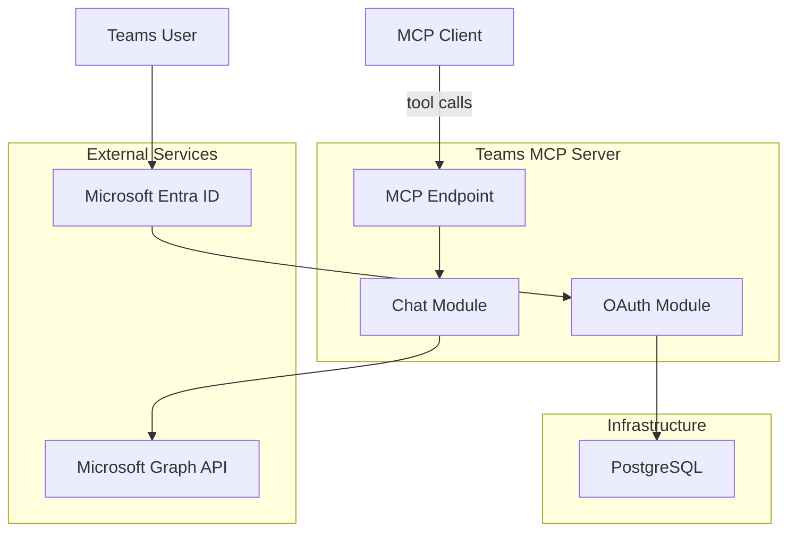
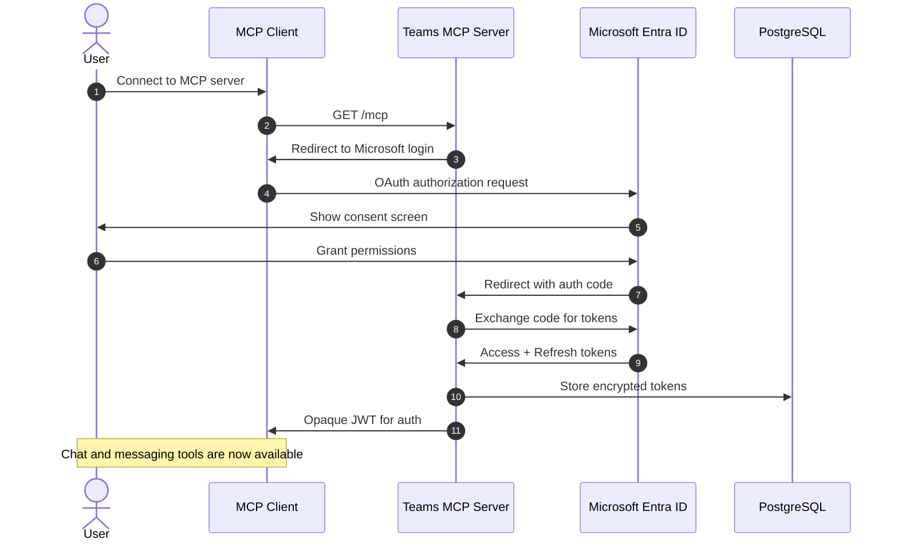
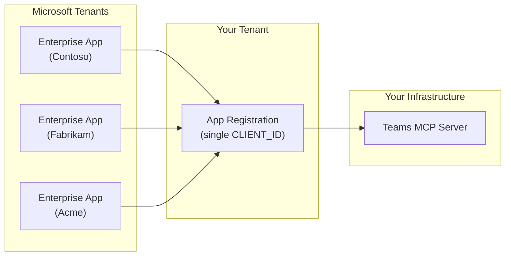

<!-- confluence-page-id: 1802633229 -->
<!-- confluence-space-key: PUBDOC -->

!!! note "Beta"
    **`teams-mcp` is in beta.** It is suitable for production use, with the following caveats:

    - **Breaking changes**: APIs, configuration, and behaviour may still change between versions; review release notes before upgrading
    - **Evolving feature set**: capabilities may be added, changed, or removed as the tool surface matures
    - **Support**: no formal SLA applies to beta software; issues are handled on a best-effort basis

## Overview

The Teams MCP Server gives Unique AI access to Microsoft Teams chats and channels. It exposes eight MCP tools for listing teams, channels, and chats, reading and searching messages, and sending messages — all executed live against the [Microsoft Graph API](https://learn.microsoft.com/en-us/graph/overview) on behalf of the signed-in user.

!!! important "Nothing is copied into Unique in the default configuration"
    Teams chat and channel messages are **never** ingested into the Unique knowledge base. Every tool call fetches from Microsoft Graph on demand, so the data continues to live only in Microsoft. This is true regardless of configuration.

    The server has one optional capability that *does* store data in Unique: capturing meeting transcripts and recordings into the knowledge base. It is **off by default** (`UNIQUE_INTEGRATION=disabled`) and documented separately under [Recordings & Transcripts](https://unique-ch.atlassian.net/wiki/spaces/PUBDOC/pages/2534866977/Recordings+Transcripts). If you do not enable it, this page describes everything the server does.

This guide provides administrators with essential information about requirements, features, and limitations. For deployment, configuration, and operational details, see the [IT Operator Guide](./operator/README.md). For the full tool reference, see [Technical Reference — Tools](./technical/tools.md).

## Quick Summary

**What it does:** Makes Teams chats and channels accessible to Unique AI through MCP tools — reading, searching, and sending messages, fetched live from Microsoft Graph on every call and never stored in Unique.

**Optional add-on:** Meeting transcript and recording capture into the Unique knowledge base — see [Recordings & Transcripts](https://unique-ch.atlassian.net/wiki/spaces/PUBDOC/pages/2534866977/Recordings+Transcripts).

**Deployment:** Kubernetes-based NestJS microservice

**Authentication:** Uses delegated OAuth2 with Microsoft Entra ID (user signs in and consents)

**Processing:** Synchronous — each tool call queries Microsoft Graph and returns immediately

## Requirements

### Microsoft 365 / Teams

| Requirement | Details |
|-------------|---------|
| **Microsoft Teams** | Active tenant |
| **Microsoft Entra ID** | Tenant with Application Administrator rights for app registration |
| **License** | Microsoft 365 license covering Teams |

**Prerequisites:**

- Access to Microsoft Entra ID for app registration
- Users must be able to consent to delegated permissions (or admin consent granted)

Enabling transcript capture adds requirements of its own — meeting transcription enabled by policy, admin consent for the meeting scopes, RabbitMQ, and a knowledge-base root scope. See the [Recordings & Transcripts Operator Manual](https://unique-ch.atlassian.net/wiki/spaces/PUBDOC/pages/2535522323/Recordings+Transcripts+-+Operator+Manual).

### Permissions

All permissions are **Delegated** (not Application), meaning they act on behalf of the signed-in user and can only access data that user has access to.

| Permission | Type | Admin Consent |
|------------|------|---------------|
| `User.Read` | Delegated | No |
| `offline_access` | Delegated | No |
| `ChannelMessage.Send` | Delegated | No |
| `ChatMessage.Send` | Delegated | No |
| `Chat.ReadBasic` | Delegated | No |
| `Chat.Read` | Delegated | No |
| `Team.ReadBasic.All` | Delegated | No |
| `Channel.ReadBasic.All` | Delegated | No |
| `ChannelMessage.Read.All` | Delegated | **Yes** |

Nothing meeting-, transcript-, or recording-related is requested, and `ChannelMessage.Read.All` is the sole permission needing admin consent. Transcript capture adds three further scopes, documented in the [Recordings & Transcripts Technical Manual](https://unique-ch.atlassian.net/wiki/spaces/PUBDOC/pages/2399993877/Recordings+Transcripts+-+Technical+Manual#Required-Microsoft-Graph-permissions).

For detailed permission justifications, see [Microsoft Graph Permissions](./technical/permissions.md#least-privilege-justification).

## Features

### Chats & Channels Messaging

Tools that read, search, and send Teams messages live through Microsoft Graph. Messages are fetched on every call and are **never** ingested into the Unique knowledge base.

Chat and messaging tools target chats and channels by id: call a `list_*` tool to obtain an id (and distinguishing metadata), then pass that id to a read, write, or search tool. See [Technical Reference — Tools](./technical/tools.md#teams--channels).

- `list_teams`: List all Microsoft Teams the user is a member of; returns team id and `isArchived` flag
- `list_channels`: List all channels in a team (by team id); returns channel id, `createdDateTime`, and `membershipType`
- `list_chats`: List the user's recent chats (1:1, group, and meeting chats) by chat id; returns `createdDateTime`, `lastMessageAt`, and members for topic-less or 1:1 chats
- `get_chat_messages`: Retrieve recent messages from a chat (by chat id)
- `get_channel_messages`: Retrieve recent messages from a channel (by team id + channel id)
- `search_messages`: Search messages by keyword across chats and channels via the Microsoft Search API; returns chat/channel ids alongside results, enabling subsequent reads or sends
- `send_channel_message`: Send a plain text message to a Teams channel (by team id + channel id)
- `send_chat_message`: Send a plain text message to a Teams chat (by chat id)

### Meeting Transcripts & Recordings (optional)

When `UNIQUE_INTEGRATION=enabled`, the server additionally captures meeting transcripts and recordings into the Unique knowledge base with participant-based access control, and registers four tools to manage that capture (`ingest_meeting`, `start_kb_integration`, `stop_kb_integration`, `verify_kb_integration_status`).

This capability, its infrastructure requirements, its Microsoft Graph limitations, and the Recordings area in Unique that presents the captured meetings are documented in [Recordings & Transcripts](https://unique-ch.atlassian.net/wiki/spaces/PUBDOC/pages/2534866977/Recordings+Transcripts).

Transcript capture and the chat/messaging tools are independent: setting `CHAT_INTEGRATION=disabled` alongside `UNIQUE_INTEGRATION=enabled` gives an **ingestion-only** deployment that captures meetings but exposes no chat tools and requests no messaging permissions. See [Configuration — Chat Integration](./operator/configuration.md#chat-integration).

### Cross-Cutting Capabilities

**Self-Service User Connection**

- Users connect their own Microsoft account via [OAuth 2.1](https://oauth.net/2.1/) with [PKCE](https://datatracker.ietf.org/doc/html/rfc7636)
- No IT administrator involvement required for individual connections

**Security**

- OAuth 2.1 with PKCE for authentication ([RFC 7636](https://datatracker.ietf.org/doc/html/rfc7636))
- Microsoft tokens encrypted at rest using AES-256-GCM
- Refresh token rotation with family-based revocation
- Short-lived access tokens (60 seconds default)
- See [Security Documentation](./technical/security.md#token-security) for details

**Observability**

- Detailed logging with trace IDs

**Configuration**

- Configurable token TTLs
- Rate limiting support

## How It Works

### High-Level Architecture

```mermaid
flowchart TB
    subgraph External["External Services"]
        MSGraph["Microsoft Graph API"]
        EntraID["Microsoft Entra ID"]
    end

    subgraph TeamsMCP["Teams MCP Server"]
        MCPEndpoint["MCP Endpoint"]
        OAuth["OAuth Module"]
        Chat["Chat Module"]
    end

    subgraph Infrastructure["Infrastructure"]
        PostgreSQL["PostgreSQL"]
    end

    User["Teams User"] --> EntraID
    EntraID --> OAuth
    OAuth --> PostgreSQL

    Client["MCP Client"] -->|"tool calls"| MCPEndpoint
    MCPEndpoint --> Chat
    Chat --> MSGraph
```

Enabling transcript capture adds a webhook controller, a RabbitMQ queue, and a transcript processor to this picture — see the [Recordings & Transcripts Technical Manual](https://unique-ch.atlassian.net/wiki/spaces/PUBDOC/pages/2399993877/Recordings+Transcripts+-+Technical+Manual#Architecture).

See [Architecture Documentation](./technical/architecture.md#components) for detailed component diagrams.

### User Connection Flow

```mermaid
sequenceDiagram
    autonumber
    actor User
    participant MCPClient as MCP Client
    participant TeamsMCP as Teams MCP Server
    participant EntraID as Microsoft Entra ID
    participant DB as PostgreSQL

    User->>MCPClient: Connect to MCP server
    MCPClient->>TeamsMCP: GET /mcp
    TeamsMCP->>MCPClient: Redirect to Microsoft login
    MCPClient->>EntraID: OAuth authorization request
    EntraID->>User: Show consent screen
    User->>EntraID: Grant permissions
    EntraID->>TeamsMCP: Redirect with auth code
    TeamsMCP->>EntraID: Exchange code for tokens
    EntraID->>TeamsMCP: Access + Refresh tokens
    TeamsMCP->>DB: Store encrypted tokens
    TeamsMCP->>MCPClient: Opaque JWT for auth

    Note over User,MCPClient: Chat and messaging tools are now available
```

See [User Connection Flow](./technical/flows.md#user-connection-flow) for additional details.

### Messaging Flow

Chat and channel tools are handled **synchronously and inline** — each tool call queries Microsoft Graph and returns immediately, with no queue, background worker, or ingestion. The caller discovers an id with a `list_*` tool, then passes it to a read, search, or send tool.

See [Chat Flows](./technical/flows.md#chat-flows) for the read, search, and send sequence diagrams.

### User Workflow

**One-time setup**

1. Open MCP client and connect to Teams MCP Server
2. Sign in with Microsoft account
3. Grant required permissions

**Using the chat and channel tools — always live from the API**

1. **Discover the target** (Each use) — call a `list_*` tool (`list_chats`, `list_teams` → `list_channels`) or `search_messages` to obtain the chat/channel id
2. **Read, search, or send** (Each use)
   - Pass the id to `get_chat_messages` / `get_channel_messages`, `search_messages`, or `send_*_message`
   - Messages are fully accessible to the Unique AI through these tools — every call fetches **live from the Microsoft Graph API**, so you always see the current state of Teams
3. **Accessible, but never stored in Unique**
   - The tools give the AI on-demand access, but Unique keeps **no copy** — messages are never ingested into the knowledge base; they exist only in Microsoft
   - Because nothing is stored, there is no knowledge-base copy to query later: once the user disconnects, the tools simply stop returning results

## Limitations and Constraints

### Authentication Constraints

| Constraint | Reason |
|------------|--------|
| **Delegated permissions only** | Requires user sign-in; application-only access would need admin-configured policies per user |
| **No certificate auth** | Certificate auth only works with Client Credentials flow, incompatible with delegated permissions |
| **Single app registration** | Each MCP server deployment uses one Entra ID app registration (multi-tenant capable) |
| **Admin consent required** | `ChannelMessage.Read.All` needs admin approval; enabling transcript capture adds two more |

See [Authentication Architecture - Single App Registration Architecture](./technical/architecture.md#single-app-registration-architecture) for details.

### Operational Constraints

| Constraint | Impact | Mitigation |
|------------|--------|------------|
| **90-day token expiry** | User must reconnect after ~90 days of inactivity | Monitor for disconnected users |
| **Encryption key change** | All stored tokens become unreadable | Users must reconnect; plan for maintenance window |

### Scaling Considerations

| Factor | Limit | Notes |
|--------|-------|-------|
| **Microsoft Graph rate limits** | ~10,000 requests/10 min per app | Shared across all users of the app registration |
| **Database connections** | PostgreSQL pool size | Monitor connection usage under load |

### Not Supported

**Chats & channels messaging:**

- **Rich message sends**: `send_chat_message` and `send_channel_message` send plain text only — no `@mentions`, no rich content (bold, tables, adaptive cards), and no attachment upload
- **Message threading/replies**: There is no tool for replying to a specific message in a thread; only new top-level messages can be sent
- **Chat/channel message ingestion**: Messages read or searched via the messaging tools are fetched live from Microsoft Graph on every call and are **never** ingested into the Unique knowledge base

**General:**

- **Token introspection**: Tokens validated locally with short TTLs for performance
- **Multi-tenant in one session**: A user belonging to multiple Microsoft tenants must authenticate separately for each tenant; one OAuth session covers exactly one tenant

Limitations that apply to transcript capture — forward-only capture, no delta sync, VTT only — are listed in [Recordings & Transcripts](https://unique-ch.atlassian.net/wiki/spaces/PUBDOC/pages/2534866977/Recordings+Transcripts#Limitations-and-constraints).

### Single App Registration Architecture

Each Teams MCP Server deployment uses **one Microsoft Entra ID app registration**:

```mermaid
flowchart LR
    subgraph Tenants["Microsoft Tenants"]
        EA1["Enterprise App<br/>(Contoso)"]
        EA2["Enterprise App<br/>(Fabrikam)"]
        EA3["Enterprise App<br/>(Acme)"]
    end

    subgraph Your["Your Tenant"]
        AppReg["App Registration<br/>(single CLIENT_ID)"]
    end

    subgraph Infra["Your Infrastructure"]
        MCP["Teams MCP Server"]
    end

    EA1 --> AppReg
    EA2 --> AppReg
    EA3 --> AppReg
    AppReg --> MCP
```

- **Multi-tenant support**: Configure app as "Accounts in any organizational directory"
- **Enterprise Application**: Created in each tenant when admin grants consent
- **Shared infrastructure**: One deployment serves all tenants
- **Data isolation**: Each user's data scoped by their Microsoft user ID

See [Authentication Architecture - Single App Registration Architecture](./technical/architecture.md#single-app-registration-architecture) for details.

## Future Versions

Planned enhancements will be documented here.

## Related Documentation

- [FAQ](./faq.md) - Frequently asked questions
- [Recordings & Transcripts](https://unique-ch.atlassian.net/wiki/spaces/PUBDOC/pages/2534866977/Recordings+Transcripts) - The optional meeting transcript and recording capture, and the Recordings area in Unique

### For IT Operators

- [Operator Guide](./operator/README.md) - Deployment, configuration, and operations
  - [Deployment](./operator/deployment.md) - Kubernetes and Helm setup
  - [Configuration](./operator/configuration.md) - Environment variables and settings
  - [Authentication](./operator/authentication.md) - Microsoft Entra ID setup
  - [FAQ](./faq.md) - Frequently asked questions

### Technical Reference

- [Technical Reference](./technical/README.md) - Architecture, flows, and design decisions
  - [Architecture](./technical/architecture.md) - System components and infrastructure
  - [Flows](./technical/flows.md) - User connection, OAuth, token refresh, and chat flows
  - [Permissions](./technical/permissions.md) - Microsoft Graph permissions with justification
  - [Security](./technical/security.md) - Encryption, authentication, and threat model
  - [Tools](./technical/tools.md) - Full reference for the chat and messaging tools

## Standard References

- [Microsoft Graph API](https://learn.microsoft.com/en-us/graph/overview) - Microsoft Graph documentation
- [Microsoft Graph Permissions Reference](https://learn.microsoft.com/en-us/graph/permissions-reference) - Permission details
- [Microsoft Entra ID Documentation](https://learn.microsoft.com/en-us/entra/identity/) - Authentication and authorization
- [OAuth 2.1](https://oauth.net/2.1/) - OAuth 2.1 specification
- [RFC 7636 - PKCE](https://datatracker.ietf.org/doc/html/rfc7636) - Proof Key for Code Exchange
- [RFC 6749 - OAuth 2.0](https://datatracker.ietf.org/doc/html/rfc6749) - OAuth 2.0 Authorization Framework
- [Model Context Protocol](https://modelcontextprotocol.io/) - MCP specification
- [MCP Authorization](https://modelcontextprotocol.io/specification/2025-03-26/basic/authorization) - MCP authorization spec
