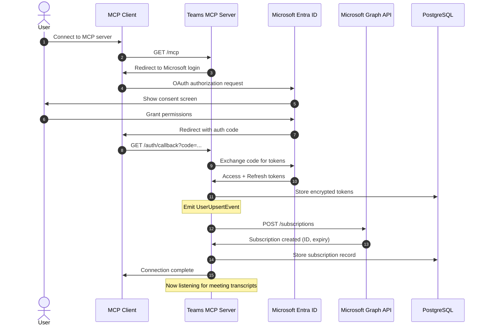
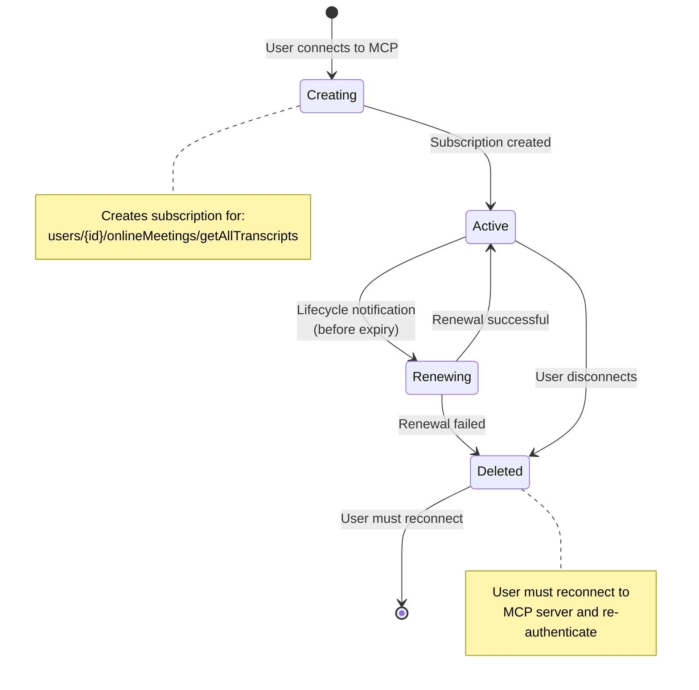
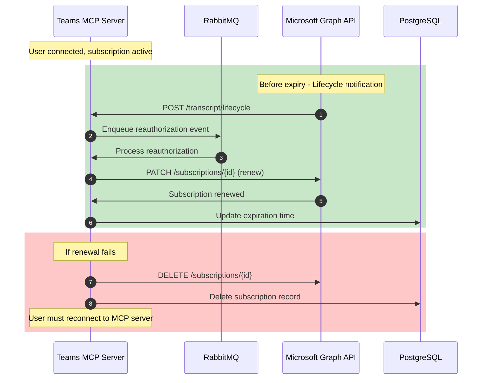
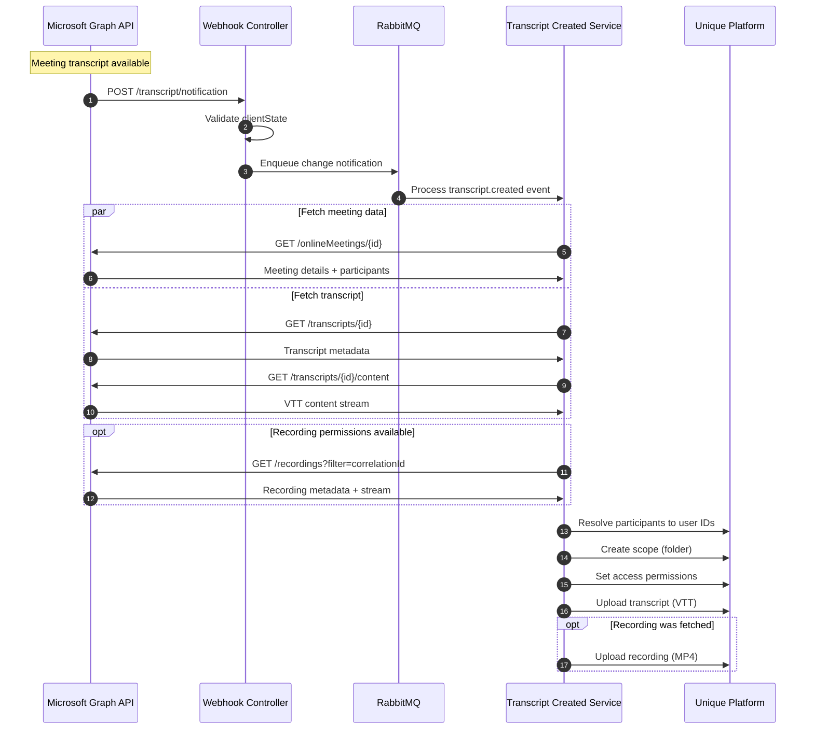
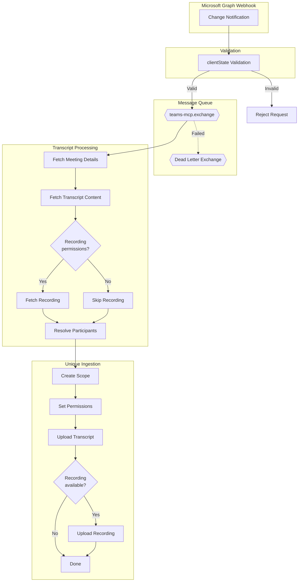

# Flows

## User Connection Flow

Everything starts when a user connects to the MCP server. This triggers OAuth authentication and sets up the subscription for receiving meeting notifications.

```mermaid
flowchart LR
    subgraph Connection["User Connects to MCP Server"]
        Connect["User opens MCP client"]
        MCPEndpoint["GET /mcp"]
    end

    subgraph Auth["OAuth Authentication"]
        Redirect["Redirect to Microsoft"]
        Consent["User grants permissions"]
        Callback["Callback with auth code"]
        Exchange["Exchange for tokens"]
        Store["Store encrypted tokens"]
    end

    subgraph Setup["Subscription Setup"]
        UserUpsert["Emit UserUpsertEvent"]
        CreateSub["Create Graph subscription"]
        StoreSub["Store subscription record"]
    end

    subgraph Ready["Ready for Notifications"]
        Active["Subscription Active"]
        Listen["Listening for transcripts"]
    end

    Connect --> MCPEndpoint
    MCPEndpoint --> Redirect
    Redirect --> Consent
    Consent --> Callback
    Callback --> Exchange
    Exchange --> Store
    Store --> UserUpsert
    UserUpsert --> CreateSub
    CreateSub --> StoreSub
    StoreSub --> Active
    Active --> Listen
```

**OAuth Scopes Required:** See [Microsoft Graph Permissions](./permissions.md) for detailed justification.

## Subscription Lifecycle

Subscriptions are **renewed** (not recreated) before they expire. If renewal fails for any reason, the subscription is deleted and the user must reconnect to the MCP server to re-authenticate.

**Subscription Scheduling:**
- Subscriptions are set to expire at a configured UTC hour (default: 3 AM)
- This batches all renewals to a single time window
- Daily renewal ensures token validity is checked consistently
- Minimum 2-hour subscription lifetime required for lifecycle notifications
- **If renewal fails**: Subscription is deleted and user must reconnect to MCP server

## Transcript Processing Flow

When a meeting transcript becomes available, Microsoft Graph sends a webhook notification. The recording is fetched **only if the user has recording permissions**.

**Webhook Validation:**
- Microsoft Graph sends a `clientState` value with each notification
- The server validates this matches the secret configured during subscription creation
- Invalid `clientState` results in request rejection

**Recording Permissions:**
- Recording fetch requires `OnlineMeetingRecording.Read.All` scope
- If the user hasn't granted this permission, only the transcript is captured
- Recording availability is checked before attempting upload

**Access Control:**
- Meeting organizer receives **write + read** access
- Meeting participants receive **read** access
- Users are resolved by email or username in Unique platform

## Related Documentation

- [Architecture](./architecture.md) - System components and infrastructure
- [Token and Authentication](./token-auth-flows.md) - Token types, validation, refresh flows
- [Microsoft Graph Permissions](./permissions.md) - Required scopes and least-privilege justification
- [Why RabbitMQ](./why-rabbitmq.md) - Message queue rationale
