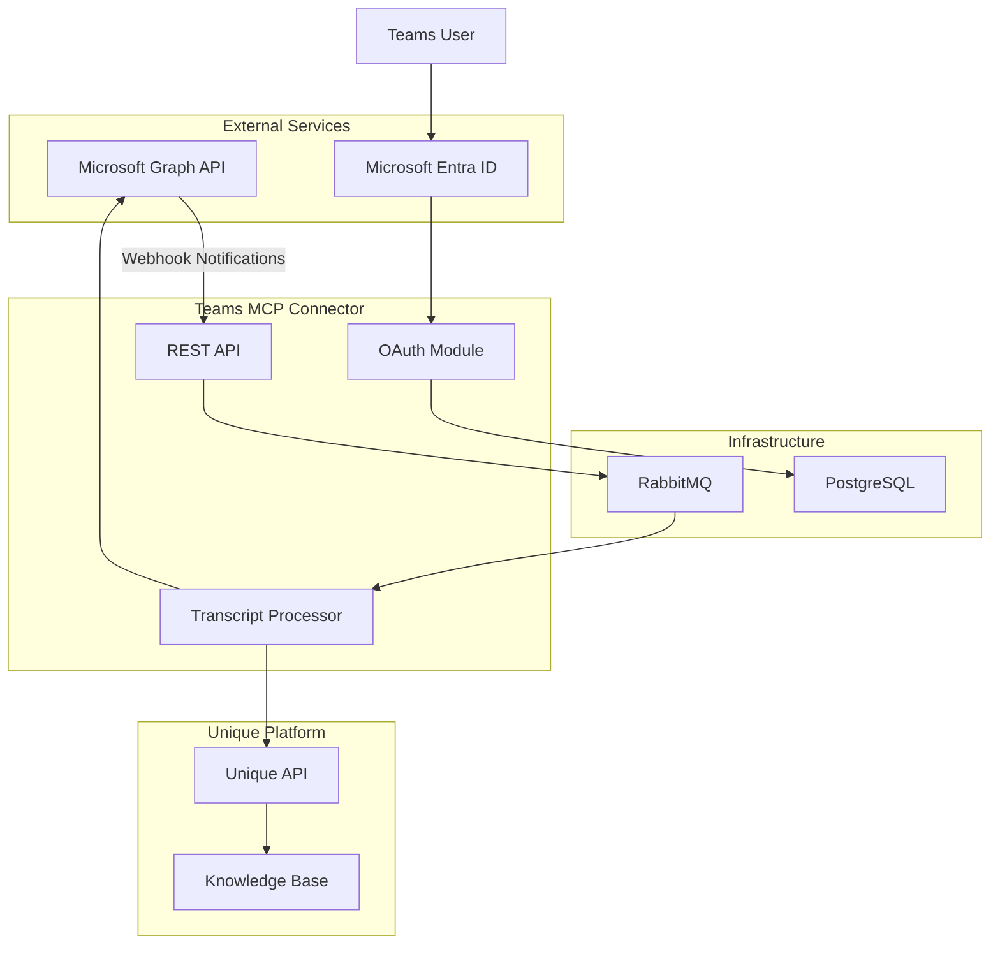
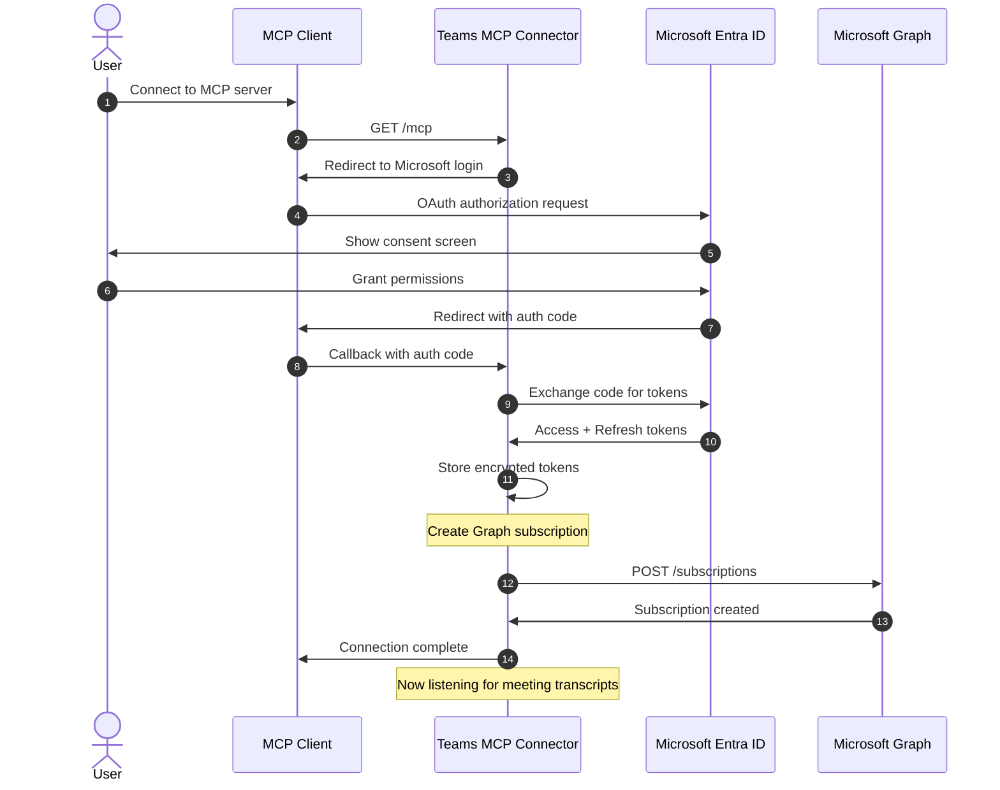
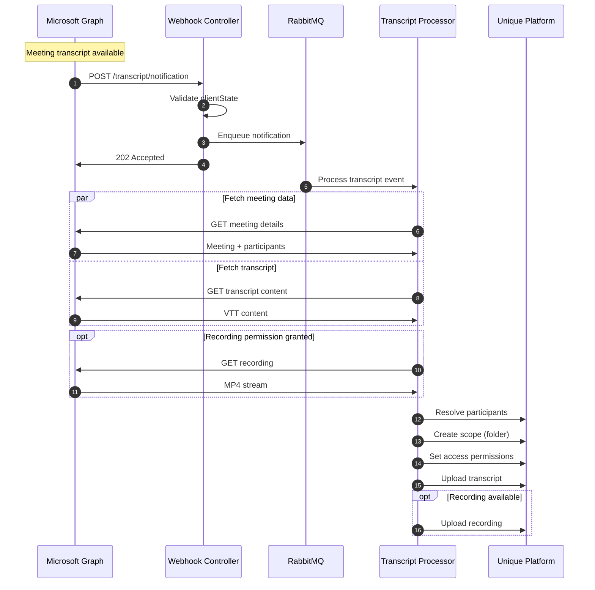

<!-- confluence-page-id: 1789788170 -->
<!-- confluence-space-key: ~624ebe8d45ece00069ce737e -->
<!-- confluence-space-key: ~624ebe8d45ece00069ce737e -->
# Teams MCP Connector

## Overview

The Teams MCP Connector is a cloud-native application that automatically captures meeting transcripts and recordings from Microsoft Teams and ingests them into the Unique knowledge base. This guide provides administrators with essential information about requirements, features, and limitations.

For more technical details on how to operate the Teams MCP Connector please refer to the documentation for IT Operators.

## Quick Summary

**What it does:** Automatically captures meeting transcripts and recordings from Microsoft Teams and ingests them into Unique's AI knowledge base with participant-based access controls

**Deployment:** Kubernetes-based NestJS microservice

**Authentication:** Uses delegated OAuth2 with Microsoft Entra ID (user signs in and consents)

**Processing:** Real-time webhook-driven (notifications received immediately when transcripts are available)

## Requirements

### Microsoft 365 / Teams

| Requirement | Details |
|-------------|---------|
| **Microsoft Teams** | Active tenant with transcription enabled for meetings |
| **Microsoft Entra ID** | Tenant with Application Administrator rights for app registration |
| **License** | Microsoft 365 license with Teams meeting transcription capabilities |

**Prerequisites:**

- Access to Microsoft Entra ID for app registration
- Microsoft Teams meetings with transcription enabled by policy
- Users must be able to consent to delegated permissions (or admin consent granted)

### Permissions

All permissions are **Delegated** (not Application), meaning they act on behalf of the signed-in user and can only access data that user has access to.

| Permission | Type | Admin Consent | Required |
|------------|------|---------------|----------|
| `User.Read` | Delegated | No | Yes |
| `OnlineMeetings.Read` | Delegated | No | Yes |
| `OnlineMeetingTranscript.Read.All` | Delegated | Yes | Yes |
| `OnlineMeetingRecording.Read.All` | Delegated | Yes | No |
| `offline_access` | Delegated | No | Yes |

For detailed permission justifications, see [Microsoft Graph Permissions](./permissions.md).

## Features

### Core Capabilities

**Real-time Transcript Capture**

- Webhook-based notifications from Microsoft Graph API
- Automatic capture when meeting transcripts become available
- VTT format transcript content ingested into Unique

**Automatic Recording Capture** (Optional)

- MP4 recording files captured alongside transcripts
- Requires optional `OnlineMeetingRecording.Read.All` permission to be enabled
- Admins can decline this permission; transcripts still work without recordings

**Participant-Based Access Control**

- Meeting organizer receives **write + read** access in Unique
- Meeting participants receive **read** access in Unique
- Users resolved by email or username in Unique platform

**Self-Service User Connection**

- Users connect their own Microsoft account via OAuth2
- No IT administrator involvement required for individual connections

**Automatic Subscription Management**

- Microsoft Graph webhook subscriptions created automatically on user connection
- Subscriptions renewed automatically before expiration
- Failed renewals handled gracefully with user reconnection required

### Advanced Features

**Security**

- Application-level authentication via OAuth2 with Microsoft Entra ID
- All Microsoft tokens encrypted at rest using AES-GCM
- Refresh token rotation with family-based revocation for theft detection
- Short-lived access tokens (60 seconds) limit exposure window

**Reliability**

- RabbitMQ message queue for asynchronous webhook processing
- Dead Letter Exchange (DLX) for failed message inspection and retry
- Meets Microsoft's strict webhook response requirements (< 10 seconds)

**Observability**

- Detailed logging with trace IDs

**Configuration**

- Configurable token TTLs
- Subscription scheduling (default renewal at 3 AM UTC)
- Rate limiting support

## How It Works

### High-Level Architecture

### User Connection Flow

### Transcript Processing Flow

### User Workflow

1. **User Setup** (One-time)
   - Open MCP client and connect to Teams MCP server
   - Sign in with Microsoft account
   - Grant required permissions

2. **Automatic Processing** (Ongoing)
   - Attend Microsoft Teams meetings with transcription enabled
   - Meeting ends and transcript becomes available
   - Teams MCP automatically receives webhook notification
   - Transcript (and recording if permitted) captured and uploaded

3. **Access in Unique** (Ongoing)
   - Meeting content available in Unique knowledge base
   - Organizer has write + read access
   - Participants have read access
   - Content searchable and queryable via Unique AI

## Limitations

### Not Supported

- **Application-only authentication**: Requires user sign-in; cannot run unattended with app-only permissions
- **Certificate authentication**: Only supported with Client Credentials flow, which is incompatible with delegated permissions
- **Immediate token revocation**: Tokens validated locally with short TTLs instead of remote introspection
- **Multiple tenants per deployment**: Requires separate deployments for each Microsoft tenant

### Considerations

- **Admin consent required**: The `OnlineMeetingTranscript.Read.All` and `OnlineMeetingRecording.Read.All` permissions require administrator consent
- **User reconnection**: If Microsoft refresh token expires (~90 days of inactivity), user must reconnect to MCP server
- **Meeting transcription policy**: Teams meetings must have transcription enabled by organizational policy
- **Subscription renewal**: Handled automatically, but if renewal fails, user must reconnect

## Future Versions

Planned enhancements will be documented here.

## Related Documentation

- [Architecture](./architecture.md) - Detailed system components and infrastructure
- [Flows](./flows.md) - Detailed user connection, subscription lifecycle, transcript processing flows
- [Microsoft Graph Permissions](./permissions.md) - Required scopes and least-privilege justification
- [Token and Authentication](./token-auth-flows.md) - Token types, validation, refresh flows
- [Why RabbitMQ](./why-rabbitmq.md) - Message queue rationale

