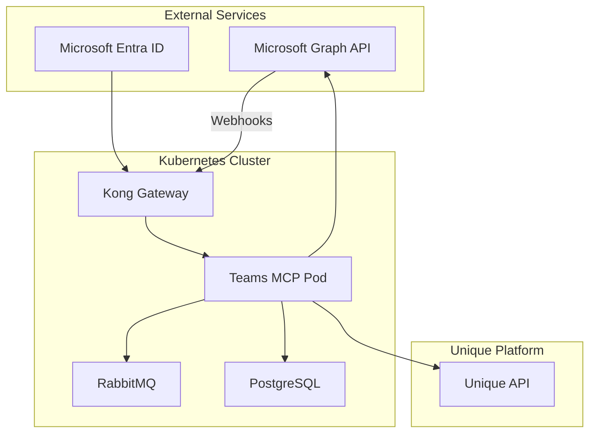

<!-- confluence-page-id: 1801683279 -->
<!-- confluence-space-key: PUBDOC -->

## Overview

This guide provides IT operators with the technical information needed to deploy, configure, and maintain the Teams MCP Server.

The Teams MCP Server exposes 13 MCP tools across two categories:

- **Chat / messaging tools** — `list_teams`, `list_channels`, `list_chats`, `get_chat_messages`, `get_channel_messages`, `search_messages`, `send_chat_message`, `send_channel_message`
- **Transcript / KB tools** — `find_transcripts`, `ingest_meeting`, `verify_kb_integration_status`, `start_kb_integration`, `stop_kb_integration`

Chat tools let users read, search, and send messages in their Teams channels and chats. Transcript tools manage the Microsoft Graph subscription that ingests meeting transcripts into the Unique knowledge base, and allow users to manually trigger ingestion and search those transcripts.

For end-user and administrator documentation, see the [Teams MCP Overview](../README.md). For a full tool reference, see [Technical — Tools](../technical/tools.md).

## Documentation

| Document | Description |
|----------|-------------|
| [Deployment](./deployment.md) | Kubernetes deployment, Helm charts, infrastructure requirements |
| [Configuration](./configuration.md) | Environment variables, feature flags, tuning |
| [Authentication](./authentication.md) | Microsoft Entra ID app registration, OAuth setup |
| [Local Development](./local-development.md) | Setting up a development environment |
| [FAQ](../faq.md) | Frequently asked questions and common mistakes |

## Architecture Overview

```mermaid
flowchart TB
    subgraph External["External Services"]
        MSGraph["Microsoft Graph API"]
        EntraID["Microsoft Entra ID"]
    end

    subgraph K8s["Kubernetes Cluster"]
        Kong["Kong Gateway"]
        TeamsMCP["Teams MCP Pod"]
        RabbitMQ["RabbitMQ"]
        PostgreSQL["PostgreSQL"]
    end

    subgraph Unique["Unique Platform"]
        UniqueAPI["Unique API"]
    end

    EntraID --> Kong
    MSGraph -->|"Webhooks"| Kong
    Kong --> TeamsMCP
    TeamsMCP --> RabbitMQ
    TeamsMCP --> MSGraph
    TeamsMCP --> UniqueAPI
    TeamsMCP --> PostgreSQL
```

The Teams MCP Server runs as a **single pod** that handles both API requests and background processing via RabbitMQ consumers.

## Quick Start

### Unique SaaS

After [granting admin consent](./authentication.md#unique-saas), no additional technical information is required from you. Unique configures the entire deployment using your existing tenant context.

Unique will provide you with the MCP server endpoint URL once the deployment is ready.

## Infrastructure Requirements

| Component | Requirement | Notes |
|-----------|-------------|-------|
| **Kubernetes** | 1.25+ | Any Kubernetes distribution |
| **PostgreSQL** | 14+ | Managed service recommended |
| **RabbitMQ** | 3.12+ | With management plugin |
| **Kong Gateway** | 3.x | Handles ingress and TLS termination |
| **DNS** | Public hostname | For Microsoft webhook callbacks |

## Deployment Checklist

1. **Infrastructure**

   - [ ] PostgreSQL database provisioned
   - [ ] RabbitMQ instance running
   - [ ] Kubernetes namespace created
   - [ ] Kong route configured for public access

2. **Microsoft Entra ID**

   - [ ] App registration created ([Authentication Guide](./authentication.md))
   - [ ] API permissions granted
   - [ ] Admin consent completed
   - [ ] Client secret configured

3. **Application**

   - [ ] Helm values configured ([Configuration Guide](./configuration.md))
   - [ ] Secrets created in Kubernetes
   - [ ] Helm chart deployed ([Deployment Guide](./deployment.md))
   - [ ] Health checks passing

4. **Verification**

   - [ ] OAuth flow works end-to-end
   - [ ] Webhook endpoint accessible from Microsoft
   - [ ] Test transcript captured successfully
   - [ ] Chat tools operational: connect as a test user and confirm `list_teams` returns the user's teams
