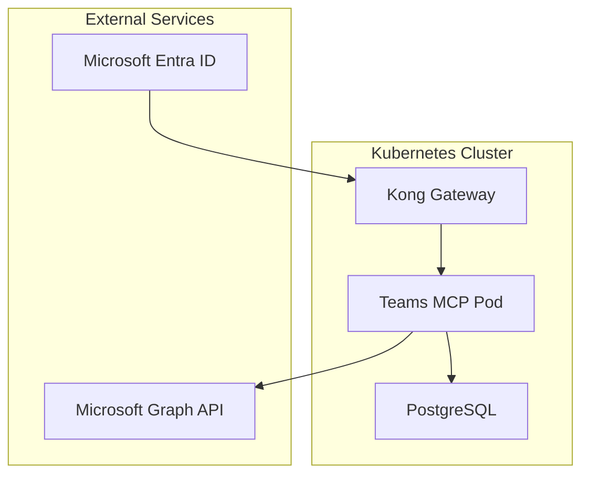

<!-- confluence-page-id: 1801683279 -->
<!-- confluence-space-key: PUBDOC -->

## Overview

This guide provides IT operators with the technical information needed to deploy, configure, and maintain the Teams MCP Server.

The Teams MCP Server exposes 8 MCP tools — `list_teams`, `list_channels`, `list_chats`, `get_chat_messages`, `get_channel_messages`, `search_messages`, `send_chat_message`, `send_channel_message` — that let users read, search, and send messages in their Teams chats and channels. Every call is served live from Microsoft Graph; nothing is stored in Unique.

!!! note "Meeting transcript capture is a separate, opt-in capability"
    Setting `UNIQUE_INTEGRATION=enabled` additionally captures meeting transcripts and recordings into the Unique knowledge base, which requires RabbitMQ, admin consent for the meeting scopes, a Zitadel service account, and a knowledge-base root scope. Enable it only if that is what you want — see the [Recordings & Transcripts Operator Manual](https://unique-ch.atlassian.net/wiki/spaces/PUBDOC/pages/2535522323/Recordings+Transcripts+-+Operator+Manual). Everything on this page applies to both modes.

For end-user and administrator documentation, see the [Teams MCP Overview](../README.md). For a full tool reference, see [Technical — Tools](../technical/tools.md).

## Documentation

| Document | Description |
|----------|-------------|
| [Deployment](./deployment.md) | Kubernetes deployment, Helm charts, infrastructure requirements |
| [Configuration](./configuration.md) | Environment variables, feature flags, tuning |
| [Authentication](./authentication.md) | Microsoft Entra ID app registration, OAuth setup |
| [Local Development](./local-development.md) | Setting up a development environment |
| [FAQ](../faq.md) | Frequently asked questions and common mistakes |

## Architecture Overview

```mermaid
flowchart TB
    subgraph External["External Services"]
        MSGraph["Microsoft Graph API"]
        EntraID["Microsoft Entra ID"]
    end

    subgraph K8s["Kubernetes Cluster"]
        Kong["Kong Gateway"]
        TeamsMCP["Teams MCP Pod"]
        PostgreSQL["PostgreSQL"]
    end

    EntraID --> Kong
    Kong --> TeamsMCP
    TeamsMCP --> MSGraph
    TeamsMCP --> PostgreSQL
```

The Teams MCP Server runs as a **single pod**. With transcript capture enabled it additionally receives webhooks from Microsoft Graph, consumes them from RabbitMQ, and calls the Unique API — see the [Recordings & Transcripts Operator Manual](https://unique-ch.atlassian.net/wiki/spaces/PUBDOC/pages/2535522323/Recordings+Transcripts+-+Operator+Manual).

## Quick Start

### Unique SaaS

After [granting admin consent](./authentication.md#unique-saas), no additional technical information is required from you. Unique configures the entire deployment using your existing tenant context.

Unique will provide you with the MCP server endpoint URL once the deployment is ready.

## Infrastructure Requirements

| Component | Requirement | Notes |
|-----------|-------------|-------|
| **Kubernetes** | 1.25+ | Any Kubernetes distribution |
| **PostgreSQL** | 14+ | Managed service recommended |
| **Kong Gateway** | 3.x | Handles ingress and TLS termination |
| **DNS** | Public hostname | For the MCP endpoint, and for Microsoft webhook callbacks when transcript capture is enabled |
| **RabbitMQ** | 3.12+ | Only with transcript capture enabled; with management plugin |

## Deployment Checklist

1. **Infrastructure**

   - [ ] PostgreSQL database provisioned
   - [ ] Kubernetes namespace created
   - [ ] Kong route configured for public access

2. **Microsoft Entra ID**

   - [ ] App registration created ([Authentication Guide](./authentication.md))
   - [ ] API permissions granted
   - [ ] Admin consent completed
   - [ ] Client secret configured

3. **Application**

   - [ ] Helm values configured ([Configuration Guide](./configuration.md))
   - [ ] Secrets created in Kubernetes
   - [ ] Helm chart deployed ([Deployment Guide](./deployment.md))
   - [ ] Health checks passing

4. **Verification**

   - [ ] OAuth flow works end-to-end
   - [ ] Chat tools operational: connect as a test user and confirm `list_teams` returns the user's teams

Deployments with transcript capture enabled have their own prerequisites and verification steps — see the [Recordings & Transcripts enablement checklist](https://unique-ch.atlassian.net/wiki/spaces/PUBDOC/pages/2535522323/Recordings+Transcripts+-+Operator+Manual#Enablement-checklist).
