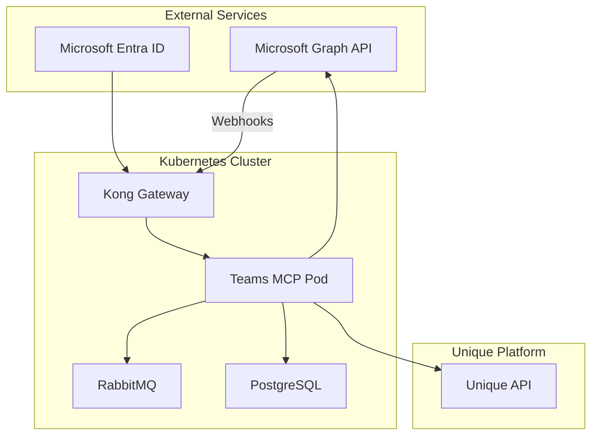

# IT Operator Guide

## Overview

This guide provides IT operators with the technical information needed to deploy, configure, and maintain the Teams MCP Connector.

For end-user and administrator documentation, see the [Teams MCP Overview](../overview.md).

## Documentation

| Document | Description |
|----------|-------------|
| [Deployment](./deployment.md) | Kubernetes deployment, Helm charts, infrastructure requirements |
| [Configuration](./configuration.md) | Environment variables, feature flags, tuning |
| [Authentication](./authentication.md) | Microsoft Entra ID app registration, OAuth setup |
| [Local Development](./local-development.md) | Setting up a development environment |
| [FAQ](./faq.md) | Frequently asked questions and common mistakes |

## Architecture Overview

The Teams MCP Connector runs as a **single pod** that handles both API requests and background processing via RabbitMQ consumers.

## Infrastructure Requirements

| Component | Requirement | Notes |
|-----------|-------------|-------|
| **Kubernetes** | 1.25+ | Any Kubernetes distribution |
| **PostgreSQL** | 14+ | Managed service recommended |
| **RabbitMQ** | 3.12+ | With management plugin |
| **Kong Gateway** | 3.x | Handles ingress and TLS termination |
| **DNS** | Public hostname | For Microsoft webhook callbacks |

## Deployment Checklist

1. **Infrastructure**
   - [ ] PostgreSQL database provisioned
   - [ ] RabbitMQ instance running
   - [ ] Kubernetes namespace created
   - [ ] Kong route configured for public access

2. **Microsoft Entra ID**
   - [ ] App registration created ([Authentication Guide](./authentication.md))
   - [ ] API permissions granted
   - [ ] Admin consent completed
   - [ ] Client secret configured

3. **Application**
   - [ ] Helm values configured ([Configuration Guide](./configuration.md))
   - [ ] Secrets created in Kubernetes
   - [ ] Helm chart deployed ([Deployment Guide](./deployment.md))
   - [ ] Health checks passing

4. **Verification**
   - [ ] OAuth flow works end-to-end
   - [ ] Webhook endpoint accessible from Microsoft
   - [ ] Test transcript captured successfully
