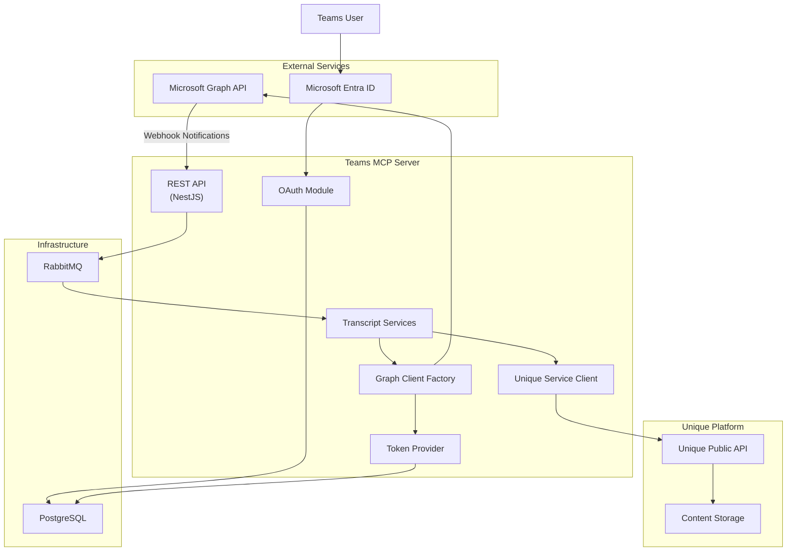
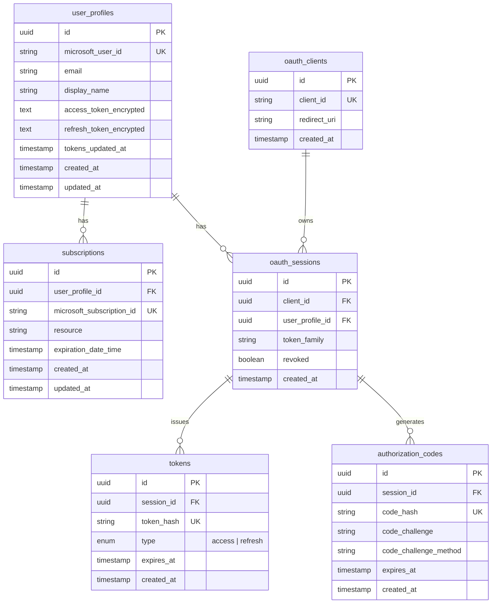

<!-- confluence-page-id: 1787953175 -->
<!-- confluence-space-key: ~624ebe8d45ece00069ce737e -->
# Architecture

## Overview

The Teams MCP Server is a NestJS-based microservice that integrates Microsoft Teams meetings with the Unique platform through the Model Context Protocol (MCP). It captures meeting transcripts and recordings from Microsoft Teams and ingests them into Unique with proper access controls.

**Core Capabilities:**
- Captures Microsoft Teams meeting transcripts and recordings in real-time
- Manages webhook subscriptions to Microsoft Graph API for notifications
- Handles OAuth2 authentication with Microsoft Entra ID
- Ingests content into the Unique platform with participant-based access controls
- Manages subscription lifecycle (create, renew, remove) with scheduled synchronization

## High-Level Architecture

## Components

```mermaid
flowchart LR
    subgraph Auth["Authentication"]
        MicrosoftProvider["Microsoft OAuth Provider"]
        McpOAuthStore["MCP OAuth Store"]
        TokenMgmt["Token Management"]
    end

    subgraph Transcript["Transcript Module"]
        WebhookController["Webhook Controller"]
        SubscriptionCreate["Subscription Create"]
        SubscriptionRemove["Subscription Remove"]
        SubscriptionReauth["Subscription Reauthorize"]
        TranscriptCreated["Transcript Created"]
    end

    subgraph MSGraph["Microsoft Graph"]
        GraphFactory["Graph Client Factory"]
        TokenProvider["Token Provider"]
        MetricsMiddleware["Metrics Middleware"]
        RefreshMiddleware["Token Refresh Middleware"]
    end

    subgraph UniqueIntegration["Unique Integration"]
        UniqueService["Unique Service"]
    end

    subgraph Data["Data Layer"]
        DrizzleORM["Drizzle ORM"]
        Subscriptions[("subscriptions")]
        UserProfiles[("user_profiles")]
        OAuthState[("oauth_*")]
    end

    subgraph Queue["Message Queue"]
        AMQPModule["AMQP Module"]
        MainExchange{{"Main Exchange"}}
        DLX{{"Dead Letter Exchange"}}
    end

    Auth --> Data
    Transcript --> Queue
    Transcript --> MSGraph
    Transcript --> UniqueIntegration
    MSGraph --> Data
    Queue --> Transcript
```

### Component Descriptions

| Component | Purpose |
|-----------|---------|
| **Microsoft OAuth Provider** | Handles OAuth2 flow with Microsoft Entra ID |
| **MCP OAuth Store** | Stores encrypted JWT tokens in PostgreSQL |
| **Token Provider** | Manages access/refresh tokens with automatic refresh |
| **Graph Client Factory** | Creates authenticated Microsoft Graph API clients |
| **Webhook Controller** | Receives notifications from Microsoft Graph |
| **Subscription Services** | Manages Graph API subscription lifecycle |
| **Transcript Created Service** | Processes new transcripts and recordings |
| **Unique Service** | Interfaces with Unique Public API for content ingestion |
| **AMQP Module** | RabbitMQ integration for async message processing |

## Infrastructure

### PostgreSQL

Stores persistent data with the following schema:

| Table | Purpose |
|-------|---------|
| `user_profiles` | User identity and encrypted Microsoft tokens |
| `subscriptions` | Active Graph API webhook subscriptions |
| `oauth_clients` | Registered MCP OAuth clients |
| `oauth_sessions` | Active OAuth sessions with token family tracking |
| `tokens` | MCP access and refresh tokens (hashed) |
| `authorization_codes` | Temporary OAuth authorization codes with PKCE |

**Key Design Decisions:**

- **Token Family Tracking**: Each session has a `token_family` ID. If a refresh token is reused (indicating possible theft), the entire family is revoked.
- **Encrypted Microsoft Tokens**: Access and refresh tokens from Microsoft are encrypted at rest using AES-GCM.
- **Hashed MCP Tokens**: MCP tokens are stored as hashes, not plaintext, for cache-based validation.

### RabbitMQ

Enables asynchronous processing of webhook notifications. See [Why RabbitMQ](./why-rabbitmq.md) for detailed rationale.

| Exchange | Type | Purpose |
|----------|------|---------|
| `unique.teams-mcp.main` | topic | Primary message routing |
| `unique.teams-mcp.dead` | topic | Failed message storage (DLX) |

| Queue | Purpose |
|-------|---------|
| `unique.teams-mcp.transcript.change-notifications` | Transcript processing |
| `unique.teams-mcp.transcript.lifecycle-notifications` | Subscription management |
| `unique.teams-mcp.dead` | Dead letter collection |

## Related Documentation

- [Flows](./flows.md) - User connection, subscription lifecycle, transcript processing
- [Security](./security.md) - Encryption, authentication, and threat model
- [Token and Authentication](./token-auth-flows.md) - Token types, validation, refresh flows
- [Microsoft Graph Permissions](./permissions.md) - Required scopes and least-privilege justification
- [Why RabbitMQ](./why-rabbitmq.md) - Message queue rationale

## Standard References

- [Microsoft Graph API](https://learn.microsoft.com/en-us/graph/overview) - Graph API overview
- [PostgreSQL Documentation](https://www.postgresql.org/docs/) - PostgreSQL official docs
- [RabbitMQ Documentation](https://www.rabbitmq.com/documentation.html) - RabbitMQ official docs
- [NestJS Documentation](https://docs.nestjs.com/) - NestJS framework docs
