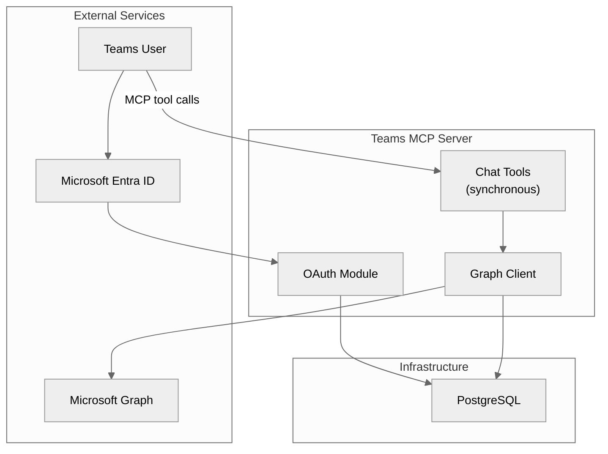
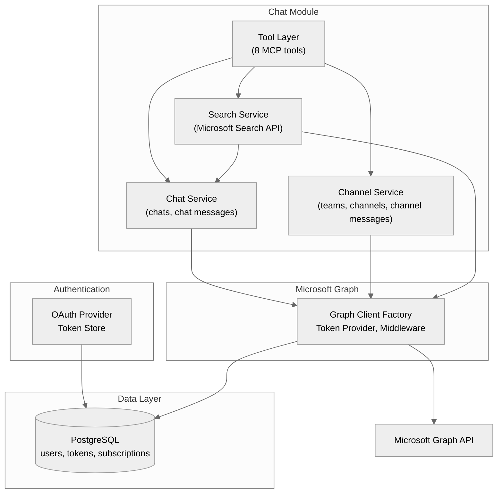
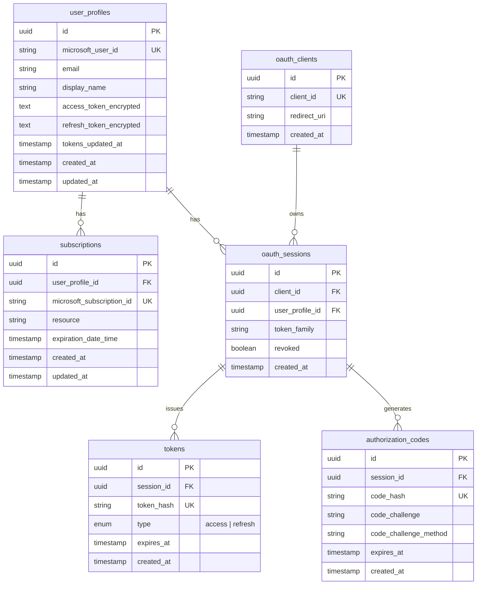
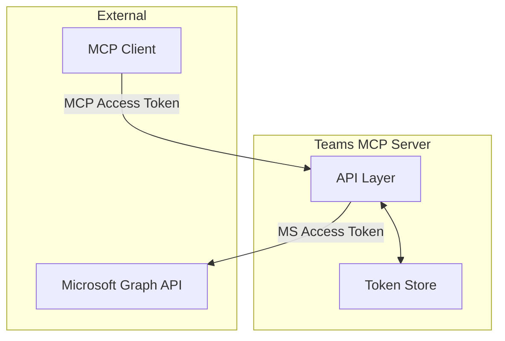

<!-- confluence-page-id: 1802502170 -->
<!-- confluence-space-key: PUBDOC -->

The Teams MCP Server is a NestJS-based microservice that gives Unique AI access to Microsoft Teams chats and channels through the Model Context Protocol (MCP). Every tool call is served synchronously and live from the Microsoft Graph API on behalf of the signed-in user; **nothing is copied into the Unique knowledge base**.

**Core Capabilities:**

- Handles OAuth2 authentication with Microsoft Entra ID, including token encryption and refresh
- Reads messages from personal chats and team channels via synchronous MCP tools
- Searches across chats and channels using the Microsoft Search API
- Sends messages to chats and channels via synchronous MCP tools

**Optional add-on:** with `UNIQUE_INTEGRATION=enabled` the server also runs a webhook-driven pipeline that captures meeting transcripts and recordings into the Unique knowledge base, adding a webhook controller, a RabbitMQ queue, a transcript processor, and a Unique API client. That architecture is documented in the [Recordings & Transcripts Technical Manual](https://unique-ch.atlassian.net/wiki/spaces/PUBDOC/pages/2399993877/Recordings+Transcripts+-+Technical+Manual#Architecture); this page covers the always-present core.

## High-Level Architecture

```mermaid
%%{init: {'theme': 'neutral', 'themeVariables': { 'fontSize': '14px' }}}%%
flowchart TB
    subgraph External["External Services"]
        User["Teams User"]
        EntraID["Microsoft Entra ID"]
        MSGraph["Microsoft Graph"]
    end

    subgraph TeamsMCP["Teams MCP Server"]
        OAuth["OAuth Module"]
        ChatTools["Chat Tools<br/>(synchronous)"]
        GraphClient["Graph Client"]
    end

    subgraph Infrastructure["Infrastructure"]
        DB["PostgreSQL"]
    end

    User --> EntraID
    EntraID --> OAuth
    OAuth --> DB

    User -->|"MCP tool calls"| ChatTools
    ChatTools --> GraphClient

    GraphClient --> DB
    GraphClient --> MSGraph
```

## Components

```mermaid
%%{init: {'theme': 'neutral', 'themeVariables': { 'fontSize': '14px' }}}%%
flowchart TB
    subgraph Auth["Authentication"]
        AuthModule["OAuth Provider<br/>Token Store"]
    end

    subgraph Chat["Chat Module"]
        ChatSvc["Chat Service<br/>(chats, chat messages)"]
        ChannelSvc["Channel Service<br/>(teams, channels, channel messages)"]
        SearchSvc["Search Service<br/>(Microsoft Search API)"]
        ChatToolLayer["Tool Layer<br/>(8 MCP tools)"]
    end

    subgraph GraphModule["Microsoft Graph"]
        GraphClient["Graph Client Factory<br/>Token Provider, Middleware"]
    end

    subgraph Data["Data Layer"]
        DB[("PostgreSQL<br/>users, tokens, subscriptions")]
    end

    AuthModule --> DB
    ChatToolLayer --> ChatSvc
    ChatToolLayer --> ChannelSvc
    ChatToolLayer --> SearchSvc
    SearchSvc --> ChatSvc
    ChatSvc --> GraphClient
    ChannelSvc --> GraphClient
    SearchSvc --> GraphClient
    GraphClient --> DB
    GraphClient --> MSGraph["Microsoft Graph API"]
```

### Component Descriptions

| Component | Purpose |
|-----------|---------|
| **Microsoft OAuth Provider** | Handles OAuth2 flow with Microsoft Entra ID |
| **MCP OAuth Store** | Stores encrypted JWT tokens in PostgreSQL |
| **Token Provider** | Manages access/refresh tokens with automatic refresh |
| **Graph Client Factory** | Creates authenticated Microsoft Graph API clients |
| **Chat Module** | Chat, channel, and search services plus the 8-tool MCP surface |

The Transcript Module — webhook controller, subscription services, transcript processor, Unique API client, and the AMQP module they depend on — is registered only when transcript capture is enabled. See the [Recordings & Transcripts Technical Manual](https://unique-ch.atlassian.net/wiki/spaces/PUBDOC/pages/2399993877/Recordings+Transcripts+-+Technical+Manual#Architecture).

### Chat Module

The Chat Module (`src/chat/`) exposes a synchronous request/response tool surface over MCP. Tool calls are handled inline — there is no queue or background worker.

**Chat and channel messages are accessible through these tools but are never ingested into Unique.** The Unique AI can read, search, and send them on demand, but each call is served **live from the Microsoft Graph API** — Unique keeps no knowledge-base copy, and the messages exist only in Microsoft. "Not ingested" refers to storage, not accessibility.

**Services:**

| Service | File | Responsibility |
|---------|------|----------------|
| **ChatService** | `chat.service.ts` | Lists personal chats; fetches and sends chat messages via `/me/chats` and `/chats/{id}/messages` |
| **ChannelService** | `channel.service.ts` | Lists joined teams and their channels; fetches and sends channel messages via `/me/joinedTeams`, `/teams/{id}/channels`, and `/teams/{id}/channels/{id}/messages` |
| **SearchService** | `search.service.ts` | Cross-container message search via the Microsoft Search API (`POST /search/query` on Graph v1.0); delegates per-hit hydration to `ChatService` |

**Tool layer** (`src/chat/tools/`):

| Tool | What it does |
|------|-------------|
| `list_chats` | Lists recent personal chats with member and preview metadata |
| `get_chat_messages` | Fetches messages from a personal chat by ID |
| `send_chat_message` | Posts a plain-text message to a personal chat by ID |
| `list_teams` | Lists all Teams the user has joined |
| `list_channels` | Lists channels in a given team by ID |
| `get_channel_messages` | Fetches messages from a team channel by ID |
| `send_channel_message` | Posts a plain-text message to a team channel by ID |
| `search_messages` | Searches messages across chats and channels in one query |

**Targeting by id:** `list_*` tools return identifiers (chat id, team id, channel id) that are passed directly to the `get_*_messages` and `send_*_message` tools. See [Chat Flows](./flows.md#Chat-Flows) for sequence diagrams.

**Search specifics (`SearchService`):** The Microsoft Search API does not use `@odata.nextLink`. It pages by `offset` and `size` on the request, and reports `moreResultsAvailable` on the response.

A search hit carries no message body, so every hit that names a container and a message id is fetched separately. A hit naming neither container (`source: unknown`) costs no call and returns without `message`. Bodies are passed through as Graph sends them, with the structured metadata alongside.

At most 3 fetches run at once (`pLimit`), because Graph throttles reads of one chat or channel at about one request per second. Any failure — 403, 404, 429, a channel reply that is only addressable under its parent post, or a schema mismatch — drops `content` for that row and logs at `warn`. The page still returns. The whole pass stops after 15 seconds, so a throttled page returns bodyless rows instead of timing the caller out.

## Infrastructure

### PostgreSQL

Stores persistent data with the following schema:

```mermaid
erDiagram
    user_profiles ||--o{ subscriptions : "has"
    user_profiles ||--o{ oauth_sessions : "has"
    oauth_clients ||--o{ oauth_sessions : "owns"
    oauth_sessions ||--o{ tokens : "issues"
    oauth_sessions ||--o{ authorization_codes : "generates"

    user_profiles {
        uuid id PK
        string microsoft_user_id UK
        string email
        string display_name
        text access_token_encrypted
        text refresh_token_encrypted
        timestamp tokens_updated_at
        timestamp created_at
        timestamp updated_at
    }

    subscriptions {
        uuid id PK
        uuid user_profile_id FK
        string microsoft_subscription_id UK
        string resource
        timestamp expiration_date_time
        timestamp created_at
        timestamp updated_at
    }

    oauth_clients {
        uuid id PK
        string client_id UK
        string redirect_uri
        timestamp created_at
    }

    oauth_sessions {
        uuid id PK
        uuid client_id FK
        uuid user_profile_id FK
        string token_family
        boolean revoked
        timestamp created_at
    }

    tokens {
        uuid id PK
        uuid session_id FK
        string token_hash UK
        enum type "access | refresh"
        timestamp expires_at
        timestamp created_at
    }

    authorization_codes {
        uuid id PK
        uuid session_id FK
        string code_hash UK
        string code_challenge
        string code_challenge_method
        timestamp expires_at
        timestamp created_at
    }
```

| Table | Purpose |
|-------|---------|
| `user_profiles` | User identity and encrypted Microsoft tokens |
| `subscriptions` | Active Graph API webhook subscriptions (only populated with transcript capture enabled) |
| `oauth_clients` | Registered MCP OAuth clients |
| `oauth_sessions` | Active OAuth sessions with token family tracking |
| `tokens` | MCP access and refresh tokens (hashed) |
| `authorization_codes` | Temporary OAuth authorization codes with PKCE |

**Key Design Decisions:**

- **Token Family Tracking**: Each session has a `token_family` ID. If a refresh token is reused (indicating possible theft), the entire family is revoked.
- **Encrypted Microsoft Tokens**: Access and refresh tokens from Microsoft are encrypted at rest using AES-GCM.
- **Hashed MCP Tokens**: MCP tokens are stored as hashes, not plaintext, for cache-based validation.

### RabbitMQ

Used **only** by transcript capture, to process webhook notifications asynchronously. A chat-only deployment does not need RabbitMQ at all. The rationale, exchanges, queues, and dead-letter behaviour are documented in the [Recordings & Transcripts Technical Manual](https://unique-ch.atlassian.net/wiki/spaces/PUBDOC/pages/2399993877/Recordings+Transcripts+-+Technical+Manual#Ingestion-pipeline).

## Authentication Architecture

The Teams MCP service handles **two layers of authentication**:

1. **MCP OAuth** - Authentication between MCP clients and this server
2. **Microsoft OAuth** - Authentication with Microsoft Entra ID for Graph API access

```mermaid
flowchart TB
    subgraph External["External"]
        Client["MCP Client"]
        Graph["Microsoft Graph API"]
    end

    subgraph TeamsMCP["Teams MCP Server"]
        API["API Layer"]
        TokenStore["Token Store"]
    end

    Client -->|"MCP Access Token"| API
    API -->|"MS Access Token"| Graph
    API <--> TokenStore
```

### Token Isolation

**Critical Security Design:** Microsoft OAuth tokens (access and refresh) are **never exposed to clients**. The OAuth flow happens entirely on the server:

1. **Microsoft OAuth Flow**: User authenticates with Microsoft Entra ID
2. **Token Exchange**: Server exchanges authorization code for Microsoft tokens (using `CLIENT_SECRET`)
3. **Token Storage**: Microsoft tokens are encrypted and stored on the server only
4. **Client Authentication**: Server issues separate opaque JWT tokens to the client for MCP API access

This design ensures that:
- Microsoft tokens never leave the server
- Clients cannot access Microsoft Graph API directly
- All Microsoft API calls are made by the server on behalf of authenticated users
- Client tokens are opaque JWTs that only authenticate with the MCP server

### Token Storage

| Token Type | Source | Storage Location | Client Access |
|------------|--------|------------------|---------------|
| Access Token | Microsoft Entra ID | Encrypted in `user_profiles` table | **Never** |
| Refresh Token | Microsoft Entra ID | Encrypted in `user_profiles` table | **Never** |

**Required Scopes:** See [Microsoft Graph Permissions](./permissions.md) for the complete list with least-privilege justification.

### Token Encryption

All Microsoft tokens are encrypted at rest using **AES-GCM** (authenticated encryption) with a 256-bit key stored in environment variables.

### Single App Registration Architecture

Each MCP server deployment uses **one Microsoft Entra ID app registration**:

- **Single App Registration**: One `CLIENT_ID`/`CLIENT_SECRET` pair per deployment
- **Multi-Tenant Capable**: The app registration can be configured to accept users from multiple Microsoft tenants
- **Cross-Tenant Authentication**: Users from different organizations authenticate via Enterprise Applications in their tenant that reference the original app registration
- **Enterprise Application Creation**: When tenant admin grants consent, Microsoft creates an Enterprise Application in their tenant as a proxy to the original app registration

This design uses a single OAuth application that can serve users across multiple tenants, rather than requiring separate app registrations per organization.

For detailed explanation, see [Permissions - Why Delegated (Not Application)](./permissions.md#why-delegated-not-application-permissions).

### Required App Registration Components

| Component | Purpose | Security Function |
|-----------|---------|-------------------|
| `CLIENT_ID` | Application identifier | Identifies which app is requesting access |
| `CLIENT_SECRET` | Application credential | Proves the server is the legitimate app (not an imposter) |
| **Redirect URI** | OAuth callback endpoint | Prevents authorization code interception |
| **API Permissions** | Graph scopes | Limits what data the app can access |
| **Admin Consent** | Privileged scopes | Required for `ChannelMessage.Read.All`, and for the meeting scopes when transcript capture is enabled |

Without proper app registration, Microsoft Graph API will reject all authentication attempts with `invalid_client` errors.

### Unsupported Authentication Methods

| Method | Supported | Reason |
|--------|-----------|--------|
| Client Secret + Delegated | **Yes** | Standard OAuth2 flow for user-specific access |
| Client Credentials (OIDC) | **No** | No user context; requires admin policy setup |
| Certificate Authentication | **No** | Only works with Client Credentials flow |
| Federated Identity | **No** | Only works with Client Credentials flow |
| Multiple App Registrations | **No** | Each MCP server deployment uses one Entra ID app registration |

The Teams MCP service requires **delegated permissions** to access user-specific resources. Client Credentials flow only supports application permissions, which would require tenant admins to create Application Access Policies via PowerShell—impractical for self-service MCP connections.

**See also:**

- [Microsoft Entra ID - Authentication flows](https://learn.microsoft.com/en-us/entra/identity-platform/msal-authentication-flows)
- [Microsoft Graph - Get access on behalf of a user](https://learn.microsoft.com/en-us/graph/auth-v2-user)

### MCP OAuth (Internal)

The MCP OAuth layer implements the [MCP Authorization specification](https://modelcontextprotocol.io/specification/2025-03-26/basic/authorization):

- **OAuth 2.1 Authorization Code + PKCE** flow
- **Refresh token rotation** with family-based revocation for theft detection
- **Cache-first token validation** (no introspection endpoint)
- **Token cleanup** for expired tokens

| Token Type | Default TTL | Purpose |
|------------|-------------|---------|
| Access Token | 60 seconds | Short-lived API access |
| Refresh Token | 30 days | Obtain new access tokens |

### Configuration Reference

| Variable | Default | Description |
|----------|---------|-------------|
| `AUTH_ACCESS_TOKEN_EXPIRES_IN_SECONDS` | 60 | MCP access token TTL |
| `AUTH_REFRESH_TOKEN_EXPIRES_IN_SECONDS` | 2592000 | MCP refresh token TTL (30 days) |
| `AUTH_HMAC_SECRET` | (required) | 64-char hex for JWT signing |
| `ENCRYPTION_KEY` | (required) | 64-char hex for AES-GCM encryption |

## Related Documentation

- [Flows](./flows.md) - User connection, OAuth, token refresh, chat read/search/send
- [Security](./security.md) - Encryption, authentication, and threat model
- [Microsoft Graph Permissions](./permissions.md) - Required scopes and least-privilege justification
- [Recordings & Transcripts - Technical Manual](https://unique-ch.atlassian.net/wiki/spaces/PUBDOC/pages/2399993877/Recordings+Transcripts+-+Technical+Manual) - The optional transcript capture pipeline and its infrastructure

## Standard References

- [Microsoft Graph API](https://learn.microsoft.com/en-us/graph/overview) - Graph API overview
- [PostgreSQL Documentation](https://www.postgresql.org/docs/) - PostgreSQL official docs
- [RabbitMQ Documentation](https://www.rabbitmq.com/documentation.html) - RabbitMQ official docs
- [NestJS Documentation](https://docs.nestjs.com/) - NestJS framework docs
