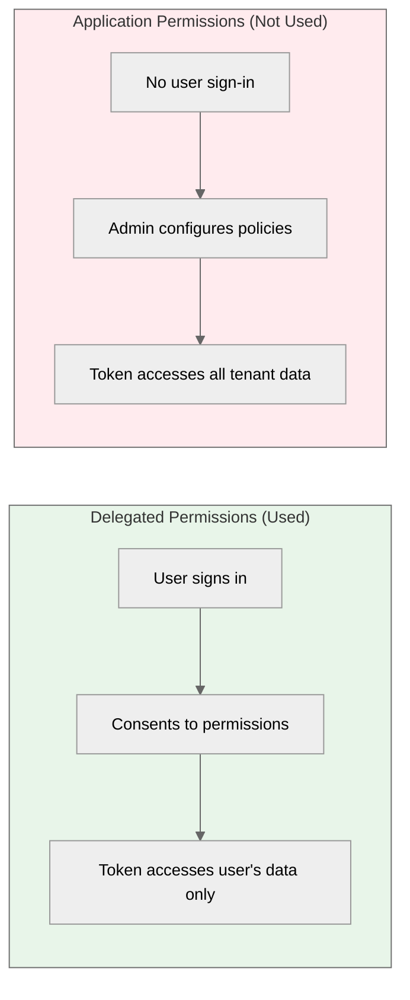

<!-- confluence-page-id: 1802240023 -->
<!-- confluence-space-key: PUBDOC -->

All permissions are **Delegated** (not Application), meaning they act on behalf of the signed-in user and can only access data that user has access to.

## Permission Summary

| Permission | Type | ID | Admin Consent | Required |
|------------|------|-----|---------------|----------|
| `User.Read` | Delegated | `e1fe6dd8-ba31-4d61-89e7-88639da4683d` | No | Yes |
| `Calendars.Read` | Delegated | `465a38f9-76ea-45b9-9f34-9e8b0d4b0b42` | No | Yes |
| `OnlineMeetings.Read` | Delegated | `9be106e1-f4e3-4df5-bdff-e4bc531cbe43` | No | Yes |
| `OnlineMeetingTranscript.Read.All` | Delegated | `30b87d18-ebb1-45db-97f8-82ccb1f0190c` | Yes | Yes |
| `OnlineMeetingRecording.Read.All` | Delegated | `190c2bb6-1fdd-4fec-9aa2-7d571b5e1fe3` | Yes | No |
| `offline_access` | Delegated | `7427e0e9-2fba-42fe-b0c0-848c9e6a8182` | No | Yes |

## Understanding Consent Requirements

**This is standard Microsoft behavior, not Teams MCP specific.** All Microsoft 365 apps use the same consent model.

### Standard Microsoft Consent Process

1. **Admin adds the app and grants admin-required permissions**
   - Organization-wide OR per-user
   - For Teams MCP: `OnlineMeetingTranscript.Read.All` and `OnlineMeetingRecording.Read.All` require admin consent

2. **Admin approval workflow (if tenant has it enabled)**
   - Users request admin approval
   - Admin approves app for that user
   - This is in addition to Step 1

3. **User consent (always required for delegated permissions)**
   - Each user must consent individually
   - Required even after admin consent (Microsoft's requirement for delegated permissions)

**Microsoft Documentation:**
- [User and admin consent overview](https://learn.microsoft.com/en-us/entra/identity/enterprise-apps/user-admin-consent-overview) - Standard Microsoft consent flows
- [Grant admin consent](https://learn.microsoft.com/en-us/entra/identity/enterprise-apps/grant-admin-consent) - Step-by-step guide
- [Admin consent workflow](https://learn.microsoft.com/en-us/entra/identity/enterprise-apps/configure-admin-consent-workflow) - Per-user approval process

## Least-Privilege Justification

Each permission is the minimum required for its function. No narrower alternatives exist.

### `User.Read`

| Aspect | Detail |
|--------|--------|
| **Purpose** | Retrieve the signed-in user's profile (ID, email, display name) |
| **Used For** | Identifying the user when storing tokens and creating subscriptions |
| **Why Not Less** | This is the minimum permission to read any user data |
| **Why Not `User.ReadBasic.All`** | That permission reads other users; we only need the signed-in user |

### `Calendars.Read`

| Aspect | Detail |
|--------|--------|
| **Purpose** | Read the user's calendar events |
| **Used For** | Determining if a meeting is recurring by querying the calendar event associated with an online meeting |
| **Why Not Less** | No narrower permission exists for reading calendar events |
| **Why Not `Calendars.ReadWrite`** | We don't create or modify calendar events, only read them |

### `OnlineMeetings.Read`

| Aspect | Detail |
|--------|--------|
| **Purpose** | Read meeting metadata (subject, start/end time, participants) |
| **Used For** | Fetching meeting details when a transcript notification arrives |
| **Why Not Less** | No narrower permission exists for reading meeting data |
| **Why Not `OnlineMeetings.ReadWrite`** | We don't create or modify meetings, only read them |

### `OnlineMeetingTranscript.Read.All`

| Aspect | Detail |
|--------|--------|
| **Purpose** | Read transcripts from all meetings the user can access |
| **Used For** | Downloading VTT transcript content for ingestion |
| **Why Not Less** | No per-meeting transcript permission exists; `.All` is the minimum |
| **Why Not Application Permission** | Would require tenant admin to create Application Access Policies per-user; impractical for self-service MCP connections |
| **Admin Consent** | Required because transcripts may contain sensitive meeting content |

### `OnlineMeetingRecording.Read.All`

| Aspect | Detail |
|--------|--------|
| **Purpose** | Read recordings from all meetings the user can access |
| **Used For** | Downloading MP4 recording files (optional feature) |
| **Why Not Less** | No per-meeting recording permission exists; `.All` is the minimum |
| **Why Optional** | Users can decline this permission; transcripts still work without recordings |
| **Admin Consent** | Required because recordings contain audio/video of meetings |

### `offline_access`

| Aspect | Detail |
|--------|--------|
| **Purpose** | Obtain refresh tokens for long-lived sessions |
| **Used For** | Refreshing expired access tokens without user re-authentication |
| **Why Required** | Without this, users would need to re-authenticate every ~1 hour when access tokens expire |

## Why Delegated (Not Application) Permissions

| Factor | Delegated | Application |
|--------|-----------|-------------|
| User involvement | User signs in and consents | No user; admin pre-configures |
| Data access scope | Only the signed-in user's data | All users' data in tenant |
| Setup requirement | None (self-service) | Admin creates Access Policies |
| Least privilege | Yes - user controls their own data | No - broad tenant access |

The MCP model requires **self-service user connections** where each user:
1. Connects their own account
2. Controls what data they share
3. Can disconnect at any time

Application permissions would require tenant administrators to pre-configure access for each user, defeating the self-service model.

## Permission Reference Links

- [Microsoft Graph Permissions Reference](https://learn.microsoft.com/en-us/graph/permissions-reference) - Official Microsoft documentation
- [Calendars.Read](https://graphpermissions.merill.net/permission/Calendars.Read) - Third-party permission explorer
- [OnlineMeetingTranscript.Read.All](https://graphpermissions.merill.net/permission/OnlineMeetingTranscript.Read.All) - Third-party permission explorer
- [OnlineMeetingRecording.Read.All](https://graphpermissions.merill.net/permission/OnlineMeetingRecording.Read.All) - Third-party permission explorer
- [Microsoft Graph API](https://learn.microsoft.com/en-us/graph/overview) - Graph API overview

## Related Documentation

- [Architecture](./architecture.md) - System components and infrastructure
- [Security](./security.md) - Encryption, PKCE, and threat model
- [Flows](./flows.md) - User connection, subscription lifecycle, transcript processing
