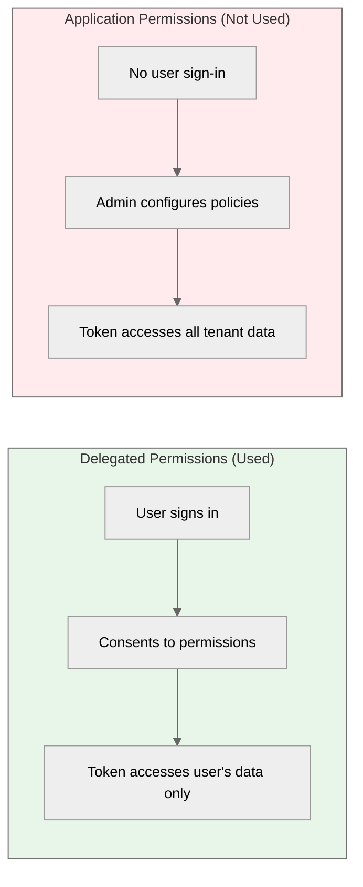

<!-- confluence-page-id: 1802240023 -->
<!-- confluence-space-key: PUBDOC -->

All permissions are **Delegated** (not Application), meaning they act on behalf of the signed-in user and can only access data that user has access to.

## Permission Summary

These are all the scopes a Teams MCP server requests. Only one of them, `ChannelMessage.Read.All`, needs admin consent.

| Permission | Type | ID | Admin Consent | Used For |
|------------|------|-----|---------------|----------|
| `User.Read` | Delegated | `e1fe6dd8-ba31-4d61-89e7-88639da4683d` | No | Identify the signed-in user |
| `offline_access` | Delegated | `7427e0e9-2fba-42fe-b0c0-848c9e6a8182` | No | Refresh tokens for long-lived sessions |
| `ChannelMessage.Send` | Delegated | `ebf0f66e-9fb1-49e4-a278-222f76911cf4` | No | `send_channel_message` |
| `ChatMessage.Send` | Delegated | `116b7235-2ffd-4103-963e-baec9c8e5c8b` | No | `send_chat_message` |
| `Chat.ReadBasic` | Delegated | `9547fcb5-d03f-419d-9948-5928bbf71b0f` | No | `list_chats` |
| `Chat.Read` | Delegated | `f501c180-9344-439a-bca0-6cbf209fd270` | No | `get_chat_messages`, `search_messages` |
| `Team.ReadBasic.All` | Delegated | `2280dda6-0bfd-44ee-a2f4-cb867cfc4c1e` | No | `list_teams` |
| `Channel.ReadBasic.All` | Delegated | `3aeca27b-ee3a-4c2b-8ded-80376e2134a4` | No | `list_channels` |
| `ChannelMessage.Read.All` | Delegated | `767156cb-16ae-4d10-8f8b-41b657c8c8c8` | **Yes** | `get_channel_messages`, `search_messages` |

No meeting, transcript, or recording scope is requested. The server reads and sends chat and channel messages, and nothing else.

!!! note "Deployments with transcript capture request more"
    Setting `UNIQUE_INTEGRATION=enabled` adds three meeting scopes on top of this set, two of which need admin consent. They are documented with the feature that uses them — see [Recordings & Transcripts — Required Microsoft Graph permissions](https://unique-ch.atlassian.net/wiki/spaces/PUBDOC/pages/2399993877/Recordings+Transcripts+-+Technical+Manual#Required-Microsoft-Graph-permissions).

## Deployment Modes and Scope Sets

The requested scopes are composed from two **independent** capability toggles:

- `CHAT_INTEGRATION` (default `enabled`) — the Teams chat/channel messaging tools.
- `UNIQUE_INTEGRATION` (default `disabled`) — meeting transcript/recording capture into the Unique knowledge base.

The scopes fall into three groups:

- **Identity** (always requested, regardless of toggles): `openid`, `profile`, `email`, `offline_access`, `User.Read`.
- **Messaging** (requested only when `CHAT_INTEGRATION=enabled`): `ChannelMessage.Send`, `ChatMessage.Send`, `Chat.ReadBasic`, `Chat.Read`, `Team.ReadBasic.All`, `Channel.ReadBasic.All`, `ChannelMessage.Read.All`.
- **Knowledge base** (requested only when `UNIQUE_INTEGRATION=enabled`): `OnlineMeetings.Read`, `OnlineMeetingRecording.Read.All`, `OnlineMeetingTranscript.Read.All`.

| Mode | `UNIQUE_INTEGRATION` | `CHAT_INTEGRATION` | Scopes requested |
|------|----------------------|--------------------|------------------|
| Full | `enabled` | `enabled` | identity + messaging + knowledge base |
| Chat-only | `disabled` | `enabled` (default) | identity + messaging |
| Ingestion-only | `enabled` | `disabled` | identity + knowledge base (**no messaging scopes**) |
| Both off | `disabled` | `disabled` | — (server fails fast at startup) |

!!! note "Ingestion-only least-privilege scope set"
    An ingestion-only deployment (`UNIQUE_INTEGRATION=enabled`, `CHAT_INTEGRATION=disabled`) requests **only** the identity scopes plus `OnlineMeetings.Read`, `OnlineMeetingRecording.Read.All`, and `OnlineMeetingTranscript.Read.All`. It requests **none** of the messaging scopes, so the app cannot read or send any chat or channel message. This is the least-privilege app registration for transcript capture.

## Understanding Consent Requirements

**This is standard Microsoft behavior, not Teams MCP specific.** All Microsoft 365 apps use the same consent model.

### Standard Microsoft Consent Process

1. **Admin adds the app and grants admin-required permissions**

   - Organization-wide OR per-user
   - `ChannelMessage.Read.All` **does** require admin consent (required for `get_channel_messages` to read channel message content). It is the only one in the set above that does.
   - Every other permission can be approved by individual users: `User.Read`, `offline_access`, `Chat.ReadBasic`, `Chat.Read`, `ChatMessage.Send`, `Team.ReadBasic.All`, `Channel.ReadBasic.All`, `ChannelMessage.Send`.

2. **Admin approval workflow (if tenant has it enabled)**

   - Users request admin approval
   - Admin approves app for that user
   - This is in addition to Step 1

3. **User consent (always required for delegated permissions)**

   - Each user must consent individually
   - Required even after admin consent (Microsoft's requirement for delegated permissions)

**Microsoft Documentation:**

- [User and admin consent overview](https://learn.microsoft.com/en-us/entra/identity/enterprise-apps/user-admin-consent-overview) - Standard Microsoft consent flows
- [Grant admin consent](https://learn.microsoft.com/en-us/entra/identity/enterprise-apps/grant-admin-consent) - Step-by-step guide
- [Admin consent workflow](https://learn.microsoft.com/en-us/entra/identity/enterprise-apps/configure-admin-consent-workflow) - Per-user approval process

## Least-Privilege Justification

Each permission is the minimum required for its function. No narrower alternatives exist.

### `User.Read`

| Aspect | Detail |
|--------|--------|
| **Purpose** | Retrieve the signed-in user's profile (ID, email, display name) |
| **Used For** | Identifying the user when storing tokens |
| **Why Not Less** | This is the minimum permission to read any user data |
| **Why Not `User.ReadBasic.All`** | That permission reads other users; we only need the signed-in user |

### `offline_access`

| Aspect | Detail |
|--------|--------|
| **Purpose** | Obtain refresh tokens for long-lived sessions |
| **Used For** | Refreshing expired access tokens without user re-authentication |
| **Why Required** | Without this, users would need to re-authenticate every ~1 hour when access tokens expire |

### `ChannelMessage.Send`

| Aspect | Detail |
|--------|--------|
| **Purpose** | Send messages to Microsoft Teams channels |
| **Used For** | `send_channel_message` tool to post messages on behalf of the user |
| **Why Not Less** | No narrower permission exists for sending channel messages |
| **Why Not `ChannelMessage.ReadWrite`** | We only send messages, not read or modify them |

### `ChatMessage.Send`

| Aspect | Detail |
|--------|--------|
| **Purpose** | Send messages to Microsoft Teams chats |
| **Used For** | `send_chat_message` tool to post messages on behalf of the user |
| **Why Not Less** | No narrower permission exists for sending chat messages |
| **Why Not `Chat.ReadWrite`** | We only send messages, not read full chat content via this permission |

### `Chat.ReadBasic`

| Aspect | Detail |
|--------|--------|
| **Purpose** | List the user's chats with basic metadata (topic, members, chat type) |
| **Used For** | `list_chats` tool, which returns chat ids plus distinguishing metadata (topic, members, creation and last-message dates) used to pick the right chat id |
| **Why Not Less** | No narrower permission exists for listing chats |
| **Why Not `Chat.Read`** | `Chat.ReadBasic` is sufficient for listing chats; `Chat.Read` is only needed for reading message content |

### `Chat.Read`

| Aspect | Detail |
|--------|--------|
| **Purpose** | Read full message content from Teams chats |
| **Used For** | `get_chat_messages` tool to retrieve message history; `search_messages` tool to run keyword searches via the Microsoft Search API and hydrate chat hits |
| **Why Not Less** | `Chat.ReadBasic` does not grant access to message content |
| **Why Not `Chat.ReadWrite`** | We do not modify or delete chat messages |

### `Team.ReadBasic.All`

| Aspect | Detail |
|--------|--------|
| **Purpose** | List all Teams the user is a member of |
| **Used For** | `list_teams` tool, which returns team ids plus `isArchived` status to disambiguate same-named teams |
| **Why Not Less** | No narrower permission exists for listing joined teams |
| **Why Not `Team.Read.All`** | `Team.ReadBasic.All` is sufficient for listing teams with the metadata needed for id-based targeting |

### `Channel.ReadBasic.All`

| Aspect | Detail |
|--------|--------|
| **Purpose** | List channels in a Team |
| **Used For** | `list_channels` tool, which returns channel ids plus `createdDateTime` and `membershipType` used to pick the right channel id |
| **Why Not Less** | No narrower permission exists for listing channels |
| **Why Not `Channel.Read.All`** | `Channel.ReadBasic.All` is sufficient for listing channels with the metadata needed for id-based targeting |

### `ChannelMessage.Read.All`

| Aspect | Detail |
|--------|--------|
| **Purpose** | Read message content from Teams channels |
| **Used For** | `get_channel_messages` tool to retrieve channel message history; `search_messages` tool to hydrate channel hits (hydration is unconditional) |
| **Why Not Less** | `Channel.ReadBasic.All` only covers listing channels, not reading message content |
| **Why Not `ChannelMessage.ReadWrite`** | We do not modify or delete channel messages |
| **Admin Consent** | Required because channel messages may contain sensitive organisational content |

## Why Delegated (Not Application) Permissions

```mermaid
%%{init: {'theme': 'neutral', 'themeVariables': { 'fontSize': '14px' }}}%%
flowchart LR
    subgraph Delegated["Delegated Permissions (Used)"]
        U1["User signs in"]
        U2["Consents to permissions"]
        U3["Token accesses user's data only"]
    end

    subgraph Application["Application Permissions (Not Used)"]
        A1["No user sign-in"]
        A2["Admin configures policies"]
        A3["Token accesses all tenant data"]
    end

    U1 --> U2 --> U3
    A1 --> A2 --> A3

    style Delegated fill:#e8f5e9
    style Application fill:#ffebee
```

| Factor | Delegated | Application |
|--------|-----------|-------------|
| User involvement | User signs in and consents | No user; admin pre-configures |
| Data access scope | Only the signed-in user's data | All users' data in tenant |
| Setup requirement | None (self-service) | Admin creates Access Policies |
| Least privilege | Yes - user controls their own data | No - broad tenant access |

The MCP model requires **self-service user connections** where each user:

1. Connects their own account
2. Controls what data they share
3. Can disconnect at any time

Application permissions would require tenant administrators to pre-configure access for each user, defeating the self-service model.

## Permission Reference Links

- [Microsoft Graph Permissions Reference](https://learn.microsoft.com/en-us/graph/permissions-reference) - Official Microsoft documentation
- [ChannelMessage.Read.All](https://graphpermissions.merill.net/permission/ChannelMessage.Read.All) - Third-party permission explorer
- [Chat.Read](https://graphpermissions.merill.net/permission/Chat.Read) - Third-party permission explorer
- [Microsoft Graph API](https://learn.microsoft.com/en-us/graph/overview) - Graph API overview

## Related Documentation

- [Architecture](./architecture.md) - System components and infrastructure
- [Security](./security.md) - Encryption, PKCE, and threat model
- [Flows](./flows.md) - User connection, OAuth, token refresh, and chat tool sequences
- [Recordings & Transcripts - Technical Manual](https://unique-ch.atlassian.net/wiki/spaces/PUBDOC/pages/2399993877/Recordings+Transcripts+-+Technical+Manual) - The three additional meeting scopes, and where they are used
