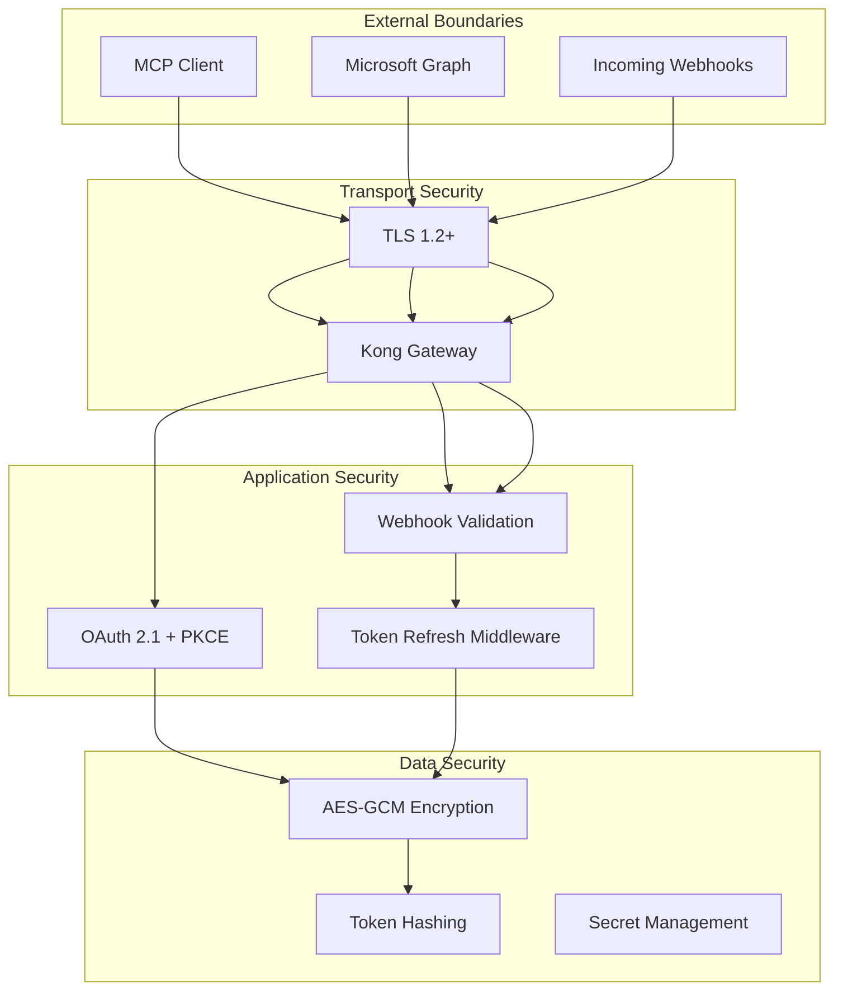
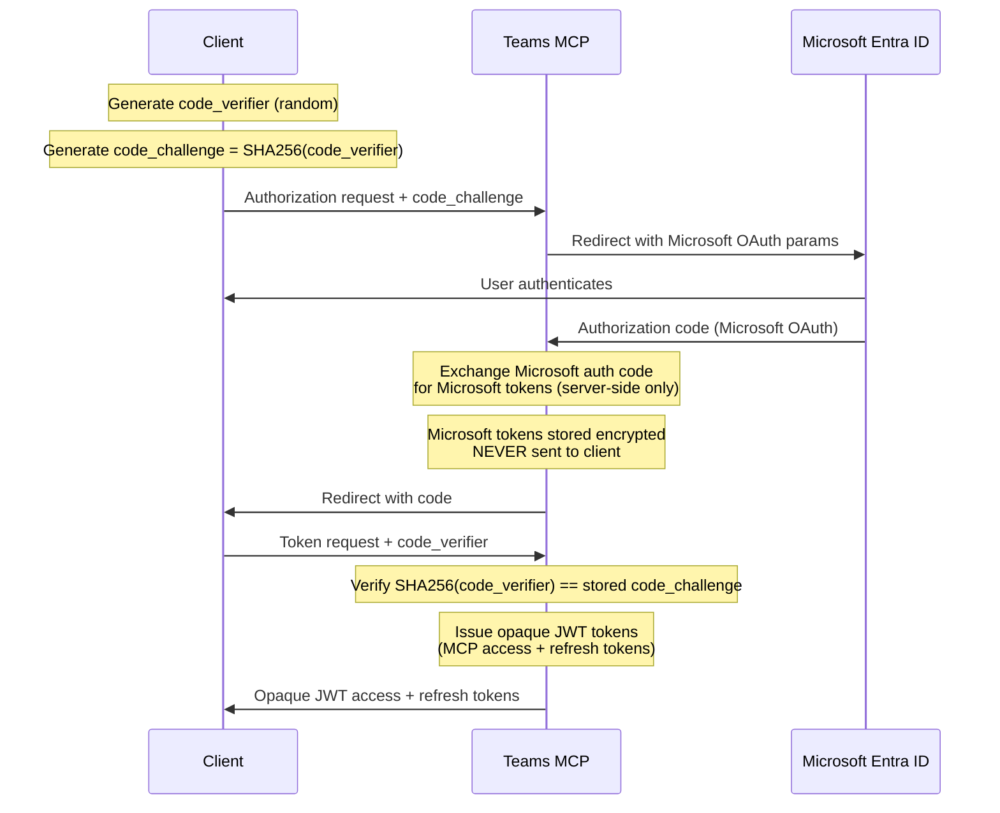
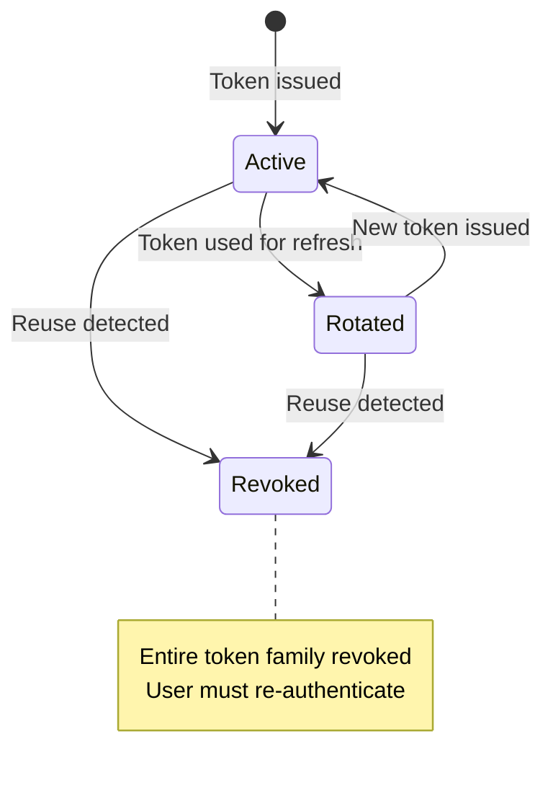
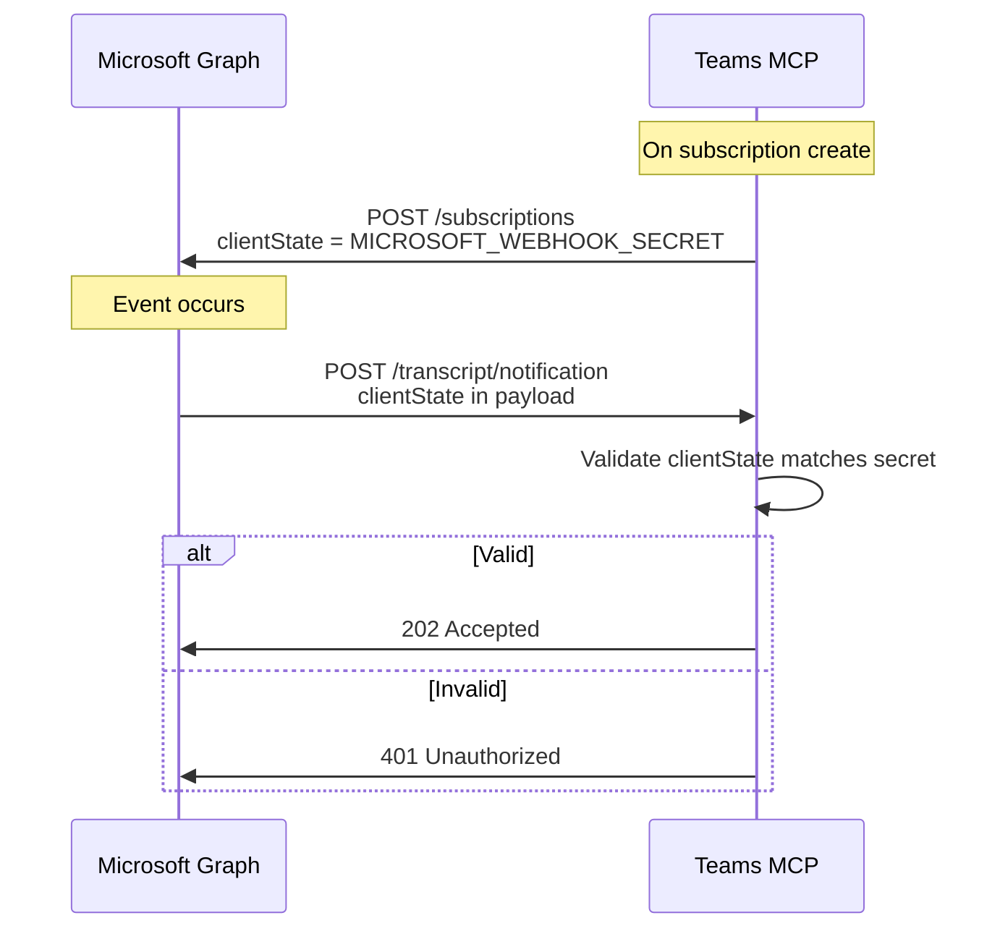

# Security

This document describes the security architecture, cryptographic decisions, and threat model for the Teams MCP Connector.

## Security Layers

## Token Security

### Microsoft Tokens (Encrypted at Rest)

Microsoft access and refresh tokens are stored encrypted using **AES-256-GCM**:

| Aspect | Implementation |
|--------|----------------|
| Algorithm | AES-256-GCM (authenticated encryption) |
| Key Size | 256 bits (64 hex characters) |
| IV | Random 12 bytes per encryption |
| Authentication | Built-in with GCM mode |
| Key Storage | `ENCRYPTION_KEY` environment variable |

**Why AES-GCM:**
- Provides both confidentiality and integrity (authenticated encryption)
- Prevents tampering with ciphertext
- Industry standard for token encryption

**Token Lifecycle:**
1. Microsoft issues tokens during OAuth flow
2. Tokens encrypted immediately before database write
3. Tokens decrypted only when needed for Graph API calls
4. Tokens re-encrypted after refresh

### MCP Tokens (Hashed for Validation)

MCP access and refresh tokens use a different approach:

| Token Type | Storage | Validation |
|------------|---------|------------|
| Access Token | SHA-256 hash | Cache-first, then database lookup |
| Refresh Token | SHA-256 hash | Database lookup with family check |

**Why Hashing (not Encryption):**
- Tokens are opaque JWTs—the server doesn't need to read them
- Hash comparison is sufficient for validation
- Reduces attack surface (no decryption key needed)

## OAuth 2.1 with PKCE

The MCP OAuth implementation follows [OAuth 2.1](https://oauth.net/2.1/) with mandatory PKCE. This diagram shows the **MCP OAuth flow** where the server issues **opaque JWT tokens** to the client after the Microsoft OAuth flow completes on the server.

**Important:** The tokens issued to the client in this flow are **opaque JWTs for MCP authentication**, not Microsoft tokens. Microsoft tokens remain on the server and are never sent to clients.

**PKCE Protection:**
- Prevents authorization code interception attacks
- Required for all OAuth flows (no exceptions)
- Uses `S256` challenge method (SHA-256)

**Token Separation:**
- **Microsoft tokens**: Stay on server, encrypted at rest, used for Graph API calls
- **MCP tokens**: Opaque JWTs issued to client, used for MCP API authentication

**References:**
- [RFC 7636 - PKCE](https://datatracker.ietf.org/doc/html/rfc7636) - Proof Key for Code Exchange
- [OAuth 2.1](https://oauth.net/2.1/) - OAuth 2.1 specification
- [RFC 6749 - OAuth 2.0](https://datatracker.ietf.org/doc/html/rfc6749) - OAuth 2.0 Authorization Framework

## Refresh Token Rotation

Refresh tokens are rotated on every use with family-based revocation:

**Token Family Revocation:**

Each OAuth session has a `token_family` identifier. When a refresh token is used:

1. Server checks if token was already used
2. If **reused** → entire family revoked (possible theft)
3. If **valid** → token marked used, new token issued with same family

This detects scenarios where an attacker obtains a refresh token and uses it, but the legitimate client also tries to use the original.

## Webhook Validation

Microsoft Graph webhooks are validated using `clientState`:

**Validation Details:**
- `MICROSOFT_WEBHOOK_SECRET` is a 128-character random string
- Sent to Microsoft when creating subscriptions
- Returned in every webhook payload
- Requests with invalid `clientState` are rejected

## Secret Management

### Required Secrets

| Secret | Purpose | Rotation Impact |
|--------|---------|-----------------|
| `ENCRYPTION_KEY` | Encrypt Microsoft tokens | All users must reconnect |
| `AUTH_HMAC_SECRET` | Sign MCP JWTs | All sessions invalidated |
| `MICROSOFT_CLIENT_SECRET` | Authenticate with Entra ID | Update and restart |
| `MICROSOFT_WEBHOOK_SECRET` | Validate webhooks | Recreate all subscriptions |

### Rotation Procedures

**ENCRYPTION_KEY Rotation:**
1. There is no zero-downtime rotation—key change invalidates all stored tokens
2. Deploy with new key
3. All users must reconnect to MCP server
4. Consider warning users before rotation

**AUTH_HMAC_SECRET Rotation:**
1. Change secret and deploy
2. All MCP sessions immediately invalidated
3. Clients will re-authenticate automatically

**MICROSOFT_CLIENT_SECRET Rotation:**
1. Create new secret in Entra ID
2. Update Kubernetes secret
3. Restart pods
4. Delete old secret from Entra ID

## Security Checklist for Operators

- [ ] `ENCRYPTION_KEY` is a cryptographically random 64-character hex string
- [ ] `AUTH_HMAC_SECRET` is a cryptographically random 64-character hex string
- [ ] `MICROSOFT_WEBHOOK_SECRET` is a cryptographically random 128-character string
- [ ] All secrets stored in Kubernetes secrets (not ConfigMaps)
- [ ] Network policies restrict pod-to-pod communication
- [ ] TLS termination configured at ingress
- [ ] Log aggregation excludes sensitive fields (tokens are auto-redacted)
- [ ] Monitoring alerts configured for authentication failures

## Related Documentation

- [Token and Authentication](./token-auth-flows.md) - Detailed token lifecycle
- [Architecture](./architecture.md) - Data model and infrastructure
- [Configuration](../operator/configuration.md) - Secret configuration
- [Troubleshooting](../operator/troubleshooting.md) - Authentication issues

## Standard References

- [RFC 7636 - PKCE](https://datatracker.ietf.org/doc/html/rfc7636) - Proof Key for Code Exchange
- [RFC 6749 - OAuth 2.0](https://datatracker.ietf.org/doc/html/rfc6749) - OAuth 2.0 Authorization Framework
- [OAuth 2.1](https://oauth.net/2.1/) - OAuth 2.1 specification
- [NIST SP 800-38D](https://csrc.nist.gov/publications/detail/sp/800-38d/final) - AES-GCM specification
- [MDN Web Crypto API](https://developer.mozilla.org/en-US/docs/Web/API/Web_Crypto_API) - Web cryptography reference
