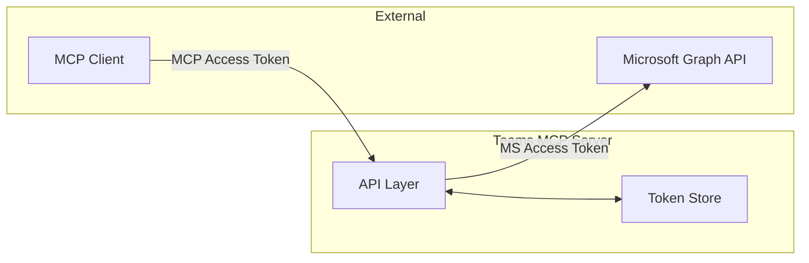
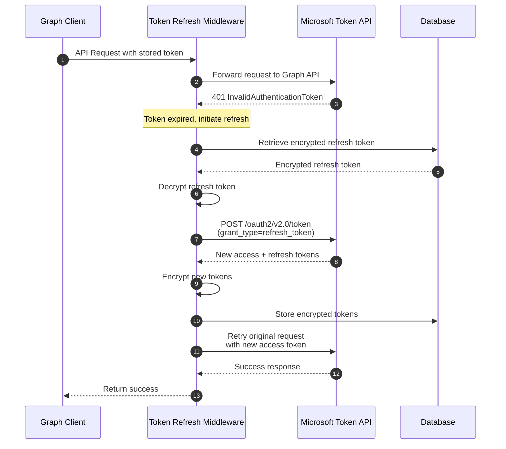

# Token and Authentication Flows

## Overview

The Teams MCP service handles **two layers of authentication**:

1. **MCP OAuth** - Authentication between MCP clients and this server
2. **Microsoft OAuth** - Authentication with Microsoft Entra ID for Graph API access

## MCP OAuth (Internal)

The MCP OAuth layer implements the [MCP Authorization specification](https://modelcontextprotocol.io/specification/2025-03-26/basic/authorization):

- **OAuth 2.1 Authorization Code + PKCE** flow
- **Refresh token rotation** with family-based revocation for theft detection
- **Cache-first token validation** (no introspection endpoint)
- **Token cleanup** for expired tokens

| Token Type | Default TTL | Purpose |
|------------|-------------|---------|
| Access Token | 60 seconds | Short-lived API access |
| Refresh Token | 30 days | Obtain new access tokens |

**References:**
- [MCP Authorization](https://modelcontextprotocol.io/specification/2025-03-26/basic/authorization) - MCP protocol authorization spec
- [OAuth 2.1 draft](https://oauth.net/2.1/) - OAuth 2.1 specification
- [RFC 7636 - PKCE](https://datatracker.ietf.org/doc/html/rfc7636) - Proof Key for Code Exchange

## Microsoft OAuth (External)

### Token Storage

| Token Type | Source | Storage Location |
|------------|--------|------------------|
| Access Token | Microsoft Entra ID | Encrypted in `user_profiles` table |
| Refresh Token | Microsoft Entra ID | Encrypted in `user_profiles` table |

**Required Scopes:** See [Microsoft Graph Permissions](./permissions.md) for the complete list with least-privilege justification.

### Token Refresh Flow

Microsoft tokens are refreshed **on-demand** when the Graph API returns a 401 error:

### Token Encryption

All Microsoft tokens are encrypted at rest using **AES-GCM** (authenticated encryption) with a 256-bit key stored in environment variables.

## Configuration Reference

| Variable | Default | Description |
|----------|---------|-------------|
| `AUTH_ACCESS_TOKEN_EXPIRES_IN_SECONDS` | 60 | MCP access token TTL |
| `AUTH_REFRESH_TOKEN_EXPIRES_IN_SECONDS` | 2592000 | MCP refresh token TTL (30 days) |
| `AUTH_HMAC_SECRET` | (required) | 64-char hex for JWT signing |
| `ENCRYPTION_KEY` | (required) | 64-char hex for AES-GCM encryption |

## Unsupported Authentication Methods

| Method | Supported | Reason |
|--------|-----------|--------|
| Client Secret + Delegated | **Yes** | Standard OAuth2 flow for user-specific access |
| Client Credentials (OIDC) | **No** | No user context; requires admin policy setup |
| Certificate Authentication | **No** | Only works with Client Credentials flow |
| Federated Identity | **No** | Only works with Client Credentials flow |

The Teams MCP service requires **delegated permissions** to access user-specific resources. Client Credentials flow only supports application permissions, which would require tenant admins to create Application Access Policies via PowerShell—impractical for self-service MCP connections.

For detailed explanation, see [Permissions - Why Delegated (Not Application)](./permissions.md#why-delegated-not-application-permissions).

**Microsoft Documentation:**
- [Authentication flows in MSAL](https://learn.microsoft.com/en-us/entra/identity-platform/msal-authentication-flows)
- [Get access on behalf of a user](https://learn.microsoft.com/en-us/graph/auth-v2-user)
- [Public and confidential client apps](https://learn.microsoft.com/en-us/entra/identity-platform/msal-client-applications)

## Troubleshooting

### MCP Token Expired

**Symptom:** API requests rejected with authentication error

**Resolution:** Client should use refresh token to obtain new access token

### Microsoft Token Refresh Failed

**Symptom:** Graph API calls fail even after refresh attempt

**Possible Causes:**
- Microsoft refresh token expired (90-day default)
- User revoked consent in Microsoft account settings
- Network issues reaching Microsoft token endpoint

**Resolution:** User must reconnect to MCP server to re-authenticate

### Token Family Revoked

**Symptom:** All refresh operations fail for a user

**Cause:** Refresh token reuse detected (possible token theft)

**Resolution:** User must re-authenticate completely

### Encryption Key Changed

**Symptom:** All Microsoft API calls fail after deployment

**Cause:** `ENCRYPTION_KEY` environment variable changed

**Resolution:** All users must reconnect to obtain fresh tokens (stored tokens are unreadable with new key)

## Related Documentation

- [Architecture](./architecture.md) - System components and infrastructure
- [Flows](./flows.md) - User connection, subscription lifecycle, transcript processing
- [Microsoft Graph Permissions](./permissions.md) - Required scopes and least-privilege justification
