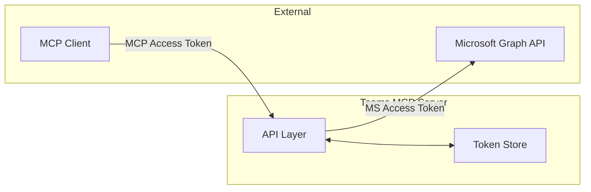
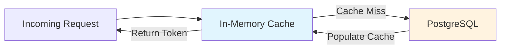
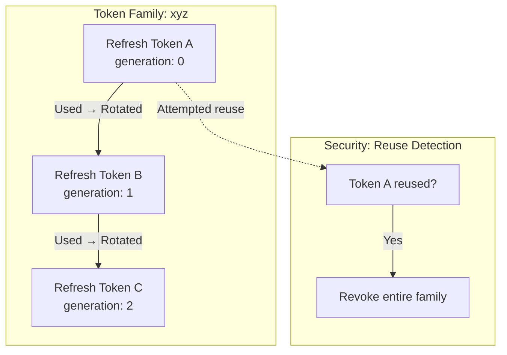
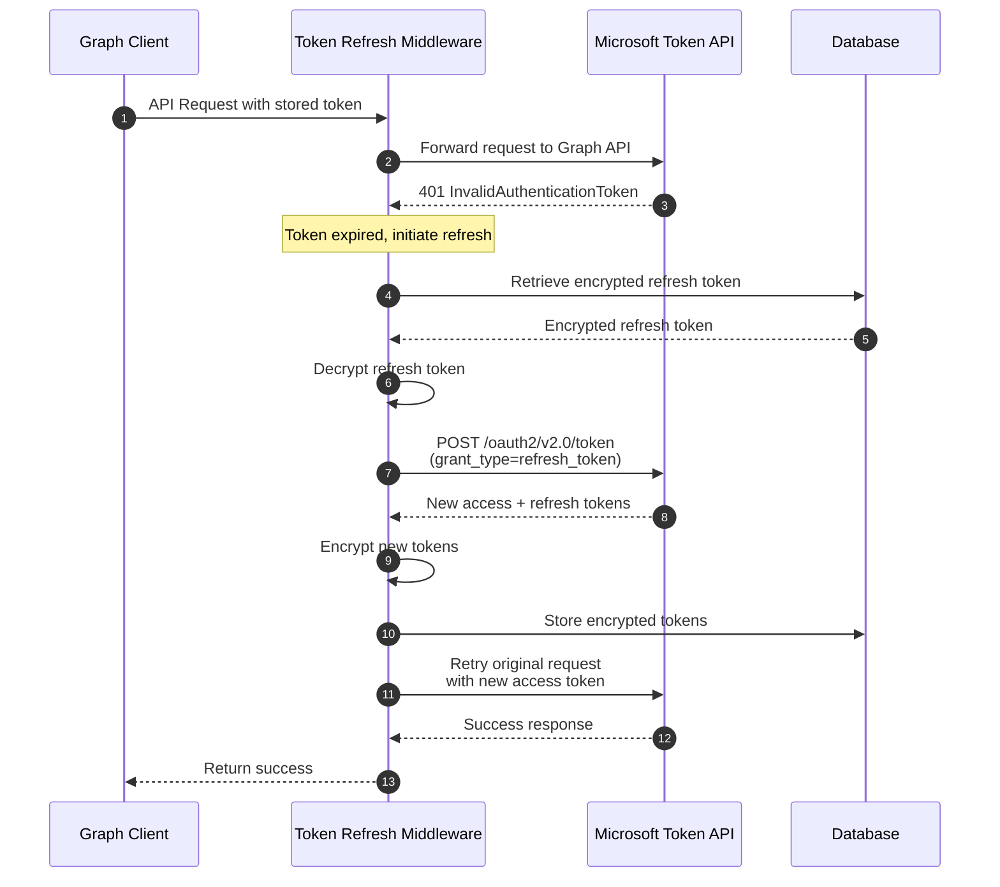
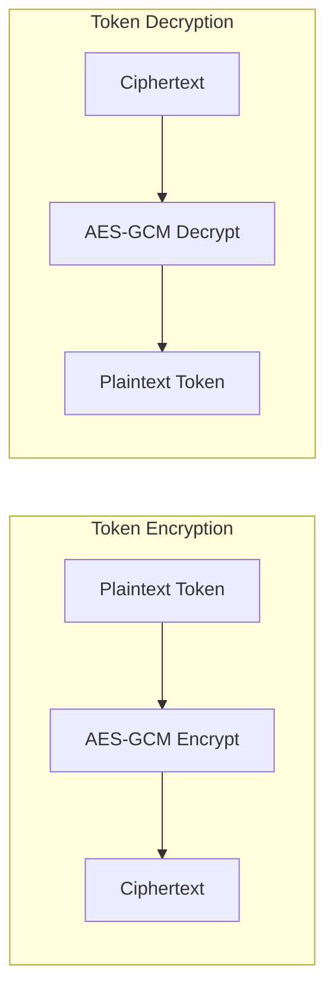
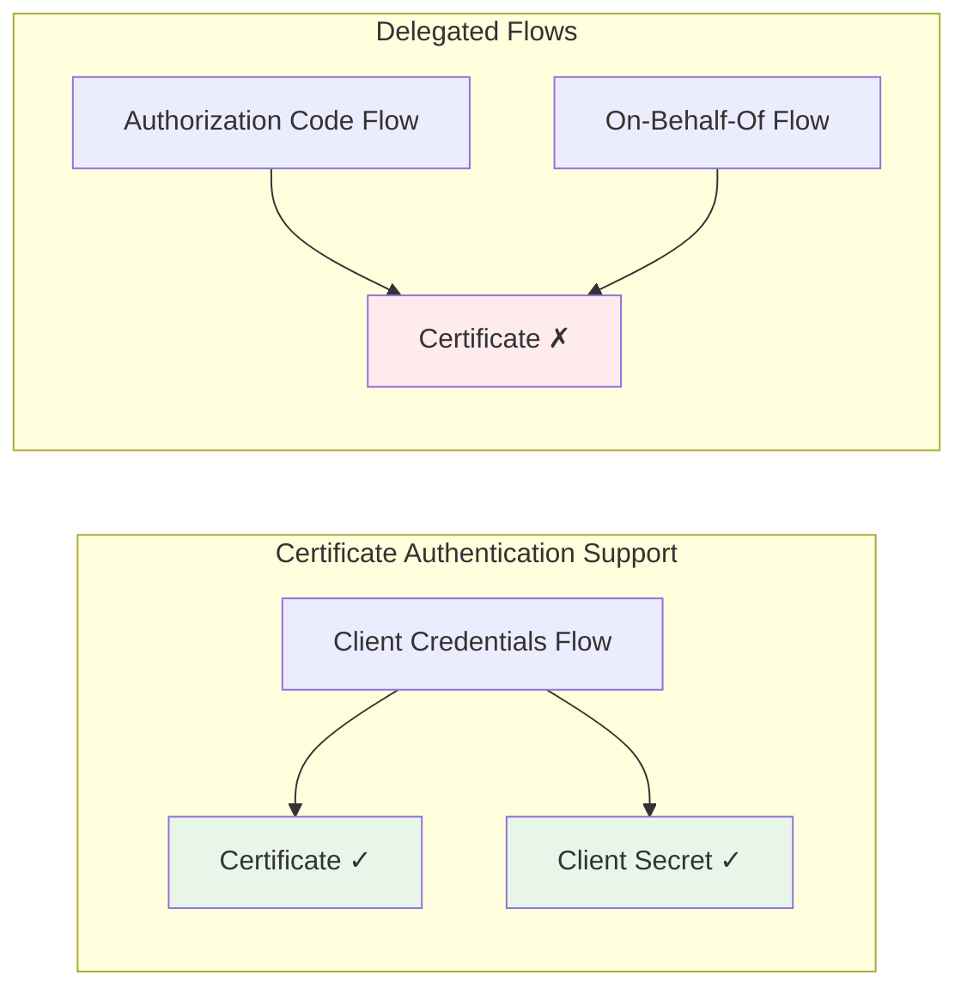

<!-- confluence-page-id: 1789919237 -->
<!-- confluence-space-key: ~624ebe8d45ece00069ce737e -->
<!-- confluence-space-key: ~624ebe8d45ece00069ce737e -->
# Token and Authentication Flows

## Overview

The Teams MCP service handles **two layers of authentication**:

1. **MCP OAuth** - Authentication between MCP clients and this server
2. **Microsoft OAuth** - Authentication with Microsoft Entra ID for Graph API access

This document explains how tokens work, their lifecycle, and validation behavior.

## Token Architecture

## MCP OAuth Tokens (Internal)

### Token Types

| Token Type | Default TTL | Purpose |
|------------|-------------|---------|
| Access Token | 60 seconds | Short-lived API access |
| Refresh Token | 30 days | Obtain new access tokens |
| Authorization Code | ~10 minutes | Exchange for tokens (one-time use) |

### Token Validation: No Introspection

**Important:** The service does **NOT** use OAuth token introspection.

Tokens are validated **locally** by:
1. Looking up the token in the cache (or database on cache miss)
2. Checking the `expiresAt` timestamp against current time
3. If expired, the token is deleted and the request is rejected

**Implications:**
- No network call to an authorization server for validation
- Tokens cannot be remotely revoked instantly (must wait for expiration)
- Token validation is fast (~1ms cache hit, ~10ms database lookup)

### Token Storage Architecture

**Storage Characteristics:**

| Layer | Behavior |
|-------|----------|
| Cache | TTL = remaining token lifetime; auto-eviction on expiry |
| Database | Encrypted at rest using AES-GCM; persistent storage |

Token deletion removes from both cache and database simultaneously.

### Refresh Token Rotation

The service implements **refresh token rotation** with family tracking for security:

**Security Features:**

| Feature | Description |
|---------|-------------|
| Single-use tokens | Each refresh token can only be used once |
| Usage tracking | `usedAt` timestamp recorded on first use |
| Family revocation | Reuse of old token revokes all tokens in the family |
| Theft mitigation | Stolen refresh tokens become detectable |

### Token Cleanup

Expired tokens are cleaned up periodically:
- Removes tokens expired more than N days ago
- Cleans expired authorization codes and OAuth sessions
- Prevents database bloat from accumulated expired tokens

## Microsoft OAuth Tokens (External)

### Token Types

| Token Type | Source | Storage Location |
|------------|--------|------------------|
| Access Token | Microsoft Entra ID | Encrypted in `user_profiles` table |
| Refresh Token | Microsoft Entra ID | Encrypted in `user_profiles` table |

**Required Scopes:** See [Microsoft Graph Permissions](./permissions.md) for the complete list with least-privilege justification.

### Token Refresh Flow

Microsoft tokens are refreshed **on-demand** when the Graph API returns a 401 error:

**Key Behaviors:**

| Step | Behavior |
|------|----------|
| Initial request | Uses stored (possibly expired) access token |
| 401 detection | Checks for `InvalidAuthenticationToken` or expiry messages |
| Token refresh | Calls Microsoft token endpoint with refresh token |
| Token storage | New tokens encrypted and stored in database |
| Request retry | Original request retried with fresh access token |
| Refresh failure | Returns original 401 to caller |

### Token Encryption

All Microsoft tokens are encrypted at rest:

**Encryption Requirements:**

| Parameter | Requirement |
|-----------|-------------|
| Algorithm | AES-GCM (authenticated encryption) |
| Key length | 256 bits (64-character hex string) |
| Key storage | Environment variable, never in code/database |
| Key rotation | Requires re-authentication of all users |

## Complete Authentication Flow

For the full user connection and authentication sequence diagram, see [Flows - User Connection Flow](./flows.md#user-connection-flow).

## Configuration Reference

| Variable | Default | Description |
|----------|---------|-------------|
| `AUTH_ACCESS_TOKEN_EXPIRES_IN_SECONDS` | 60 | MCP access token TTL |
| `AUTH_REFRESH_TOKEN_EXPIRES_IN_SECONDS` | 2592000 | MCP refresh token TTL (30 days) |
| `AUTH_HMAC_SECRET` | (required) | 64-char hex for JWT signing |
| `ENCRYPTION_KEY` | (required) | 64-char hex for AES-GCM encryption |

## Security Considerations

### What This Service Does NOT Do

| Feature | Status | Mitigation |
|---------|--------|------------|
| Token Introspection | Not supported | Local validation with short TTLs |
| Immediate Revocation | Not supported | 60-second access token limits exposure |
| Token Binding | Not supported | Refresh token rotation detects theft |

### What This Service Does

| Feature | Description |
|---------|-------------|
| Encryption at Rest | All Microsoft tokens encrypted with AES-GCM |
| Refresh Token Rotation | Single-use refresh tokens with family revocation |
| Short-Lived Access Tokens | 60-second default limits exposure window |
| Automatic Token Refresh | Seamless refresh for Microsoft Graph calls |
| Cache-First Validation | Fast validation without database round-trip |

## Unsupported Authentication Methods

This section documents authentication methods that are **not supported** by the Teams MCP service and the technical reasons why.

### Why Client Credentials (OIDC/App-Only) Is Not Supported

**Short Answer:** The Teams MCP service requires **delegated permissions** to access user-specific resources. Client Credentials flow only supports application permissions.

For detailed explanation of why delegated permissions are required, see [Permissions - Why Delegated (Not Application)](./permissions.md#why-delegated-not-application-permissions).

**Key Points:**
- Client Credentials flow authenticates the **application**, not a user
- Application permissions for transcripts require tenant admin to create **Application Access Policies** via PowerShell
- This is impractical for self-service MCP connections where users connect without IT involvement

**Microsoft Documentation:**
- [Authentication flows in MSAL](https://learn.microsoft.com/en-us/entra/identity-platform/msal-authentication-flows)
- [Get access on behalf of a user](https://learn.microsoft.com/en-us/graph/auth-v2-user)

### Why Certificate Authentication Is Not Supported

**Short Answer:** Certificates are only supported in the Client Credentials flow, which is incompatible with delegated permissions.

**Technical Explanation:**

Microsoft MSAL supports certificates **only** for confidential client authentication in the **Client Credentials flow**:

| Authentication Flow | Certificate Support | User Context |
|--------------------|---------------------|--------------|
| Client Credentials | Yes | No user (app-only) |
| Authorization Code | No | Yes (user signs in) |
| On-Behalf-Of | No | Yes (delegated) |
| Device Code | No | Yes (user signs in) |

Since the Teams MCP service **requires delegated permissions** (see above), it must use the Authorization Code flow. This flow:
- Requires interactive user sign-in
- Uses client secret (not certificate) for confidential client authentication
- Issues tokens that act on behalf of the signed-in user

**Why Not Implement Certificate Support Anyway?**

While MSAL does support certificates for the token exchange step in Authorization Code flow (as a client credential alternative to client secrets), implementing this would require:

1. **Significant changes to MCP OAuth packages** - The underlying `@unique-ag/mcp-oauth` library does not support certificate-based client authentication
2. **Certificate management infrastructure** - Key storage, rotation, and distribution mechanisms

**Microsoft Documentation References:**
- [Authentication flows in MSAL](https://learn.microsoft.com/en-us/entra/identity-platform/msal-authentication-flows) - Shows certificate support only for Client Credentials
- [Public and confidential client apps](https://learn.microsoft.com/en-us/entra/identity-platform/msal-client-applications) - Credential types by application type
- [Certificate credentials in MSAL Node](https://github.com/AzureAD/microsoft-authentication-library-for-js/blob/dev/lib/msal-node/docs/certificate-credentials.md) - Certificate usage in confidential clients

### Summary

| Method | Supported | Reason |
|--------|-----------|--------|
| Client Secret + Delegated | **Yes** | Standard OAuth2 flow for user-specific access |
| Client Credentials (OIDC) | **No** | No user context; requires admin policy setup |
| Certificate Authentication | **No** | Only works with Client Credentials flow |
| Federated Identity | **No** | Only works with Client Credentials flow |

## Troubleshooting

### MCP Token Expired

**Symptom:** API requests rejected with authentication error

**Resolution:** Client should use refresh token to obtain new access token

### Microsoft Token Refresh Failed

**Symptom:** Graph API calls fail even after refresh attempt

**Possible Causes:**
- Microsoft refresh token expired (90-day default)
- User revoked consent in Microsoft account settings
- Network issues reaching Microsoft token endpoint

**Resolution:** User must reconnect to MCP server to re-authenticate

### Token Family Revoked

**Symptom:** All refresh operations fail for a user

**Cause:** Refresh token reuse detected (possible token theft)

**Resolution:** User must re-authenticate completely

### Encryption Key Changed

**Symptom:** All Microsoft API calls fail after deployment

**Cause:** `ENCRYPTION_KEY` environment variable changed

**Resolution:** All users must reconnect to obtain fresh tokens (stored tokens are unreadable with new key)

## Related Documentation

- [Architecture](./architecture.md) - System components and infrastructure
- [Flows](./flows.md) - User connection, subscription lifecycle, transcript processing
- [Microsoft Graph Permissions](./permissions.md) - Required scopes and least-privilege justification
- [Why RabbitMQ](./why-rabbitmq.md) - Message queue rationale
